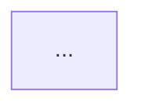

<!-- context:prd-template:start -->
# PRD 正文

> 版本：v1.0
> 状态：评审稿
> 基于 design.md v1.0

| 版本 | 日期 | 修订人 | 修订说明 | 状态 |
|------|------|--------|----------|------|
| v1.0 | YYYY-MM-DD | （生成人） | 首次生成，基于 design v1.0 展开 | 评审稿 |

---

## 1. 文档概述

<!-- 可选 -->

## 2. 名词说明

<!-- 按确认版 Design 中的术语填写；名词章节规则由独立 reference 负责。 -->

## 3. 范围

<!-- 可选 -->

## 4. 业务流程

<!-- 仅在存在整体业务流转时保留；按业务流程骨架填写。 -->

## 5. 详细需求说明

<!-- 按模块 → 小模块 → 页面 → 动作组织；详细写法由 PRD rules 负责。 -->
<!-- 有多小模块的大模块骨架：
### 5.1 大模块名
大模块职责与涉及页面，1-2 句。说明小模块间的衔接关系。

模块级权限规则：
- 默认权限：xxx
- 例外：xxx

#### 5.1.1 小模块名
小模块职责与涉及页面，1-2 句。

状态含义：列出该小模块涉及实体的状态枚举与含义（如"草稿：编制人新建后的初始状态"）

---

**5.1.1.1 页面名**

页面区域组成与职责，1 段。

· 动作一
动作正文

· 动作二
动作正文

小模块字段定义：
| 字段 | 类型 | 必填 | 取值约束 | 默认值 | 业务来源 | 说明 |
|------|------|------|----------|--------|----------|------|

小模块状态机：
| 状态 | 含义 | 操作人 | 触发动作 | 下一状态 | 限制条件 |
|------|------|--------|----------|----------|----------|

---
-->

<!-- 只有一小模块的大模块骨架：
### 5.2 大模块名
模块职责与涉及页面，1-2 句。

模块级权限规则：
- 默认权限：xxx
- 例外：xxx

状态含义：列出该模块涉及实体的状态枚举与含义

---

**5.2.1 页面名**

· 动作一
动作正文

小模块字段定义：
| 字段 | 类型 | 必填 | 取值约束 | 默认值 | 业务来源 | 说明 |
|------|------|------|----------|--------|----------|------|

小模块状态机：
| 状态 | 含义 | 操作人 | 触发动作 | 下一状态 | 限制条件 |
|------|------|--------|----------|----------|----------|

---
-->

<!-- 页面正文写清当前动作的条件、字段归宿、数据/状态副作用、成功失败和恢复；字段表覆盖 Design 全部字段及属性，系统内部字段在说明中标明用途；状态和权限按规则归位。 -->

## 6. 验收标准汇总

## 7. 风险与待确认
<!-- context:prd-template:end -->
