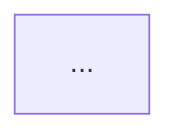

# PRD 正文

> 版本：v1.0
> 状态：评审稿
> 基于 design.md v1.0

| 版本 | 日期 | 修订人 | 修订说明 | 状态 |
|------|------|--------|----------|------|
| v1.0 | YYYY-MM-DD | （生成人） | 首次生成，基于 design v1.0 展开 | 评审稿 |

---

## 1. 文档概述

<!-- 可选 -->

## 2. 名词说明

<!-- 核心：按类别分组列出文档中使用的业务术语，让研发在进入详细需求前建立统一认知 -->
<!-- 术语来源：design.md 中已确认的角色、状态、字段、概念；不新增定义 -->
<!-- 类别分组：角色术语 / 业务术语 / 流程术语 / 概念术语 -->
<!-- 格式：| 术语 | 类别 | 定义 | -->
<!-- 入 glossary 的范围：状态名、角色名、业务专有名词、系统特有概念 -->
<!-- 不入 glossary 的范围：动作名、按钮文案、提示文案、页面名（页面名在范围章节已列） -->

## 3. 范围

<!-- 可选 -->

## 4. 业务流程

<!-- 可选：写整体业务流转和全局视图 -->
<!-- 推荐节奏：先用 1 段交代流程边界，再按阶段展开，每个阶段写清角色、动作、判断条件、分支走向 -->
<!-- 关键分支写具体判断条件（写具体数值和字段），异常路径写清降级策略 -->
<!-- 这里只写整体业务流转，可配一张整体流程图；不展开页面级详细流转、按钮点击、弹窗/抽屉开合等页面操作细节 -->
<!-- 单角色、无分支的简单流程一段话带过，不需要分阶段展开 -->

## 5. 详细需求说明

<!-- 核心：按模块 → 小模块 → 页面 → 动作组织 -->
<!-- 大模块职责与涉及页面，1-2 句 -->
<!-- 大小适配：大模块内只有一个小模块时不分层，直接展开职责、流程图、页面 -->

<!-- 有多小模块的大模块骨架：
### 5.1 大模块名
大模块职责与涉及页面，1-2 句。说明小模块间的衔接关系。

模块级权限规则：
- 默认权限：xxx
- 例外：xxx

#### 5.1.1 小模块名
小模块职责与涉及页面，1-2 句。

状态含义：列出该小模块涉及实体的状态枚举与含义（如"草稿：编制人新建后的初始状态"）

---

**5.1.1.1 页面名**

页面区域组成与职责，1 段。

· 动作一
动作正文

· 动作二
动作正文

小模块字段定义：
| 字段 | 类型 | 必填 | 说明 |
|------|------|------|------|

小模块状态机：
| 状态 | 含义 | 操作人 | 触发动作 | 下一状态 | 限制条件 |
|------|------|--------|----------|----------|----------|

---
-->

<!-- 只有一小模块的大模块骨架：
### 5.2 大模块名
模块职责与涉及页面，1-2 句。

模块级权限规则：
- 默认权限：xxx
- 例外：xxx

状态含义：列出该模块涉及实体的状态枚举与含义

---

**5.2.1 页面名**

· 动作一
动作正文

小模块字段定义：
| 字段 | 类型 | 必填 | 说明 |
|------|------|------|------|

小模块状态机：
| 状态 | 含义 | 操作人 | 触发动作 | 下一状态 | 限制条件 |
|------|------|--------|----------|----------|----------|

---
-->

<!-- 列表/表单/详情中的字段描述只写当前动作需要理解的关键字段、展示方式和规则，不把数据字典完整字段清单搬进页面正文 -->
<!-- 动作开头先写业务判断和关键结果，再补排序、分页、默认加载、空状态等通用展示规则 -->
<!-- 默认角色可见性不在正文重复，只写有特殊限制的角色（如"仅编制人可见"、"仅项目主审可见"） -->
<!-- 衔接角色在动作正文内说清（如"下一步由项目组长/主审在详情页进行初审操作"），不单独列表 -->
<!-- 状态字段流转由流程驱动时，所有用户对状态字段只读，在小模块职责段落统一说明 -->
<!-- 如需交代页面区块，且区块较多或存在子分组时，优先用 `- 区块名：规则`；区块内子分组可用缩进 `- 子分组：规则`。区块很少且内容很短时，直接自然句写，避免过度拆分 -->
<!-- 字段/状态机按小模块归位到小模块末尾，权限规则放大模块开头，替代原独立章节 -->

## 6. 验收标准汇总

## 7. 风险与待确认
