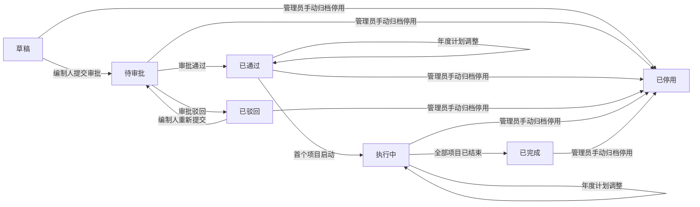
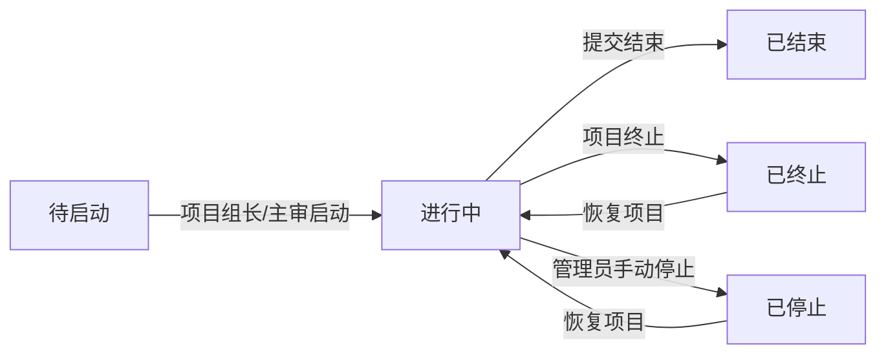

# 审计计划模块（5.1）— spm-prd skill 真实生成片段（已按 design 第八章页面落点修正）

> 按 spm-prd skill 流程生成的审计计划模块（5.1）片段：design-confirmation 已 confirm（sha256=5fcd5078…）；context-pack --pass writing 加载 8 个规则段；完整读取 design 功能清单 / 页面清单 / 数据字典 / 系统流程 / 状态流转 / 角色权限 / 第八章页面与字段落点。本文件仅用于模块片段验证，不代表完整 PRD，也不包含其余模块。

### 5.1 审计计划模块

负责年度审计计划的编制、审批与调整，以及计划内审计项目的维护，包含 7 个页面。本模块涉及"年度计划"和"审计项目"两个核心业务对象（外加"项目成员"辅助对象）：一个年度计划包含多个审计项目，审计项目通过"来源计划"关联年度计划；审计项目成员单独建模（项目成员实体），与审计项目多对多。

模块角色、数据范围与权限规则：
- 集团领导：全集团只读
- 公司领导：本公司只读
- 审计用户：按数据范围——集团审计部可见全集团审计项目，子公司审计部可见本公司审计项目，非审计部门仅可见个人参与项目
- 外包审计用户：仅被分配的审计项目（只读）
- 被审单位用户：不可见
- 敏感操作与职责分离：年度计划调整（增加/停止项目）仅由编制人操作；计划审批仅由管理员/领导角色操作，编制人不可自审；手动归档停用仅由系统/集团/公司管理员操作；删除年度计划仅由编制人在草稿/已驳回状态操作

> 状态机操作人角色映射：编制人 = 审计用户（项目组员）；审批人 = 公司管理员/集团管理员/集团领导/公司领导；项目组长/主审 = 审计用户的项目身份；管理员 = 系统管理员/集团管理员/公司管理员。

#### 5.1.1 年度计划

负责年度计划的编制、提交审批、查看与调整。涉及页面：年度计划列表、年度计划详情、计划编辑、计划审批。

状态含义：年度计划状态枚举及含义——草稿（未提交审批）、待审批（审批流程中）、已通过（审批通过待启动）、执行中（至少一个项目已启动）、已完成（所有项目已结束）、已驳回（审批被驳回）、已停用（手动归档停用）。状态流转由流程驱动，所有角色对状态字段只读。

**5.1.1.1 年度计划列表**

按年度筛选查看审计计划列表，默认按计划年度倒序、创建时间倒序排列，每页 20 条；年度、计划类型、状态为下拉筛选。点击行进入年度计划详情页（见 5.1.1.2）。

· 新建计划
审计用户（按数据范围）点击"新建计划"进入计划编辑页，计划类型默认"初始规划"，计划版本默认 V1.0，编制人、填报人由系统带出当前登录人。

· 操作列（按角色 × 状态）
- 审计用户（按数据范围，即该计划编制人/项目组员）：草稿、已驳回状态显示"编辑""提交审批""删除"；已通过、执行中状态显示"年度计划调整""查看详情"；已完成、已停用状态显示"查看详情"
- 集团领导 / 公司领导：所有状态仅显示"查看详情"
- 外包审计用户（仅被分配项目）：仅显示"查看详情"
- 被审单位用户：本模块不可见，无操作列

· 删除
审计用户（按数据范围，即该计划编制人）在草稿或已驳回状态点击"删除"，二次确认后删除该年度计划及其下未同步的审计项目；已提交审批或已同步的项目不可删除。

**5.1.1.2 年度计划详情**

展示计划基本信息（计划名称、计划年度、计划类型、计划版本、是否当前执行版本、编制部门、编制人、创建/更新时间、状态）、审计背景/指导思想/工作目标、计划组员/填报人/填报日期、计划统计（项目计划数、未执行数、在执行数、已关闭数，系统自动计算）、审计项目列表（状态、项目名称、审计类型、被审单位、项目级别、审计期间，可新增/停止项目）、审批记录时间线、备注、版本历史。

· 编辑
审计用户（按数据范围，即该计划编制人）在草稿或已驳回状态点击"编辑"进入计划编辑页。

· 年度计划调整
审计用户（按数据范围，即该计划编制人）在已通过或执行中状态点击"年度计划调整"，跳转计划编辑页并预填当前版本数据，计划版本自动递增（V1.0→V2.0→V3.0）；可在审计项目列表新增或停止项目，提交后进入审批流程，审批通过后新版本生效、旧版本自动设为非当前执行版本。

· 查看审批记录
审批通过后，任意可查看角色点击"查看审批记录"展开审批流程全部历史节点（审批人、审批时间、审批意见）。

**5.1.1.3 计划编辑**

新建或编辑年度计划，添加/修改计划内审计项目。页面区域：基本信息（计划名称、计划类型、计划版本，必填；计划类型默认"初始规划"）、审计背景/指导思想/工作目标（选填，各最大 2000 字符）、人员信息（计划组员，选填多选）、备注（选填，最大 1000 字符）、审计项目列表（状态、项目名称、审计类型、被审单位、项目级别、审计期间，可新增/编辑/删除审计项目）、计划调整区（仅年度计划调整场景显示：操作类型新增/停止必填、变更原因选填最大 500 字符，停止时建议填写）。字段完整定义见大模块字段定义表；本页仅说明当前动作需理解的字段与关键规则。

· 新增审计项目
在审计项目列表点击"新增审计项目"进入审计项目新建页（见 5.1.2.1），保存后回本页并加入项目列表。

· 编辑审计项目
在审计项目列表点击已有项目"编辑"进入审计项目编辑页（见 5.1.2.3）。

· 删除审计项目
在审计项目列表点击"删除"移除该行项目（尚未同步到项目启动列表的项目）。

· 保存草稿
审计用户（按数据范围，即该计划编制人）点击"保存草稿"，校验通过后保存为草稿并返回年度计划列表；计划名称、计划类型为必填，不填标红提示，已填内容不丢失。

· 提交审批
审计用户（按数据范围，即该计划编制人）在草稿或已驳回状态点击"提交审批"，校验必填项通过后计划状态变为"待审批"，生成审批流程实例并推送待办给审批人；校验不通过标红提示。

**5.1.1.4 计划审批**

审批人（公司管理员/集团管理员/集团领导/公司领导）查看待审批计划并审批。展示计划信息、计划统计、审计背景/指导思想/工作目标、审计项目列表（可展开查看审计目标/重点）、备注、审批记录时间线。

· 通过
审批人（公司管理员/集团管理员/集团领导/公司领导）在待审批状态填写审批意见后点击"通过"，计划状态变为"已通过"，审批流程实例记录结果；通过后计划内审计项目自动同步到项目启动列表（计划同步，系统自动）。

· 驳回
审批人（公司管理员/集团管理员/集团领导/公司领导）在待审批状态填写审批意见（驳回时强制必填）后点击"驳回"，计划状态变为"已驳回"，编制人可修改后重新提交；审批驳回时计划版本回退到原版本号。

年度计划状态机：

| 状态 | 含义 | 操作人 | 触发动作 | 下一状态 | 限制条件 |
|------|------|--------|----------|----------|----------|
| 草稿 | 未提交审批 | 编制人（审计用户项目组员） | 提交审批 | 待审批 | — |
| 待审批 | 审批流程中 | 审批人（管理/领导角色） | 审批通过 | 已通过 | — |
| 待审批 | 审批流程中 | 审批人（管理/领导角色） | 审批驳回 | 已驳回 | 驳回时审批意见强制必填 |
| 已驳回 | 审批被驳回 | 编制人（审计用户项目组员） | 重新提交 | 待审批 | — |
| 已通过 | 审批通过待启动 | 编制人（审计用户项目组员） | 年度计划调整 | 已通过 | 增加或停止项目，状态不变 |
| 已通过 | 至少一个项目启动后自动进入执行中 | 项目组长/主审 | 首个项目启动 | 执行中 | 至少一个项目启动后自动进入执行中 |
| 执行中 | 进行中 | 编制人（审计用户项目组员） | 年度计划调整 | 执行中 | 增加或停止项目，状态不变 |
| 执行中 | 计划下全部项目均已结束 | 系统自动 | 所有项目已结束 | 已完成 | 计划下全部项目均已结束 |
| 任意状态 | 管理员手动归档停用 | 管理员（系统/集团/公司管理员） | 手动归档停用 | 已停用 | — |

---

#### 5.1.2 审计项目

负责年度计划内审计项目的新建、查看与编辑。涉及页面：审计项目新建、审计项目详情、审计项目编辑。审计项目在计划编辑中新增，审批通过后随计划同步到项目启动列表。

状态含义：审计项目状态枚举及含义——待启动（计划同步后未启动）、进行中（已启动，各阶段可并行推进）、已结束（七环节全部完成并归档）、已终止（项目终止）、已停止（手动暂停，可恢复）。计划模块内仅可查看；停止/恢复由项目组长/主审操作。

**5.1.2.1 审计项目新建**

在计划编辑的审计项目列表点击"新增审计项目"进入，按区域填写：基本信息（来源计划自动带入不可修改、审计年度带入、项目名称/项目类型/审计类型/审计范围/被审单位/被审单位对接人必填，其余选填）、审计信息（审计期间、审计目标最大 1500 字符、审计重点最大 1500 字符、立项依据最大 2000 字符、审计事项，全部必填）、项目属性（项目级别、完成形式、审计方式、审计单位、审计领域、版块业态、业务领域，全部必填）、人员安排（项目组长兼项目主审必填，项目副组长/内部项目组员选填）、外部协作（中介机构选填最大 200 字符，二期预留）、计划调整（仅年度计划调整场景显示，操作类型新增/停止必填）、备注（选填最大 2000 字符）、附件信息（文件名称/文件类型选填，上传人系统自动记录）。项目编号系统生成（格式 XM-YYYY-NNN）。

· 保存
审计用户（按数据范围，即当前计划编制人）点击"保存"，校验通过后新建审计项目（状态"待启动"）并返回计划编辑页加入项目列表；校验不通过标红提示，已填内容不丢失。

· 取消
点击"取消"放弃本次填写，返回计划编辑页，不创建项目。

**5.1.2.2 审计项目详情**

只读展示审计项目完整信息：基本信息（项目 ID、来源计划可跳转、项目名称、项目类型、审计类型、审计范围、被审单位、被审单位对接人、计划开始/结束日期、审计年度、启动月份、状态）、审计信息（审计期间、审计目标、审计重点、立项依据、审计事项）、项目属性（项目级别、完成形式、审计方式、审计单位、审计领域、版块业态、业务领域）、人员安排（项目组长兼项目主审、项目副组长、内部项目组员）、外部协作（中介机构）、计划调整（仅年度计划调整产生的项目显示）、备注、附件信息（文件名称支持下载）、审批记录时间线。字段完整定义见大模块字段定义表。

· 编辑
审计用户（按数据范围，即当前计划编制人）在年度计划处于草稿态时点击"编辑"进入审计项目编辑页；计划审批通过后项目信息调整须通过年度计划调整流程，本页不提供编辑入口。

· 返回年度计划详情
点击"返回年度计划详情"回到所属年度计划详情页（见 5.1.1.2）。

**5.1.2.3 审计项目编辑**

编辑已有审计项目信息，区域与新建一致：基本信息（来源计划只读，项目名称/项目类型/审计类型/审计范围/被审单位可编辑必填，其余可编辑选填）、审计信息（全部可编辑必填）、项目属性（全部可编辑必填）、人员安排（项目组长可编辑必填）、外部协作（中介机构可编辑选填）、计划调整（仅年度计划调整场景可编辑，操作类型新增/停止必填，停止保存后该项目在计划中标记为停止）、备注、附件信息（上传人系统自动更新为当前修改人）。项目编号、来源计划、状态为系统字段不可编辑。

· 保存
审计用户（按数据范围，即当前计划编制人）点击"保存"，校验通过后返回项目详情页；校验不通过标红提示。

· 取消
点击"取消"放弃修改，返回项目详情页。

审计项目状态机：

| 状态 | 含义 | 操作人 | 触发动作 | 下一状态 | 限制条件 |
|------|------|--------|----------|----------|----------|
| 待启动 | 计划同步后未启动 | 项目组长/主审 | 启动 | 进行中 | — |
| 进行中 | 七环节全部已完成，归档信息填写完整 | 项目组长/主审 | 提交结束 | 已结束 | 七环节全部已完成，归档信息填写完整 |
| 进行中 | 项目已终止 | 项目组长/主审 | 项目终止 | 已终止 | 记录终止原因 |
| 进行中 | 暂停项目 | 管理员（系统/集团/公司管理员） | 手动停止 | 已停止 | 暂停项目，可恢复 |
| 已终止 | 项目已终止 | 项目组长/主审 | 恢复项目 | 进行中 | 终止后可恢复继续执行 |
| 已停止 | 项目已停止 | 项目组长/主审 | 恢复项目 | 进行中 | 停止后可恢复继续执行 |

---

大模块字段定义表：

| 字段 | 类型 | 必填 | 取值约束 | 默认值 | 业务来源 | 说明 |
|------|------|------|----------|--------|----------|------|
| 计划 ID | 整数 | 是 | 系统自动生成 | — | 系统 | 主键 |
| 计划名称 | 字符串 | 是 | 最大 100 字符 | — | 用户输入 | 如"2026 年度审计计划" |
| 计划年度 | 字符串 | 是 | 格式 YYYY | — | 用户输入 | 如 2026 |
| 计划类型 | 枚举 | 是 | 初始规划/年度计划调整 | 初始规划 | 用户选择 | 区分编制阶段 |
| 计划版本 | 字符串 | 是 | 格式 V1.0、V2.0 | V1.0 | 系统 | 年度计划调整审批通过后自动递增（V1.0→V2.0→V3.0），审批驳回回退原版本号 |
| 是否当前执行版本 | 布尔 | 是 | — | 是 | 系统 | 同一年度同一时间只能一个"是"，新版本通过时旧版本自动设"否" |
| 编制部门 | 关联 | 是 | 关联组织机构 | 系统带出（编制人所属部门） | 系统 | 编制人所属部门 |
| 计划组员 | 多选人员 | 否 | 关联用户表 | — | 用户选择 | 计划参与协作人员 |
| 编制人 | 关联 | 是 | 关联用户表 | 系统带出（当前登录人） | 系统 | 计划编制人 |
| 填报人 | 关联 | 是 | 关联用户表 | 系统自动（当前登录人） | 系统 | 操作留痕，不可修改 |
| 审批流程实例 ID | 关联 | 否 | 关联审批实例 | — | 系统（审批通过后生成） | — |
| 审计背景 | 文本 | 否 | 最大 2000 字符 | — | 用户输入 | 编制背景说明 |
| 指导思想 | 文本 | 否 | 最大 2000 字符 | — | 用户输入 | 整体指导方针 |
| 工作目标 | 文本 | 否 | 最大 2000 字符 | — | 用户输入 | 整体工作目标 |
| 备注 | 文本 | 否 | 最大 1000 字符 | — | 用户输入 | 补充说明 |
| 项目计划数 | 整数 | 否 | 自然数≥0 | 0（系统计算） | 系统 | 计划下关联项目总数，系统自动计算 |
| 未执行数 | 整数 | 否 | 自然数≥0 | 0（系统计算） | 系统 | 未执行项目数，系统自动计算 |
| 在执行数 | 整数 | 否 | 自然数≥0 | 0（系统计算） | 系统 | 进行中项目数，系统自动计算 |
| 已关闭数 | 整数 | 否 | 自然数≥0 | 0（系统计算） | 系统 | 已完结项目数，系统自动计算 |
| 填报日期 | 日期时间 | 是 | — | 系统自动 | 系统 | 操作留痕，不可修改 |
| 创建时间 | 日期时间 | 是 | — | 系统自动 | 系统 | — |
| 更新时间 | 日期时间 | 是 | — | 系统自动 | 系统 | — |
| 状态 | 枚举 | 是 | 草稿/待审批/已通过/执行中/已完成/已驳回/已停用 | 草稿 | 系统 | 计划状态 |
| 项目 ID | 整数 | 是 | 系统自动生成 | — | 系统 | 主键 |
| 项目编号 | 字符串 | 是 | 格式 XM-YYYY-NNN | 系统生成 | 系统 | — |
| 项目名称 | 字符串 | 是 | 最大 200 字符 | — | 用户输入（关联自年度计划） | — |
| 计划年度 | 整数 | 是 | 4 位年度数字 | 来源计划带出 | 系统 | 项目所属审计年度 |
| 审计类型 | 枚举 | 是 | 数据字典配置 | — | 用户选择 | — |
| 项目类型 | 枚举 | 是 | 财务收支审计/全过程跟踪审计/内控监督评价/监事专项检查/专项审计/竣工决算审计/经济责任审计/管理审计/经济效益审计/后续审计/其他审计 | — | 用户选择（从年度计划带入可改） | 业务细分分类 |
| 审计期间 | 日期区间 | 否 | 起止日期选择 | — | 用户选择（带入可改） | — |
| 完成形式 | 枚举 | 否 | 同项目属性枚举 | — | 用户选择（带入可改） | — |
| 审计方式 | 枚举 | 否 | 自行审计/协同审计/全部外包/联审 | — | 用户选择 | 项目实施模式 |
| 项目级别 | 枚举 | 否 | 重大项目/常规项目/其他 | — | 用户选择（带入） | — |
| 审计领域 | 枚举 | 否 | 内部审计/国家审计/社会审计/外部审计/其他 | — | 用户选择（带入） | — |
| 版块业态 | 枚举 | 否 | 数据字典配置 | — | 用户选择（带入） | — |
| 业务领域 | 枚举 | 否 | 数据字典配置 | — | 用户选择（带入） | — |
| 审计单位 | 多选组织 | 是 | 集团本部/各子公司/部门组织树 | — | 用户选择 | 实施审计的责任部门 |
| 被审单位对接人 | 关联 | 否 | 关联被审单位用户 | — | 用户选择 | — |
| 内部项目组员 | 多选人员 | 否 | 关联用户表 | — | 用户选择 | 内部审计团队成员 |
| 项目组长 | 关联 | 是 | 关联用户表 | — | 用户选择 | 项目组长兼项目主审 |
| 项目主审 | 关联 | 是 | 关联用户表 | — | 用户选择 | 审计执行负责人，与项目组长并列 |
| 项目副组长 | 关联 | 否 | 关联用户表 | — | 用户选择 | 项目副负责人 |
| 来源计划 | 关联 | 是 | 关联年度计划 | 系统（创建时关联） | 系统 | — |
| 来源计划项目 | 关联 | 否 | 自引用（关联原审计项目） | — | 系统（年度计划调整时） | 调整时关联原始审计项目 |
| 中介机构 | 多选字符串 | 否 | 会计师事务所/造价咨询公司等 | — | 用户选择 | 合作第三方审计机构 |
| 终止原因 | 文本 | 否 | 最大 500 字符 | — | 用户输入（项目终止时） | — |
| 计划开始日期 | 日期 | 否 | — | — | 用户选择 | — |
| 计划结束日期 | 日期 | 否 | — | — | 用户选择 | — |
| 启动月份 | 月份 | 否 | 年月选择器 | — | 用户选择 | 项目计划启动年月 |
| 联系电话 | 字符串 | 否 | 11 位手机号 | — | 用户输入 | 填报人联系手机号 |
| 审计目标 | 文本 | 否 | 最大 1500 字符 | — | 用户输入（带入可改） | — |
| 审计重点 | 文本 | 否 | 最大 1500 字符 | — | 用户输入（带入可改） | — |
| 立项依据 | 文本 | 否 | 最大 2000 字符 | — | 用户输入（带入可改） | — |
| 实际开始日期 | 日期 | 否 | — | — | 系统（启动后） | — |
| 实际结束日期 | 日期 | 否 | — | — | 系统（结束后） | — |
| 被审单位 | 字符串 | 是 | 最大 200 字符 | — | 用户输入 | — |
| 审计范围 | 文本 | 是 | 最大 2000 字符 | — | 用户输入 | 审计范围描述 |
| 审计事项 | 枚举 | 否 | 数据字典配置 | — | 用户选择（带入可改） | 本次审计对应事项分类 |
| 备注信息 | 文本 | 否 | 最大 2000 字符 | — | 用户输入 | 项目补充说明 |
| 中介其他 | 字符串 | 否 | 手动录入/选择 | — | 用户输入 | 第三方机构对接人员 |
| 状态 | 枚举 | 是 | 待启动/进行中/已结束/已终止/已停止 | 待启动 | 系统 | 项目状态 |
| 相关附件 | 文件上传 | 否 | 多格式文件，支持预览/下载 | — | 用户上传 | 项目佐证附件 |
| 文件名称 | 字符串 | 否 | 上传自动读取 | — | 系统（上传读取） | 附件文件名 |
| 文件类型 | 枚举 | 否 | 发文/纪要/决议/通知 | — | 用户选择 | 附件公文类型 |
| 上传人 | 字符串 | 是 | — | 系统自动（当前登录人） | 系统 | 附件上传人 |
| 成员 ID | 整数 | 是 | 系统自动生成 | — | 系统 | 主键 |
| 用户 | 关联 | 是 | 关联用户表（审计用户或外包审计用户） | — | 用户选择 | — |
| 项目 | 关联 | 是 | 关联审计项目 | 系统（添加时关联） | 系统 | — |
| 加入时间 | 日期时间 | 是 | — | 系统自动 | 系统 | — |
| 项目角色 | 枚举 | 是 | 组长/主审/组员 | — | 用户选择 | 审计侧项目身份 |
