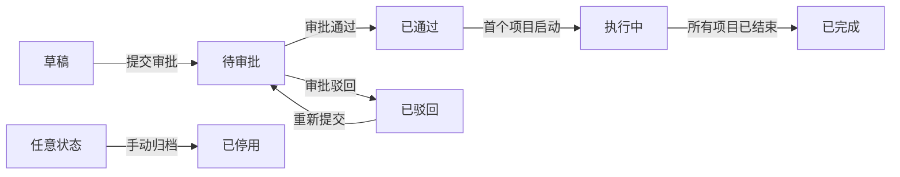

# PRD 正文

> 说明：本文件是历史负例/结构对照，不是符合当前 PRD 规则的正例基线；请以 `prd-5.1-skill-generated.md` 和完整生成产物为正例参考。

> 版本：v1.0  
> 状态：评审稿  
> 基于 design.md v1.0

| 版本   | 日期         | 修订人   | 修订说明                                        | 状态  |
| ---- | ---------- | ----- | ------------------------------------------- | --- |
| v1.0 | 2026-07-03 | （生成人） | 首次生成，基于 design v1.0 展开；本次仅生成审计计划模块小样本验证归位结构 | 评审稿 |

---

## 5. 详细需求说明

### 5.1 审计计划模块

负责年度审计计划的编制、审批与调整，以及计划内审计项目的维护，包含 7 个页面。本模块核心业务对象为"年度计划"和"审计项目"（含"项目成员"辅助对象）：一个年度计划包含多个审计项目，审计项目通过"来源计划"关联年度计划，项目成员与审计项目多对多。

模块角色、数据范围与权限规则：

- 集团领导：全集团只读
- 公司领导：本公司只读
- 审计用户：按数据范围可见可编辑
- 外包审计用户：仅被分配项目
- 被审单位用户：无权限
- 例外字段权限：无
- 敏感操作与职责分离：无

计划状态流转由流程驱动，所有用户对状态字段只读。各状态含义：

- 草稿：未提交审批，可编辑、删除
- 待审批：审批流程中，不可编辑
- 已通过：审批通过待启动
- 执行中：至少一个项目已启动
- 已完成：所有项目已结束
- 已驳回：审批被驳回，可修改后重新提交
- 已停用：管理员手动归档停用

#### 5.1.1 年度计划管理

负责年度计划的列表浏览、详情查看、编辑编制与审批处理，包含 4 个页面。

---

**5.1.1.1 年度计划列表页**

页面顶部为筛选栏，下方为年度计划分页列表，每页 20 条，按创建时间倒序。

· 筛选年度计划

筛选栏提供计划年度、计划类型、状态下拉筛选。展示列：计划名称、计划年度、计划类型、计划版本、项目计划数、未执行数、在执行数、已关闭数、状态。计划名称超长截断 30 字符，悬停显示全文。

· 新建计划

审计用户（按数据范围）点击“新建计划”按钮进入计划编辑页。计划类型默认“初始规划”，计划版本默认 V1.0。

· 操作计划

操作列按角色与状态显示按钮：
- 审计用户（按数据范围）：草稿、已驳回状态显示“编辑”“提交审批”“删除”；已通过、执行中状态显示“查看详情”“年度计划调整”。
- 集团领导、公司领导：任意状态仅显示“查看详情”。
- 外包审计用户、被审单位用户：无操作按钮。
点击“查看详情”进入年度计划详情页；“编辑”进入计划编辑页；“提交审批”提交当前计划；“删除”删除当前计划（仅草稿、已驳回可删）；“年度计划调整”进入计划编辑页并预填当前版本数据。

---

**5.1.1.2 年度计划详情页**

展示计划完整信息，按区域分块呈现，全部只读。

· 查看计划全貌

- 基本信息：计划名称、年度、计划类型、计划版本、是否当前执行版本、编制部门、编制人、创建时间、更新时间、状态
- 审计背景：审计背景、指导思想、工作目标，长文本完整展示
- 人员信息：计划组员、填报人、填报日期
- 计划统计：项目计划数、未执行数、在执行数、已关闭数，系统自动计算
- 审计项目列表：状态、项目名称、审计类型、被审单位、项目级别、审计期间，可新增/停止项目
- 审批记录：审批节点、审批人、审批时间、审批意见，时间线展示，提交审批后显示
- 版本历史：该年度所有版本的修订历史

· 操作计划

操作区按角色与状态显示：审计用户（按数据范围）草稿状态显示“编辑”“提交审批”，已通过/执行中状态显示“年度计划调整”“查看审批记录”；集团领导、公司领导任意状态仅“查看审批记录”；外包审计用户、被审单位用户无操作按钮。点击“编辑”跳转计划编辑页；“年度计划调整”跳转计划编辑页并预填当前版本数据，计划版本自动递增（V1.0→V2.0→V3.0）。

---

**5.1.1.3 计划编辑页**

编制或调整年度计划的表单页，分为基本信息、审计背景、人员信息、备注、审计项目列表五个区域。

· 编辑计划信息

- 基本信息：计划名称（必填，最大 100 字符）、计划类型（必填，默认"初始规划"）、计划版本（必填，初始版本 V1.0，调整审批通过后自动递增）
- 审计背景：审计背景、指导思想、工作目标，选填，富文本编辑器，单项最大 2000 字符
- 人员信息：计划组员，选填，人员多选
- 备注：备注，选填，最大 1000 字符
- 审计项目列表：展示状态、项目名称、审计类型、被审单位、项目级别、审计期间，可新增/编辑/删除审计项目，点击项目名称进入审计项目编辑页

· 保存与提交

操作区提供"保存草稿""提交审批"。保存草稿仅校验必填项非空；提交审批时校验所有必填项，校验不通过的字段标红并显示错误提示，不关闭表单。提交成功后跳回列表页，列表顶部 toast 提示"计划已提交审批"，状态变为"待审批"。

---

**5.1.1.4 计划审批页**

审批人查看计划详情并执行审批操作的表单页。

· 查看计划详情

只读展示计划信息（计划名称、计划年度、计划类型、计划版本、编制人、编制部门、填报人、填报日期、状态）、计划统计（项目计划数、未执行数、在执行数、已关闭数）、审计背景、审计项目列表、备注。

· 执行审批

审批操作区提供审批意见输入框（必填，驳回时强制要求填写原因）、"通过""驳回"按钮。点击"通过"后状态变为"已通过"，审计项目自动同步到项目启动列表；点击"驳回"后状态变为"已驳回"，编制人可修改后重新提交。审批记录区时间线展示全部历史节点。

年度计划状态机：

| 状态  | 含义             | 操作人     | 触发动作    | 下一状态 | 限制条件             |
| --- | -------------- | ------- | ------- | ---- | ---------------- |
| 草稿  | 未提交审批，可编辑、删除   | 编制人     | 提交审批    | 待审批  | 必填项校验通过          |
| 待审批 | 审批流程中，不可编辑     | 审批人     | 审批通过    | 已通过  | 审批流程全部节点通过       |
| 待审批 | 审批流程中，不可编辑     | 审批人     | 审批驳回    | 已驳回  | 驳回需填写原因          |
| 已驳回 | 审批被驳回，可修改后重新提交 | 编制人     | 重新提交    | 待审批  | 必填项校验通过          |
| 已通过 | 审批通过待启动        | 项目组长/主审 | 首个项目启动  | 执行中  | 至少一个项目启动后自动进入执行中 |
| 已通过 | 审批通过待启动        | 编制人     | 年度计划调整  | 已通过  | 增加或停止审计项目，状态不变   |
| 执行中 | 至少一个项目已启动      | 编制人     | 年度计划调整  | 执行中  | 增加或停止审计项目，状态不变   |
| 执行中 | 至少一个项目已启动      | 系统      | 所有项目已结束 | 已完成  | 计划下全部项目均已结束      |
| 已停用 | 管理员手动归档停用      | 管理员     | 手动归档停用  | 已停用  | 任意状态可触发          |

---

#### 5.1.2 审计项目管理

负责计划内审计项目的新建、详情查看与编辑维护，包含 3 个页面。

---

**5.1.2.1 审计项目新建页**

在年度计划编制阶段新增审计项目的表单页，按区域分块展开。

· 填写项目基本信息

- 基本信息：来源计划（自动带入不可修改）、审计年度、项目名称（必填，最大 200 字符）、项目类型（必填）、审计类型（必填，数据字典配置）、审计范围（必填，最大 2000 字符）、被审单位（必填）、被审单位用户对接人（选填）、计划开始日期、计划结束日期、启动月份
- 审计信息：审计期间（必填，日期区间）、审计目标（必填，最大 1500 字符）、审计重点（必填，最大 1500 字符）、立项依据（必填，最大 2000 字符）、审计事项（必填，枚举选择）
- 项目属性：项目级别（必填，重大项目/常规项目/其他）、完成形式（必填，就地审计/报送审计/远程审计/驻在审计/派出审计/巡回审计/轮回审计/联合审计）、审计方式（必填，自行审计/协同审计/全部外包/联审）、审计单位（必填，组织选择器）、审计领域（必填，内部审计/国家审计/社会审计/外部审计/其他）、版块业态（必填，数据字典配置）、业务领域（必填，数据字典配置）
- 人员安排：项目组长兼项目主审（必填，人员选择器）、项目副组长（选填）、内部项目组员（选填，人员多选）
- 外部协作：中介机构（选填，最大 200 字符）
- 计划调整：仅在年度计划调整场景显示，操作类型（新增/停止，必填）、变更原因（选填，最大 500 字符，停止时建议填写）
- 备注：备注说明（选填，最大 2000 字符）
- 附件信息：文件名称、文件类型（选填）、上传人（系统自动记录当前登录用户）

· 保存项目

审计用户（按数据范围）点击“保存”按钮，校验通过后回到年度计划详情页，新建的审计项目状态为“待启动”。校验不通过时标红字段并提示。

---

**5.1.2.2 审计项目详情页**

只读展示审计项目完整信息。

· 查看项目全貌

按区域只读展示：基本信息、审计信息、项目属性、人员安排、外部协作、计划调整（仅年度计划调整产生的项目显示）、备注、附件信息。来源计划可点击跳转到年度计划详情；附件文件名称支持下载。

· 操作项目

操作区按角色与状态显示。审计用户（按数据范围）：年度计划处于草稿态时显示“编辑”按钮，点击进入审计项目编辑页；审批通过后不显示编辑按钮，需通过年度计划调整流程修改。集团领导、公司领导任意状态仅“返回年度计划详情”；外包审计用户、被审单位用户无操作按钮。点击“返回年度计划详情”回到上级页面。

---

**5.1.2.3 审计项目编辑页**

编辑已有审计项目信息的表单页，字段同新建页，但来源计划只读不可修改。

· 编辑项目信息

各区域字段同新建页，基本信息/审计信息/项目属性/人员安排/外部协作/备注/附件信息均可编辑。计划调整区域仅在年度计划调整场景可编辑，操作类型为"停止"时保存后该项目在计划中标记为停止。

· 保存修改

审计用户（按数据范围）点击“保存”按钮，校验通过后回到项目详情页。校验不通过时标红字段并提示。

审计项目状态机：

| 状态   | 含义             | 操作人     | 触发动作 | 下一状态 | 限制条件                  |
| ---- | -------------- | ------- | ---- | ---- | --------------------- |
| 待启动  | 从年度计划同步而来，等待启动 | 项目组长/主审 | 启动项目 | 进行中  | 启动后各阶段（准备/实施/报告）可并行推进 |
| 进行中  | 启动后各阶段可并行推进    | 项目组长/主审 | 提交结束 | 已结束  | 七环节全部已完成，归档信息填写完整     |
| 进行中  | 启动后各阶段可并行推进    | 项目组长/主审 | 项目终止 | 已终止  | 记录终止原因                |
| 任意状态 | —              | 管理员     | 手动停止 | 已停止  | 暂停项目，可恢复              |
| 已终止  | 项目终止，记录终止原因    | 项目组长/主审 | 恢复项目 | 进行中  | 终止后可恢复继续执行            |
| 已停止  | 手动暂停，可恢复       | 项目组长/主审 | 恢复项目 | 进行中  | 停止后可恢复继续执行            |

---

大模块字段定义表：

**年度计划**

| 字段        | 类型   | 必填 | 取值约束                       | 默认值    | 业务来源 | 说明                                     |
| --------- | ---- | -- | -------------------------- | ------ | ---- | -------------------------------------- |
| 计划 ID     | 整数   | 是  | 主键，全局唯一                    | 系统生成   | 系统生成 | 计划唯一标识                                 |
| 计划名称      | 字符串  | 是  | 最大 100 字符                  | —      | 用户填写 | 如“2026 年度审计计划”                         |
| 计划年度      | 字符串  | 是  | 格式 YYYY                    | —      | 用户填写 | 如 2026                                 |
| 计划类型      | 枚举   | 是  | 初始规划/年度计划调整                | 初始规划   | 用户选择 | 区分编制阶段                                 |
| 计划版本      | 字符串  | 是  | 格式 V1.0、V2.0               | V1.0   | 系统生成 | 调整审批通过后自动递增（V1.0→V2.0→V3.0），驳回时回退到原版本号 |
| 是否当前执行版本  | 布尔   | 是  | 同一年度同一时间仅一个为“是”            | 是      | 系统计算 | 新版本审批通过时旧版本自动设为“否”                     |
| 编制部门      | 关联   | 是  | 关联组织机构                     | —      | 用户选择 | 编制人所属部门                                |
| 计划组员      | 多选人员 | 否  | 关联用户表                      | —      | 用户选择 | 计划参与协作人员                               |
| 编制人       | 关联   | 是  | 关联用户表                      | 当前登录用户 | 系统带出 | 计划编制人                                  |
| 填报人       | 关联   | 是  | 关联用户表                      | 当前登录用户 | 系统自动 | 操作留痕，不可修改                              |
| 审批流程实例 ID | 关联   | 否  | 关联审批实例                     | —      | 系统生成 | 审批通过后生成                                |
| 审计背景      | 文本   | 否  | 最大 2000 字符                 | —      | 用户填写 | 本次年度审计编制背景说明                           |
| 指导思想      | 文本   | 否  | 最大 2000 字符                 | —      | 用户填写 | 审计工作整体指导方针                             |
| 工作目标      | 文本   | 否  | 最大 2000 字符                 | —      | 用户填写 | 年度审计整体工作目标                             |
| 备注        | 文本   | 否  | 最大 1000 字符                 | —      | 用户填写 | 计划补充说明信息                               |
| 项目计划数     | 整数   | 否  | 自然数≥0                      | 0      | 系统计算 | 该计划下关联项目总数                             |
| 未执行数      | 整数   | 否  | 自然数≥0                      | 0      | 系统计算 | 计划下未执行项目数量                             |
| 在执行数      | 整数   | 否  | 自然数≥0                      | 0      | 系统计算 | 计划下进行中项目数量                             |
| 已关闭数      | 整数   | 否  | 自然数≥0                      | 0      | 系统计算 | 计划下已完结项目数量                             |
| 填报日期      | 日期时间 | 是  | —                          | 系统当前时间 | 系统自动 | 操作留痕，不可修改                              |
| 创建时间      | 日期时间 | 是  | —                          | 系统当前时间 | 系统自动 | —                                      |
| 更新时间      | 日期时间 | 是  | —                          | 系统当前时间 | 系统自动 | —                                      |
| 状态        | 枚举   | 是  | 草稿/待审批/已通过/执行中/已完成/已驳回/已停用 | 草稿     | 系统流转 | 计划生命周期状态                               |

**审计项目**

| 字段      | 类型    | 必填 | 取值约束                                                                  | 默认值    | 业务来源 | 说明                          |
| ------- | ----- | -- | --------------------------------------------------------------------- | ------ | ---- | --------------------------- |
| 项目ID    | 整数    | 是  | 主键，全局唯一                                                               | 系统生成   | 系统生成 | 项目唯一标识                      |
| 项目编号    | 字符串   | 是  | 格式 XM-YYYY-NNN                                                        | 系统生成   | 系统生成 | 系统自动生成                      |
| 项目名称    | 字符串   | 是  | 最大 200 字符                                                             | —      | 用户填写 | 关联自年度计划编制阶段                 |
| 计划年度    | 整数    | 是  | 4 位年度数字                                                               | —      | 用户填写 | 项目所属审计年度                    |
| 审计类型    | 枚举    | 是  | 数据字典配置                                                                | —      | 用户选择 | —                           |
| 项目类型    | 枚举    | 是  | 财务收支审计/全过程跟踪审计/内控监督评价/监事专项检查/专项审计/竣工决算审计/经济责任审计/管理审计/经济效益审计/后续审计/其他审计 | —      | 用户选择 | 从年度计划编制时带入，可修改              |
| 审计期间    | 日期区间  | 否  | 起止日期                                                                  | —      | 用户选择 | 从年度计划编制时带入，可修改              |
| 完成形式    | 枚举    | 否  | 就地审计/报送审计/远程审计/驻在审计/派出审计/巡回审计/轮回审计/联合审计                               | —      | 用户选择 | 从年度计划编制时带入，可修改              |
| 审计方式    | 枚举    | 否  | 自行审计/协同审计/全部外包/联审                                                     | —      | 用户选择 | 项目实施模式                      |
| 项目级别    | 枚举    | 否  | 重大项目/常规项目/其他                                                          | —      | 用户选择 | 从年度计划编制时带入                  |
| 审计领域    | 枚举    | 否  | 内部审计/国家审计/社会审计/外部审计/其他                                                | —      | 用户选择 | 从年度计划编制时带入                  |
| 版块业态    | 枚举    | 否  | 数据字典配置                                                                | —      | 用户选择 | 从年度计划编制时带入                  |
| 业务领域    | 枚举    | 否  | 数据字典配置                                                                | —      | 用户选择 | 从年度计划编制时带入                  |
| 审计单位    | 多选组织  | 是  | 集团本部/各子公司/部门组织树                                                       | —      | 用户选择 | 实施审计的责任部门                   |
| 被审单位对接人 | 关联    | 否  | 关联被审单位用户                                                              | —      | 用户选择 | —                           |
| 内部项目组员  | 多选人员  | 否  | 关联用户表                                                                 | —      | 用户选择 | 内部审计团队成员                    |
| 项目组长    | 关联    | 是  | 关联用户表                                                                 | —      | 用户选择 | —                           |
| 项目主审    | 关联    | 是  | 关联用户表                                                                 | —      | 用户选择 | 审计执行负责人，与项目组长并列             |
| 项目副组长   | 关联    | 否  | 关联用户表                                                                 | —      | 用户选择 | 项目副负责人                      |
| 来源计划    | 关联    | 是  | 关联年度计划                                                                | —      | 系统带出 | 关联年度计划                      |
| 来源计划项目  | 关联    | 否  | 自引用，关联原审计项目                                                           | —      | 系统带出 | 年度计划调整时新增/停止项目，关联调整前的原始审计项目 |
| 中介机构    | 多选字符串 | 否  | 会计师事务所/造价咨询公司等                                                        | —      | 用户填写 | 合作第三方审计机构                   |
| 终止原因    | 文本    | 否  | 最大 500 字符                                                             | —      | 用户填写 | 项目终止时填写                     |
| 计划开始日期  | 日期    | 否  | —                                                                     | —      | 用户选择 | —                           |
| 计划结束日期  | 日期    | 否  | —                                                                     | —      | 用户选择 | —                           |
| 启动月份    | 月份    | 否  | 年月选择器                                                                 | —      | 用户选择 | 项目计划启动年月                    |
| 联系电话    | 字符串   | 否  | 11 位手机号                                                               | —      | 用户填写 | 填报人联系手机号                    |
| 审计目标    | 文本    | 否  | 最大 1500 字符                                                            | —      | 用户填写 | 从年度计划编制时带入，可修改              |
| 审计重点    | 文本    | 否  | 最大 1500 字符                                                            | —      | 用户填写 | 从年度计划编制时带入，可修改              |
| 立项依据    | 文本    | 否  | 最大 2000 字符                                                            | —      | 用户填写 | 从年度计划编制时带入，可修改              |
| 实际开始日期  | 日期    | 否  | —                                                                     | —      | 系统记录 | —                           |
| 实际结束日期  | 日期    | 否  | —                                                                     | —      | 系统记录 | —                           |
| 被审单位    | 字符串   | 是  | 最大 200 字符                                                             | —      | 用户填写 | —                           |
| 审计范围    | 文本    | 是  | 最大 2000 字符                                                            | —      | 用户填写 | 审计范围描述                      |
| 审计事项    | 枚举    | 否  | 数据字典配置                                                                | —      | 用户选择 | 从年度计划编制时带入，可修改              |
| 备注信息    | 文本    | 否  | 最大 2000 字符                                                            | —      | 用户填写 | 项目补充说明信息                    |
| 中介其他    | 字符串   | 否  | 手动录入/选择                                                               | —      | 用户填写 | 第三方机构对接人员                   |
| 状态      | 枚举    | 是  | 待启动/进行中/已结束/已终止/已停止                                                   | 待启动    | 系统流转 | 项目生命周期状态                    |
| 相关附件    | 文件上传  | 否  | 多格式文件                                                                 | —      | 用户上传 | 项目佐证附件材料，支持预览、下载            |
| 文件名称    | 字符串   | 否  | 上传自动读取                                                                | —      | 系统读取 | 附件资料文件名                     |
| 文件类型    | 枚举    | 否  | 发文/纪要/决议/通知                                                           | —      | 用户选择 | 附件公文类型                      |
| 上传人     | 字符串   | 是  | —                                                                     | 当前登录用户 | 系统自动 | 附件上传操作人员                    |

**项目成员**

| 字段   | 类型   | 必填 | 取值约束     | 默认值    | 业务来源 | 说明          |
| ---- | ---- | -- | -------- | ------ | ---- | ----------- |
| 成员ID | 整数   | 是  | 主键，全局唯一  | 系统生成   | 系统生成 | 成员唯一标识      |
| 用户   | 关联   | 是  | 关联用户表    | —      | 用户选择 | 审计用户或外包审计用户 |
| 项目   | 关联   | 是  | 关联审计项目   | —      | 系统带出 | —           |
| 加入时间 | 日期时间 | 是  | —        | 系统当前时间 | 系统自动 | —           |
| 项目角色 | 枚举   | 是  | 组长/主审/组员 | —      | 用户选择 | 审计侧项目身份     |

> 被审单位对接人在审计项目实体中指定（被审单位对接人字段），被审单位用户（经办人）通过任务转办产生，不在此表管理。

---
