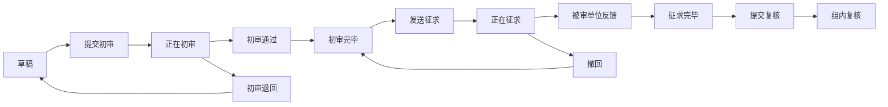
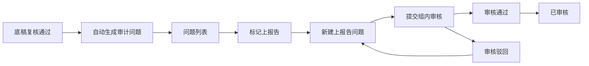
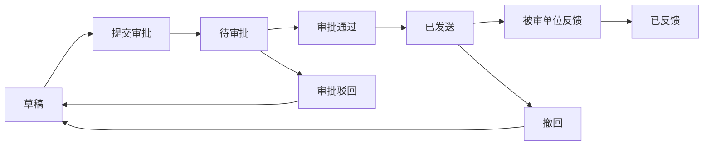
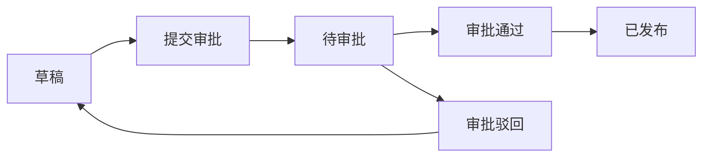
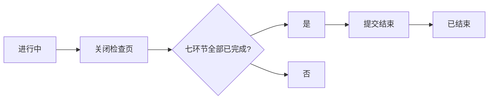
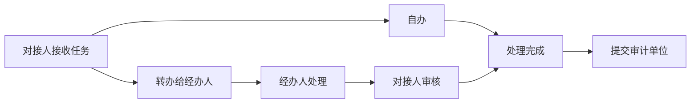

# 审计管理系统产品需求文档

> 版本：v2.3
> 状态：评审稿
> 基于 design.md v1.0

---

## 一、文档概述

### （一）项目背景

广西交投集团审计管理系统（产品化版本）一期建设，覆盖审计计划、项目启动、审计准备、审计实施、审计报告、审计反馈、审计总览、审计知识库、项目档案、系统管理共 10 个模块，合计 54 个页面。纯 PC 端，不对接 OA 和移动端。

### （二）建设目标

1. 审计全流程线上化：计划、启动、准备、实施、报告、整改跟踪、归档全阶段纳入系统管理。
2. 审计单位与被审单位在线协同：通过独立登录入口和任务推送，实现承诺书签署、资料提交、底稿反馈、报告意见、整改结果在线交互。
3. 产品化架构：组织机构、审批流程、数据字典等基础能力灵活配置。
4. 统一首页总览：为审计人员和被审单位分别提供项目看板。
5. 审批流程灵活配置：图形化审批流程设计器，支持条件分支、会签、加签、驳回。
6. 问题整改闭环追踪：问题发现、上报告、征求意见、正式报告、整改反馈完整生命周期管理。

---

## 二、范围

### （一）范围内

本系统共包含 10 个功能模块，合计 54 个页面。

| 模块 | 页面名称 | 页面类型 | 核心用途 |
|------|----------|----------|----------|
| 审计计划 | 年度计划列表 | 列表 | 按年度查看审计计划，支持新建和筛选 |
| 审计计划 | 年度计划详情 | 详情 | 查看计划基本信息和包含的审计项目列表 |
| 审计计划 | 计划新建/编辑 | 表单 | 新建或编辑年度计划，添加/修改计划内审计项目；已通过后的再次编辑按年度计划变更处理 |
| 审计计划 | 计划审批 | 表单 | 审批人查看计划详情并执行审批操作 |
| 项目启动 | 项目列表 | 列表 | 查看所有审计项目，支持按状态和计划筛选 |
| 项目启动 | 项目详情 | 详情 | 查看项目信息、成员、对接人和项目状态 |
| 项目启动 | 项目编辑 | 表单 | 填写项目信息、添加成员和对接人 |
| 审计准备 | 准备项目列表 | 列表 | 查看参与项目，5项准备材料完成状态一目了然 |
| 审计准备 | 实施方案编辑 | 表单 | 编辑实施方案，支持多次修改重提 |
| 审计准备 | 审计通知书 | 表单 | 制作审计通知书，保存后即可发送给被审计单位 |
| 审计准备 | 进点会记录 | 表单 | 记录进点会信息，保存即完成 |
| 审计准备 | 承诺书管理 | 组合 | 管理承诺书及跟踪各被审单位签署情况 |
| 审计准备 | 资料清单列表 | 列表 | 查看已发送的资料清单，支持按状态筛选 |
| 审计准备 | 资料清单编辑 | 列表+弹窗 | 查看和管理资料清单条目，支持按状态/名称/对接人筛选，新增/修改/删除资料项，发送/撤回，查看被审单位上传的资料详情 |
| 审计实施 | 实施项目列表 | 列表 | 查看"进行中"项目，选择进入底稿作业 |
| 审计实施 | 底稿列表 | 列表 | 查看底稿，支持筛选、批量操作 |
| 审计实施 | 底稿编辑 | 表单 | 录入或编辑审计底稿 |
| 审计实施 | 底稿详情 | 详情 | 查看底稿详情、审核记录和反馈意见 |
| 审计实施 | 问题列表 | 列表 | 汇总审计问题，支持筛选和选定进入详情 |
| 审计实施 | 问题详情 | 详情/表单 | 查看和编辑问题详细信息，提交/撤回上报告 |
| 审计实施 | 上报告问题列表 | 列表 | 管理已提交上报告的问题，支持筛选、批量操作 |
| 审计实施 | 上报告问题详情 | 详情/表单 | 填写整改要求后提交整改，记录数据流转信息 |
| 审计实施 | 问题沟通会 | 表单 | 记录与被审单位的问题沟通会 |
| 审计报告 | 报告项目列表 | 列表 | 查看"进行中"项目，列表中直接展示各环节（征求意见稿、正式报告、关闭检查）状态标签，点击状态进入对应页面操作 |
| 审计报告 | 报告列表 | 列表 | 展示当前项目的征求意见稿和正式报告列表，通过类型标签区分；支持新建、查看、发送、撤回、删除 |
| 审计报告 | 报告编辑 | 表单 | 新建或编辑审计报告（征求意见稿/正式报告），填写报告标题、送达信息、报告正文等 |
| 审计报告 | 报告详情 | 详情 | 查看报告详情，含被审单位反馈意见楼层，支持回复和撤回；正式报告展示关联的上报告问题 |
| 审计报告 | 关闭检查 | 表单 | 查看项目基本信息，按环节（实施方案、审计通知书、审计承诺书、审计资料清单、审计底稿、上报告问题、审计报告）逐项检查内容/附件，标记已确认并上传遗漏附件，提交项目结束 |
| 审计反馈 | 反馈首页 | 看板 | 被审单位待办列表和整改台账统计 |
| 审计反馈 | 承诺书签署 | 表单 | 在线签署承诺书或上传签署版附件 |
| 审计反馈 | 资料提交 | 列表+弹窗 | 按资料清单逐条查看待提交资料，支持上传/下载/查看已提交资料详情，查看资料提交状态 |
| 审计反馈 | 底稿意见反馈 | 表单 | 对审计底稿反馈意见 |
| 审计反馈 | 报告意见 | 表单 | 对征求意见稿反馈意见 |
| 审计反馈 | 整改反馈 | 表单 | 提交整改结果 |
| 审计反馈 | 任务转办 | 表单 | 转办待办任务给经办人 |
| 审计总览 | 审计单位首页 | 看板 | 审计人员项目阶段分布、待办提醒、年度计划进度 |
| 审计总览 | 被审单位首页 | 看板 | 被审单位待配合事项、整改项目概览、整改统计 |
| 审计知识库 | 审计检查项列表 | 列表 | 审计检查项的配置管理 |
| 项目档案 | 项目档案列表 | 列表 | 查看所有项目档案 |
| 项目档案 | 项目档案详情 | 详情 | 查看项目信息、状态、实施阶段 |
| 系统管理 | 组织机构树 | 列表 | 多级部门结构管理 |
| 系统管理 | 用户列表 | 列表 | 系统用户管理 |
| 系统管理 | 角色列表 | 列表 | 角色权限配置 |
| 系统管理 | 审批流程配置 | 表单 | 配置各业务模块的审批流程 |
| 系统管理 | 审批流程设计器 | 表单 | 图形化设计审批流程节点、条件分支、会签等 |
| 系统管理 | 数据字典 | 列表 | 管理系统枚举值和数据字典 |
| 系统管理 | 菜单管理 | 列表 | 管理系统菜单结构 |
| 系统管理 | 操作日志 | 列表 | 查看用户操作记录 |
| 系统管理 | 登录日志 | 列表 | 查看用户登录记录 |
| 系统管理 | 审批流程列表 | 列表 | 审批流程管理入口 |
| 系统管理 | 年度规划设置 | 配置 | 年度规划参数配置 |
| 系统管理 | 数据请求配置 | 配置 | 数据资料请求模板配置 |

### （二）范围外

OA 对接、移动端、底稿批量导入的具体文件格式（一期待确认）、在线批注功能（待研发评估）。

---

## 三、业务流程

### 流程一：审计项目全流程

1. 审计用户（项目组员）填报年度计划，提交审批（公司管理员/集团管理员审核→集团领导/公司领导审批）。
2. 审批通过后，计划状态变为"已通过"，审计项目自动同步到项目启动列表。
3. 项目组长填写项目详细信息、添加成员和对接人，确认启动，项目状态变为"进行中"。
4. 审计人员在准备项目列表页查看5项准备材料的完成状态，点击对应材料进入编辑页。每项材料支持多次修改重提。
5. 准备工作完成后，项目状态保持"进行中"。
6. 审计用户（项目组员）录入底稿（一条底稿对应一个问题），提交组内初审；初审通过后发送给被审单位征求意见；收到反馈后主审进行组内复核。
7. 审计人员进入问题列表页查看所有问题，选定问题进入详情页进行问题定性和上报告标记。
8. 审计人员在报告项目列表页查看各环节状态，点击征求意见稿状态进入报告列表，新建征求意见稿并发送给被审单位收集意见。
9. 收集并确认采纳意见后，编制正式审计报告并发布，项目状态保持"进行中"。
10. 项目组长在报告项目列表页点击关闭检查状态进入关闭检查页，按环节逐项检查确认后提交项目结束，项目状态变为"已结束"。

### 流程二：被审单位协同反馈

1. 被审单位用户（对接人）通过独立登录页进入系统。
2. 在反馈首页查看待办列表和整改台账统计。
3. 接收任务（承诺书签署、资料提交、底稿意见、报告意见、整改反馈），可转办给具体经办人。
4. 经办人处理完成后，任务回到对接人处审核。对接人统一审核后提交给审计单位。

### 流程三：审批流程

1. 用户提交审批申请（年度计划、底稿、报告等）。
2. 系统根据业务类型匹配审批流程模板，创建审批流程实例。
3. 审批人收到待办通知，执行通过/驳回/转办。
4. 支持条件分支、会签、加签、驳回。所有节点通过后，流程结束，业务对象状态更新。

### 流程四：底稿作业流程

1. 审计用户（项目组员）录入底稿（单条录入或批量导入），状态为"草稿"。
2. 经办人提交组内初审，状态变为"正在初审"。
3. 项目组长/主审初审：通过→"初审完毕"；退回→"草稿"，经办人修改后重新提交。
4. 初审完毕后，经办人将底稿发送给被审单位征求意见，状态变为"正在征求"。
5. 被审单位通过审计反馈模块反馈意见（无异议/有异议），附说明和附件。
6. 征求意见期间，经办人可撤回底稿：状态回到"初审完毕"，填写撤回原因，修改后重新发送。
7. 被审单位反馈后状态变为"征求完毕"；经办人也可手动标记征求完毕。
8. 主审进行组内复核，记录复核意见和是否采纳反馈，状态变为"组内复核"，底稿作业完成。
9. 复核后如需进一步沟通，可退回征求意见（状态回到"正在征求"），重新反馈后再次复核。

---

## 四、角色与权限

### （一）三层权限模型

本系统采用三层权限模型：**系统管理角色 + 业务角色 → 用户类型 → 项目身份**，分别控制系统级、模块级和操作级权限。

#### 1. 系统管理角色（系统级，登录后固定，负责人员和系统配置管理）

| 角色 | 职责 | 管理范围 |
|------|------|----------|
| 系统管理员 | 全系统配置、用户管理、角色分配 | 全部数据 |
| 集团管理员 | 管理集团本部全部部门人员（含审计部和其他部门）、审批流程配置 | 集团本部所有部门 |
| 公司管理员 | 管理本公司全部部门人员、审批流程配置 | 本公司所有部门 |
| 普通用户 | 使用业务功能 | 根据业务角色和所属机构决定 |

#### 2. 业务角色（系统级，决定可访问的业务模块和数据范围）

| 角色 | 说明 | 数据范围 |
|------|------|----------|
| 集团领导 | 查看全集团审计业务数据 | 全集团审计项目+被审计数据 |
| 公司领导 | 查看本公司审计业务数据 | 本公司审计项目+被审计数据 |
| 审计用户 | 审计部门正式员工，可参与审计业务 | 按所属机构决定（见数据范围判定规则） |
| 外包审计用户 | 外部审计公司人员，仅能参与被分配的项目 | 仅被分配项目 |
| 被审单位用户 | 被审单位人员，仅在审计反馈模块操作 | 本单位相关项目 |

> 一个用户可同时拥有多个角色（如子公司高层可同时是"公司管理员"+"公司领导"；子公司审计人员被集团审计时，既是"审计用户"又是"被审单位用户"）。多身份用户登录后可在首页顶部切换视角。

#### 3. 用户类型（系统级，可多选）

| 用户类型 | 说明 |
|----------|------|
| 审计用户 | 审计部门正式员工，可参与全部审计业务 |
| 外包审计用户 | 外部审计公司人员，仅能参与被分配的项目 |
| 被审单位用户 | 被审单位人员，仅在审计反馈模块操作 |

#### 4. 项目身份（项目级，在每个项目中指定）

| 用户类型 | 可分配的项目身份 |
|----------|------------------|
| 审计用户 | 项目组长、项目主审、项目组员 |
| 外包审计用户 | 项目组长、项目主审、项目组员 |
| 被审单位用户 | 对接人（项目启动/审计准备阶段指定）、经办人（通过转办任务产生） |

### （二）数据范围判定规则

| 业务角色/用户类型 | 所属机构 | 数据范围 |
|-------------------|----------|----------|
| 集团领导 | - | 全集团审计项目+被审计数据（只读） |
| 公司领导 | - | 本公司审计项目+被审计数据（只读） |
| 审计用户 | 集团审计部 | 全集团审计项目（集团+所有子公司） |
| 审计用户 | 子公司审计部 | 本公司审计项目 |
| 审计用户 | 非审计部门 | 仅个人参与项目 |
| 外包审计用户 | - | 仅被分配项目 |
| 被审单位用户 | - | 本单位相关项目 |

### （三）模块级权限矩阵

| 模块 | 集团领导 | 公司领导 | 审计用户 | 外包审计用户 | 被审单位用户 |
|------|----------|----------|----------|-------------|-------------|
| 审计计划 | ✅ 全集团只读 | ✅ 本公司只读 | ✅ 按数据范围 | ✅ 仅被分配项目 | ❌ |
| 项目启动 | ✅ 全集团只读 | ✅ 本公司只读 | ✅ 按数据范围 | ✅ 仅被分配项目 | ❌ |
| 审计准备 | ✅ 全集团只读 | ✅ 本公司只读 | ✅ 按数据范围 | ✅ 仅被分配项目 | ❌ |
| 审计实施 | ✅ 全集团只读 | ✅ 本公司只读 | ✅ 按数据范围 | ✅ 仅被分配项目 | ❌ |
| 审计报告 | ✅ 全集团只读 | ✅ 本公司只读 | ✅ 按数据范围 | ✅ 仅被分配项目 | ❌ |
| 审计反馈 | ✅ 全集团只读 | ✅ 本公司只读 | ❌ | ❌ | ✅ 本单位 |
| 审计知识库 | ✅ | ✅ | ✅ | ✅ | ❌ |
| 审计总览 | ✅ 全集团 | ✅ 本公司 | ✅ | ✅ | ✅ |
| 项目档案 | ✅ 全集团只读 | ✅ 本公司只读 | ✅ 按数据范围 | ✅ 仅被分配项目 | ❌ |
| 系统管理 | ❌ | ❌ | 仅管理员 | ❌ | ❌ |

### （四）项目内操作权限

| 操作 | 项目组长 | 项目主审 | 项目组员 | 对接人 | 经办人 |
|------|----------|----------|----------|--------|--------|
| 编辑项目信息 | ✅ | ✅ | ❌ | ❌ | ❌ |
| 管理成员 | ✅ | ✅ | ❌ | ❌ | ❌ |
| 录入底稿 | ✅ | ✅ | ✅ | ❌ | ❌ |
| 初审底稿 | ✅ | ✅ | ❌ | ❌ | ❌ |
| 复核底稿 | ✅ | ✅ | ❌ | ❌ | ❌ |
| 编辑报告 | ✅ | ✅ | ✅ | ❌ | ❌ |
| 发布报告 | ✅ | ✅ | ❌ | ❌ | ❌ |
| 签署承诺书 | ❌ | ❌ | ❌ | ✅ | ❌ |
| 提交资料 | ❌ | ❌ | ❌ | ✅ | ✅（转办） |
| 反馈底稿意见 | ❌ | ❌ | ❌ | ✅ | ✅（转办） |
| 反馈报告意见 | ❌ | ❌ | ❌ | ✅ | ✅（转办） |
| 提交整改 | ❌ | ❌ | ❌ | ✅ | ✅（转办） |

### （五）业务角色名称映射

详细需求说明中使用的业务友好角色名称与三层权限模型的映射关系：

| 业务角色名称 | 对应权限模型 |
|--------------|-------------|
| 审计经办人 | 审计用户 + 项目组员 |
| 项目组长/主审 | 审计用户 + 项目组长/主审 |
| 部门负责人 | 集团管理员/公司管理员 |
| 分管领导 | 集团领导/公司领导 |
| 被审单位对接人 | 被审单位用户 + 对接人项目身份 |
| 被审单位经办人 | 被审单位用户 + 经办人（通过转办任务产生） |

### （六）字段级权限例外

底稿列表页：经办人对状态、编制日期、初审时间只读；组长/主审对状态只读（流程驱动）。

底稿编辑页：经办人对初审意见、复核意见、是否采纳反馈只读。

问题详情页：经办人对底稿类型、底稿名称、问题名称、具体问题、处理建议只读（从底稿带入）；对问题定性、涉及金额、整改意见可编辑。

上报告问题详情页：经办人对问题类型、问题名称可编辑（手动填写）；被审计单位从项目自动带入；存在问题必填；对整改要求可编辑（提交整改时必填）；对提交人、提交时间、审批人等数据流转字段只读。

报告编辑页：经办人对报告编号只读；报告类型=正式报告时主送组织、抄送组织、发送清单、密级、关联上报告问题、修订说明可编辑；报告类型=征求意见稿时征求对象、反馈截止日期可编辑；关联上报告问题、密级、修订说明在征求意见稿时隐藏。

承诺书签署页：对接人对承诺书内容只读；对签署人、签署时间、签署文件可编辑。

整改反馈页：经办人对整改状态、整改期限只读；对整改措施、整改结果说明、整改报告可编辑；审批记录只读。

报告编辑页：经办人对报告编号只读；待审批状态时经办人不可编辑，项目组长/主审可填写审批意见并通过/驳回。
报告详情页：经办人对基本信息、送达信息、报告内容、附件全部只读；反馈人、反馈意见、反馈附件、反馈时间为被审单位填写，审计单位只读；回复人自动带出当前用户不可修改；回复意见、回复附件可编辑（在查看详情弹窗中填写，仅征求意见稿时显示反馈区）。

关闭检查页：项目组长/主审对项目信息（项目编号、名称、审计类型、被审单位、组长、主审）只读；七环节检查清单全部只读（系统自动判定已完成/未完成）；档案归档字段（编制日期、档案编号、保管期限）可编辑。

## 五、详细需求说明

### （一）审计计划模块

负责年度审计计划的编制、审批和变更，包含 7 个页面。

#### 年度计划列表页

页面顶部为筛选栏，下方为计划列表。列表按创建时间倒序，每页 20 条。

（1）筛选年度计划

筛选栏提供计划年度下拉、计划类型下拉（初始规划/年度计划变更）、状态下拉（草稿/待审批/已通过/执行中/已完成/已驳回），多条件组合后点击"查询"触发搜索。列表展示计划名称（超长截断 20 字符，悬停展示全文）、计划年度、计划类型、计划版本、项目计划数、未执行数、在执行数、已关闭数、状态标签。状态标签配色：草稿/已驳回灰色，待审批橙色，已通过/执行中绿色，已完成蓝色。无数据时显示"暂无计划数据"。加载失败显示"加载失败，点击重试"，点击后重新请求接口。

（2）新建计划

"新建计划"按钮仅审计用户（项目组员）和项目组长/主审可见。点击后进入计划编辑页，分两步完成计划新建。

（3）编辑计划

草稿和已驳回状态的行显示"编辑"链接，点击跳转计划编辑页并加载已有数据。已通过/执行中/已完成状态不再提供普通编辑入口，需走年度计划变更流程。

（4）提交审批

草稿和已驳回状态的行显示"提交审批"链接。提交前校验计划名称非空且至少包含一个审计项目，校验失败在列表顶部弹出提示"计划名称不能为空"或"请至少添加一个审计项目"。提交成功则计划状态变为"待审批"，行内"编辑""删除"链接消失。网络异常导致提交失败时提示"提交失败，请重试"，状态不变。

（5）删除计划

草稿和已驳回状态的行显示"删除"链接。点击弹出确认弹窗，标题"确认删除"，正文"删除后不可恢复，是否确认删除？"，按钮"取消""确认"。确认后调用删除接口，成功则行从列表移除，失败弹出"删除失败，请重试"。已通过/执行中/已完成/待审批状态无"删除"入口。

#### 年度计划详情页

页面从上到下依次为基本信息区、审计背景区、人员信息区、计划统计区、审计项目列表区、审批记录区、版本历史区。

（1）查看计划信息

· 基本信息区：计划名称、计划年度、计划类型、计划版本、是否当前执行版本（"是"/"否"标签）、编制部门、编制人、创建时间、更新时间、状态，全部只读
· 审计背景区：背景、指导思想、工作目标，长文本完整展示，超过 3 行高度时出现纵向滚动条
· 人员信息区：计划组员（逗号分隔姓名）、填报人、填报日期
· 计划统计区：项目计划数、未执行数、在执行数、已关闭数，系统自动计算，数字为可点击链接，点击后筛选下方审计项目列表
· 审计项目列表区：状态、项目名称、审计类型、被审单位、项目级别、审计期间，每页 20 条分页
· 审批记录区：提交审批后显示，时间线形式展示审批节点名称、审批人姓名、审批时间、审批意见
· 版本历史区：该年度所有版本的修订历史，按时间倒序展示版本号、变更人、变更时间

（2）编辑/提交审批/年度计划变更

草稿和已驳回状态显示"编辑""提交审批"按钮，点击分别跳转计划编辑页和触发提交审批。已通过/执行中/已完成状态显示"年度计划变更"按钮，点击后跳转计划编辑页，计划类型自动置为"年度计划变更"，用户可新增或停止审计项目，修改后需重新提交审批。

#### 计划编辑页

本页用于新建或编辑年度计划。新建时采用向导模式分两步完成（填写基本信息→添加审计项目），编辑时在同一页面内完成所有操作。页面字段结构与年度计划详情页保持一致，按基本信息区、审计背景区、人员信息区、计划统计区、审计项目列表区、备注区组织。编辑模式下审批记录区和版本历史区只读展示。

（1）填写计划信息

新建模式第一步和编辑模式共用同一表单：
· 基本信息区：计划名称（必填，最大 100 字符，实时校验，超限显示"已超出限制"）、计划年度（必填，年度选择器）、计划类型（新建时默认"初始规划"只读；编辑时保持原值只读；年度计划变更时自动置为"年度计划变更"只读）
· 审计背景区：审计背景、指导思想、工作目标（选填，富文本输入，最大 2000 字符，底部字数统计）
· 人员信息区：计划组员（选填，人员多选组件，支持按姓名搜索，选中后以标签展示，可点击"x"移除）；填报人、填报日期只读
· 计划统计区：项目计划数、未执行数、在执行数、已关闭数（系统自动计算，只读）
· 审批记录区：编辑模式下已有审批记录时按时间线只读展示审批节点名称、审批人姓名、审批时间、审批意见
· 版本历史区：编辑模式下已有版本时按时间倒序展示版本号、变更人、变更时间
· 备注区：备注可编辑，文本域，最大 1000 字符
· 附件区：相关附件（选填，多文件上传，单文件≤100M）

新建模式下点击"保存草稿"校验计划名称非空，通过后保存并跳转年度计划列表页。点击"下一步：添加项目"进入第二步。编辑模式下点击"保存草稿"直接保存。

（2）管理审计项目

新建模式第二步和编辑模式共用同一项目列表。列表展示已添加的审计项目：状态、项目名称、审计类型、被审单位、项目级别、审计期间，每页 20 条。无项目时显示"暂无项目，请添加"。

编辑态下列表行尾补充"新增项目""停止项目""编辑项目"入口。点击"新增项目"跳转审计项目新建页，填写完成后返回本页，列表刷新。年度计划变更模式下停止既有项目时操作类型切换为"停止"，必须填写变更原因（最大 500 字符）。初始规划模式不显示变更字段。项目状态、计划统计和版本历史在当前页面联动刷新。

新建模式下点击"上一步"返回基本信息填写。

（3）保存草稿/提交审批

点击"保存草稿"校验计划名称非空，通过后保存草稿。点击"提交审批"校验计划名称非空且至少包含一个项目，校验失败分别提示"计划名称不能为空"或"请至少添加一个审计项目"。校验通过后计划状态变为"待审批"，弹出"已提交审批"提示，2 秒后跳转年度计划详情页。年度计划变更模式下提交按新版本进入审批，计划类型保持"年度计划变更"。点击"取消"放弃修改返回详情页，未保存内容不保留。网络异常提示"提交失败，请重试"，已填写内容保留。

#### 计划审批页

页面展示计划全部信息（只读），底部为审批操作栏。

（1）查看审批信息

所有字段只读。审批记录区展示全部审批节点历史，时间线形式。计划统计数字可点击筛选下方审计项目列表。

（2）执行审批操作

页面底部固定审批操作栏：审批意见文本域（必填，最大 1000 字符，底部字数统计）、"驳回"按钮（红色）、"通过"按钮（蓝色）。点击"驳回"时校验审批意见非空，空时提示"驳回时必须填写审批意见"。通过后计划状态变为"已通过"，计划内"待启动"状态的审计项目自动同步到项目启动列表，按钮置灰显示"审批已完成"。驳回后状态变为"已驳回"。网络异常提示"操作失败，请重试"。

#### 审计项目新建页

本页用于在计划编辑中新增审计项目，填写项目基本信息、审计信息和项目属性。

（1）填写项目信息

· 基本信息：项目名称（必填，最大 200 字符）、项目类型（必填，下拉选择，枚举同审计项目数据字典）、审计类型（必填，下拉选择）、被审单位（必填，组织选择器）、项目级别（必填，下拉选择：重大项目/常规项目/其他）、审计期间（选填，起止日期选择器）
· 审计信息：审计方式（选填，自行审计/协同审计/全部外包/联审）、审计领域（选填，下拉选择）、版块业态（选填，下拉选择）、业务领域（选填，下拉选择）
· 项目属性：完成形式（选填，下拉选择）
· 人员安排：项目组长（选填，人员选择器）、项目主审（选填，人员选择器）

（2）保存项目

点击"保存"校验项目名称、项目类型、审计类型、被审单位、项目级别非空，校验失败在对应字段下方显示提示。校验通过后保存项目并返回计划编辑页，审计项目列表刷新。点击"取消"放弃填写返回计划编辑页。

#### 审计项目详情页

本页用于查看审计项目完整信息，所有字段只读。

（1）查看项目信息

页面按分区展示项目全部信息：
· 基本信息：项目名称、项目类型、审计类型、被审单位、项目级别、审计期间
· 审计信息：审计方式、审计领域、版块业态、业务领域
· 项目属性：完成形式
· 人员安排：项目组长、项目主审
· 附件区：项目相关附件列表，支持下载

#### 审计项目编辑页

本页用于编辑已有审计项目信息，字段与审计项目新建页一致。

（1）编辑项目信息

页面加载已有项目数据，各字段可编辑。修改后点击"保存"校验必填项，校验通过后保存并返回计划编辑页。点击"取消"放弃修改返回计划编辑页，未保存内容不保留。

### （二）项目启动模块

负责审计项目的立项、成员管理和对接人指定，包含 3 个页面。

#### 项目列表页

页面顶部为筛选栏，下方为项目列表。列表按创建时间倒序，每页 20 条。

（1）筛选项目

筛选栏提供项目编号输入、项目名称输入（模糊匹配）、审计类型下拉、状态下拉。列表展示项目编号、项目名称（超长截断）、审计类型、项目组长、项目主审、被审单位、状态标签。无数据时显示"暂无项目数据"。

（2）编辑项目

待启动状态的行显示"编辑"链接，点击跳转项目编辑页。其他状态无"编辑"入口。

（3）启动项目

待启动状态的行显示"启动项目"按钮。点击弹出确认弹窗"确认启动该项目？启动后项目进入准备阶段"，确认后项目状态变为"进行中"，页面刷新。启动失败提示"启动失败，请重试"。

#### 项目详情页

页面分为基本信息区、审计信息区、项目属性区、人员信息区、项目成员列表区、审批记录区。

（1）查看项目信息

· 基本信息区：项目编号、名称、审计类型、状态
· 审计信息区：审计期间、完成形式、审计方式、审计目标、审计重点、立项依据，长文本完整展示
· 项目属性区：项目级别、审计领域、版块业态、业务领域
· 人员信息区：被审单位用户（对接人）、内部项目组员（逗号分隔姓名）、项目组长、项目主审、副组长
· 项目成员列表区：成员姓名、项目角色（组长/主审/组员标签）、加入时间，每页 10 条分页
· 审批记录区：提交审批后显示，时间线形式

所有字段只读。点击成员姓名弹出成员详情悬浮卡。

（2）终止项目

页面右上角"终止项目"按钮任意状态可见。点击弹出确认弹窗，必填终止原因（最大 500 字符），确认后项目状态变为"已终止"，所有操作入口关闭。终止操作不可逆。

#### 项目编辑页

页面分为基本信息区、审计信息区、项目属性区、人员信息区、外部协作区、对接人区、附件区。

（1）填写项目信息

· 基本信息：项目名称（必填，从年度计划带入可修改）、计划年度（必填，只读）、审计类型（必填，从年度计划带入可修改）、被审单位（必填，从年度计划带入可修改）
· 审计信息：审计期间（选填）、完成形式（选填）、审计方式（选填）、审计单位（必填）、审计目标/审计重点/立项依据（选填，文本域）
· 项目属性：项目级别/审计领域/版块业态/业务领域（选填，下拉）
· 人员信息：内部项目组员（选填）、项目组长（必填）、项目主审（必填）、项目副组长（选填）
· 外部协作：中介机构（选填）、中介其他（选填）
· 对接人：被审单位用户（对接人）（选填）
· 附件区：相关附件，多文件上传，单文件≤100M

（2）保存

点击"保存"校验项目组长和项目主审非空，失败时对应字段边框变红并显示"必填项"。保存成功跳转详情页并弹出"保存成功"提示。

### （三）审计准备模块

#### 模块流程与状态变化

5项准备材料各自有独立的编制→审批/发送→完成流程，完成后仍可修改并重新提交。

**各材料状态流转：**

· 实施方案：编制人填写并提交审核→审批人审核通过→状态变为“已通过”。审核驳回时回退为草稿。
· 审计通知书：编制人保存后直接发送给被审计单位，状态变为“已发送”。
· 进点会记录：编制人保存后状态变为“已完成”，如有修改在详情页点击修改按钮编辑后重新保存。
· 承诺书：编制人发出承诺书→被审单位逐一签署→全部签署完成后状态变为“已完成”。
· 资料清单：编制人发送清单→被审单位提交资料→全部提交完成后状态变为“已提交”。

负责 5 项准备材料（实施方案、通知书、进点会、承诺书、资料清单）的编制，包含 6 个页面。每项材料完成后仍可进入修改。

#### 准备项目列表页

页面顶部为筛选栏，下方为项目列表。列表仅展示当前用户参与且状态为"进行中"的项目，每页 20 条。

（1）筛选参与项目

筛选栏提供计划年度、项目名称、审计类型、被审单位。列表展示计划年度、项目名称、被审单位、实施方案状态、通知书状态、进点会状态、承诺书状态、资料清单状态。每项材料状态以彩色标签展示（未开始灰色，进行中橙色，已完成绿色）。无数据时显示"暂无进行中的项目"。

（2）进入材料编辑

点击材料状态标签跳转到对应材料编辑页。未开始进入空表单，进行中进入已有数据，已完成进入可编辑模式。点击项目名称跳转项目详情页。

#### 实施方案编辑页

页面分为基本信息区和附件区。

（1）填写实施方案

· 基本信息：方案名称（必填，最大 200 字符）、被审单位/项目组长/项目主审（从项目带入只读）、审计部门（当前用户所属部门只读）、项目名称/审计类型/项目编号（关联带出只读）
· 附件区：多文件上传，单文件≤100M

（2）保存草稿/提交审核

点击"保存草稿"校验方案名称非空，状态保持"起草中"。点击"提交审核"校验方案名称非空，校验通过后状态变为"待审核"进入审批流程。审批通过后状态变为"已通过"，方案生效；审批驳回后状态变为"已驳回"，可修改后重新提交审核。已通过的方案可再次进入修改，修改后需重新提交审核。

#### 审计通知书页

页面分为基本信息区、送达组织区、发送人员区、通知内容区、附件区。

（1）制作通知书

· 基本信息：通知书编号（自动生成 TZ-YYYY-NNN，只读）、通知书名称（必填，最大 200 字符）、被审单位（必填，从项目带入只读）
· 送达组织：主送组织（必填，多选组织）、抄送组织（选填）
· 发送人员：发送清单人员（选填，人员多选）
· 通知内容（必填，富文本编辑器）
· 附件区：多文件上传，用于上传正式发文扫描件

（2）保存草稿/发送

点击"保存草稿"状态保持"起草中"。点击"发送"校验通知书名称、被审单位、主送组织、通知内容非空，校验通过后状态变为"已发送"，直接发送给被审计单位。已发送的通知书可再次修改，修改后需重新发送。

#### 进点会记录页

页面分为基本信息区、参会信息区、会议内容区、附件区。

（1）记录进点会信息

· 基本信息：项目名称/审计类型/项目编号（自动带出只读）、会议主题（必填，最大 200 字符）、会议时间（必填，日期时间选择器）、被审单位（必填，只读）、会议地点（选填，最大 200 字符）
· 参会信息：参会人员（必填，文本域，最大 1000 字符）
· 会议内容（必填，富文本编辑器）
· 附件区：多文件上传

（2）保存

点击"保存"校验必填字段，校验通过后状态变为"已完成"，记录生效。已完成的记录在详情页点击"修改"按钮进入编辑状态，修改后重新保存。

#### 承诺书管理页

页面分为基本信息区、对接人区、附件区、签署情况列表区。

（1）编辑承诺书

· 基本信息：项目名称/审计类型/项目编号（自动带出只读）、被审单位（必填，最大 200 字符）、承诺书内容（必填，富文本编辑器）
· 对接人：审计单位接口人（必填，人员选择器）
· 附件区：多文件上传

（2）查看签署情况

页面下方签署情况列表逐行展示被审单位用户（对接人）、被审单位、签署方式（线上签署/附件签署）、签署状态（待签署灰色/已签署绿色/已过期红色）、签署时间、签署文件链接。签署方式根据对接人是否有系统账号自动判定：有账号显示线上签署并展示倒计时天数，无账号显示附件签署并展示上传入口。

（3）保存草稿/发送签署

点击"保存草稿"状态保持"草稿"。点击"发送签署"自动为有账号的被审单位用户（对接人）生成签署任务，状态变为"已发出"。已发出的承诺书可再次修改，修改后重新发送，已完成的签署记录不受影响。

#### 资料清单页

页面分为基本信息区、对接人区、资料项表格区、提交要求区、附件区。

（1）编辑资料清单

· 基本信息：清单名称（必填，最大 200 字符）、项目名称/审计类型/项目编号（自动带出只读）、需求名称（选填，下拉可预设模板）
· 对接人：审计单位接口人/被审单位用户（对接人）（选填）
· 资料项表格：资料名称（必填）、份数（必填，正整数输入）、说明（选填），可动态增删行，至少保留一行
· 提交截止日期（选填，日期选择器）
· 附件区：多文件上传

（2）保存/发送

点击"保存"状态保持"待提交"。点击"发送"将资料清单发送给被审单位，清单整体状态变为"已发送"。被审单位部分提交后状态变为"部分提交"，全部提交后变为"已提交"。审计单位可退回已提交的资料，退回后状态回退。已发送的清单可撤回至"待提交"状态重新修改。

#### 资料清单编辑页

（1）查看资料清单列表

页面展示当前项目资料清单列表。列表包含：序号、资料名称、被审单位用户（对接人）、审计单位对接人、详细说明、资料状态（未上传/已上传/已退回）、资料清单（文件下载链接）、操作列。支持按资料状态、资料名称、详细说明、被审单位用户（对接人）筛选。操作列包含：修改、删除、发送、撤回按钮。

（2）新增资料

点击"新增资料"按钮，弹出新增资料弹窗：资料名称（必填）、审计单位对接人（必填，人员选择）、被审单位用户（对接人）（必填，人员选择）、提交截止日期（选填，日期选择器）、详细说明（选填，多行文本）。弹窗底部有"从资料库选择"按钮（可引用已有资料模板）、"关闭"、"保存"按钮。保存后新增条目到清单列表。

（3）修改/删除

点击操作列"修改"按钮，弹出编辑弹窗，可修改资料名称、对接人、截止日期、详细说明。点击"删除"按钮可删除未发送的资料项。

（4）发送/撤回

点击"发送"按钮将该资料清单发送给被审单位，清单整体状态变为"已发送"。已发送的清单可撤回至"待提交"状态重新修改。点击"撤回"按钮可撤回已发送的资料清单。

（5）查看被审单位上传的资料详情

点击列表中的资料名称或操作列"查看详情"按钮，弹出查看上传资料详情弹窗：资料名称（只读）、被审单位用户（对接人）（只读）、审计单位对接人（只读）、提交截止日期（只读）、详细说明（只读）、已上传文件列表（文件名、上传时间、文件大小，支持预览和下载）。底部有"下载"（支持批量下载全部上传文件）和"关闭"按钮。

#### 资料清单编辑

（1）查看已发送的资料清单

页面展示当前用户发送的所有资料清单。列表包含：清单名称、项目名称、发送人、发送时间、资料状态（待提交/部分提交/已提交）、操作列。支持按清单名称、项目名称、状态筛选。

（2）查看详情

点击清单名称进入资料清单编辑页，查看和管理资料清单条目。

### （四）审计实施模块

#### 模块流程与状态变化

**底稿生命周期流程：**

**问题与上报告流程：**

**状态变化说明：**

底稿状态流转：编制人提交初审后从“草稿”进入“正在初审”，初审人通过后进入“初审完毕”，可发送给被审单位征求意见；被审单位反馈后进入“征求完毕”，组长/主审提交复核；复核通过后底稿完成，系统自动生成审计问题。初审退回或复核退回时状态回退为“草稿”。

上报告问题状态流转：编制人新建并提交审核后从“草稿”进入“待审核”，组长/主审审核通过后变为“已审核”，可提交整改；审核驳回时回退为“草稿”。

面向"进行中"项目，覆盖底稿作业、问题管理和沟通会记录，包含 9 个页面。

#### 实施项目列表页

（1）筛选进行中项目

筛选栏提供项目编号、项目名称、审计类型、被审单位输入或下拉。列表按创建时间倒序，每页 20 条，仅展示状态为"进行中"且当前用户参与的项目。展示列：项目编号、项目名称、审计类型、被审单位、项目组长、项目主审、底稿进度。底稿进度以标签展示"待开始"灰色、"进行中"橙色、"已完成"绿色，计算口径 = 组内复核状态底稿数 / 总底稿数 × 100%。无数据时显示"暂无进行中项目"。

（2）进入实施

行尾"进入实施"按钮，点击进入该项目底稿作业区，默认跳转底稿列表页。点击不改变项目状态。

#### 底稿列表页

（1）筛选底稿

筛选栏提供底稿编号输入、底稿名称输入（模糊匹配）、底稿类型下拉、编制人下拉、状态下拉、审计事项下拉。列表按创建时间倒序，每页 20 条。展示列：底稿编号、底稿名称（超长截断 30 字符，悬停显示全文）、问题标题（超长截断 30 字符）、底稿类型、编制人、编制日期、状态标签（只读，流程驱动）、审计事项。无数据时显示"暂无底稿数据，点击'新建底稿'开始录入"。

（2）新建底稿

"新建底稿"按钮任意状态下可见。点击跳转底稿编辑页。

（3）批量导入底稿

"批量导入"按钮。点击弹出文件选择对话框，支持 Excel 文件上传。上传后显示导入预览表格（行号、底稿名称、问题标题、导入状态：成功/失败），失败行标红并显示失败原因。点击"确认导入"批量生成底稿记录，状态均为"草稿"。

（4）编辑/删除底稿

草稿状态的行显示"编辑""删除"链接。点击"删除"弹出确认弹窗"删除后不可恢复"。"正在初审"/"初审完毕"/"正在征求"/"征求完毕"/"组内复核"状态仅显示"查看详情"链接。批量勾选框仅在草稿状态可用。

#### 底稿编辑页

页面分为基本信息区、问题信息区、审计依据区、审计记录区、审核记录区、附件区。

（1）填写底稿信息

· 基本信息：底稿编号（自动生成 DG-YYYY-NNN，只读）、底稿名称（必填，最大 200 字符）、底稿类型（必填，下拉）、项目编号（关联带出，只读）、项目名称（关联带出，只读）、项目类型（关联带出，只读）、被审计单位（关联带出，只读）、审计检查项（选填，关联审计检查项库搜索）、审计事项（必填，下拉）
· 问题信息：问题标题（必填，最大 200 字符）、问题描述（必填，富文本编辑器）、定性依据（选填，文本域，最大 2000 字符）、审计依据（选填，文本域，最大 2000 字符）、审计结论（选填，文本域，最大 2000 字符）、审计建议（选填，文本域，最大 2000 字符）
· 审计记录（选填，文本域，最大 5000 字符）
· 附件区：经办人附件，多文件上传，单文件≤1G
· 审批记录：审批流程配置后显示，时间线形式，仅已提交后显示

（2）保存草稿

点击"保存草稿"校验底稿名称、问题描述非空，失败时对应字段边框变红并显示"必填项"。状态保持"草稿"。

（3）提交初审

点击"提交初审"校验底稿名称、底稿类型、审计事项、问题标题、问题描述非空，校验通过后状态变为"正在初审"，提交按钮置灰，弹出"已提交初审"提示，2 秒后回到底稿列表。网络异常提示"提交失败，请重试"。

#### 底稿详情页

（1）查看底稿全貌

· 底稿信息区：底稿编号、底稿名称、底稿类型、项目编号、项目名称、项目类型、被审单位、审计检查项、审计事项、编制人、编制日期、底稿状态，全部只读
· 问题详情区：问题标题、问题描述、定性依据、审计依据、审计结论、审计建议，富文本展示
· 审计记录区：审计记录全文，只读
· 征求意见区：征求意见办理人、撤回原因、撤回时间，只读，如已撤回则显示撤回原因
· 反馈记录区：反馈人、被审单位反馈意见、征求完毕时间、被审单位附件
· 审批记录区：审批节点、审批人、审批时间、审批意见，时间线展示，审批流程配置后显示
· 附件区：附件列表含文件名、上传人、上传时间，点击下载

（2）发送征求意见

底稿状态为"初审完毕"时显示"发送征求意见"按钮（仅项目组长/主审可见）。点击弹出确认弹窗，确认后状态变为"正在征求"。

（3）撤回底稿

底稿状态为"正在征求"时显示"撤回"按钮（仅经办人可见）。点击弹出撤回原因输入框（必填，最大 500 字符），确认后状态回到"初审完毕"。

（4）复核底稿

底稿状态为"征求完毕"时显示"复核"按钮（仅主审可见）。点击弹出复核意见输入框（必填，最大 1000 字符）和是否采纳反馈单选（是/否，必填），确认后状态变为"组内复核"。

（5）退回征求意见

底稿状态为"组内复核"时显示"退回征求意见"按钮（仅主审可见）。点击后状态回到"正在征求"。

#### 问题列表页

（1）筛选问题

筛选栏提供问题名称（模糊匹配）、底稿类型、问题定性、状态、是否上报告。列表按创建时间倒序，每页 20 条。底稿初审通过后自动生成对应问题记录。展示列：问题名称、底稿类型、问题定性、状态标签、是否上报告（是/否标签）。无数据时显示"暂无问题数据"。

（2）新增无底稿关联问题

"新增问题"按钮。点击跳转问题详情页，所有字段需手动填写。

（3）批量设定上报告标记

勾选列表行后顶部操作栏出现"设为上报告""取消上报告"按钮。"设为上报告"将选中问题的"是否上报告"设为"是"；"取消上报告"设为"否"并弹出未上报告原因输入框。操作成功列表刷新。

（4）批量提交到上报告清单

勾选列表行后顶部操作栏出现"提交到上报告清单"按钮。按钮仅在至少勾选一条草稿状态问题时可用。点击后批量将选中问题状态变为"已上报告"，提示"已提交 N 条问题"。

（5）批量撤回上报告

勾选列表行后顶部操作栏出现"撤回上报告"按钮。按钮仅在至少勾选一条"已上报告"状态问题时可用。点击后批量将选中问题状态回退为"草稿"。

#### 问题详情页

（1）查看/编辑问题信息

· 基础信息区：底稿类型、底稿名称、问题名称、被审计单位，从底稿带入只读；无底稿关联的新问题需手动填写
· 问题定性区：问题定性（下拉选择）、涉及金额（数字输入，单位万元，非负，保留 2 位小数），需手动填写
· 问题信息区：底稿名称、存在问题、处理建议，从底稿带入只读；无底稿关联的新问题需手动填写

（2）设定上报告标记

页面提供是否上报告单选（是/否），选择"否"时未上报告原因文本域出现（必填，最大 500 字符），未填写时保存提示"未上报告时请填写原因"。

（3）保存/提交/撤回

点击"保存"保存为草稿。点击"提交到上报告清单"校验通过后状态变为"已上报告"，提交按钮置灰。状态为"已上报告"时显示"撤回"按钮，点击后状态回退为"草稿"。

#### 上报告问题列表页

（1）筛选上报告问题

筛选栏提供问题名称（模糊匹配）、问题类型下拉、状态下拉。列表按创建时间倒序，每页 20 条。展示用户手动新建的上报告问题。展示列：问题名称、问题类型、问题数量、被审计单位、状态标签（草稿/待审核/已审核/已提交整改）。无数据时显示"暂无上报告问题"。

（2）新建上报告问题

"新建上报告问题"按钮。点击跳转上报告问题详情页（新建模式），所有字段需手动填写，选择问题类型、填写问题名称后从列表中多选已上报告问题。

（3）审核问题

状态为"待审核"的行显示"审核"链接（仅组长/主审可见）。点击弹出审核对话框，选择"审核通过"或"审核不通过"。审核通过后问题成立，状态变为"已审核"；审核不通过则回退到"草稿"可继续编辑。

（4）批量提交整改

勾选列表行后顶部操作栏出现"批量提交整改"按钮。按钮仅在至少勾选一条"已审核"状态问题时可用。点击后跳转批量填写整改要求页面，填写完成后批量将选中问题状态变为"已提交整改"。

（5）批量撤回

勾选列表行后顶部操作栏出现"批量撤回"按钮。按钮仅在至少勾选一条"已提交整改"状态问题时可用。点击后批量将选中问题状态回退为"已审核"。

#### 上报告问题详情页

页面分为基本信息区、关联问题区、问题归纳区、整改要求区、数据流转区。

（1）新建上报告问题

进入页面为新建模式，填写以下信息：
· 基本信息区：问题类型（下拉选择，必填）、问题名称（手动填写，必填，最大 200 字符）、被审计单位（从项目自动带入，只读）
· 关联问题区：关联问题多选框，仅展示本项目内状态为"已上报告"的审计问题，支持搜索和勾选，勾选后系统自动在上方显示"已选择 N 条问题"
· 问题数量：系统自动计算，等于关联问题条数，只读显示
· 问题归纳：文本域（必填，最大 2000 字符），对所选问题的归纳总结
· 整改要求：文本域（必填，最大 2000 字符），对被审计单位的整改要求

（2）保存草稿

点击"保存"校验问题类型、问题名称、关联问题、问题归纳、整改要求非空，校验失败对应字段标红。状态保持"草稿"。

（3）提交组内审核

点击"提交组内审核"校验通过后状态变为"待审核"，提交按钮置灰，弹出"已提交审核"提示。

（4）审核问题

页面状态为"待审核"时显示"审核通过""审核不通过"按钮（仅组长/主审可见）。点击"审核通过"后状态变为"已审核"，问题成立，记录审批人和审批时间。点击"审核不通过"后状态回退为"草稿"，可继续编辑。

（5）撤回

草稿/待审核/已审核/已提交整改状态均显示"撤回"按钮。点击后：草稿状态保持不变；待审核状态回退到草稿；已审核/已提交整改状态分别回退到上一状态。撤回后弹出"已撤回"提示。

（6）提交整改

页面状态为"已审核"时显示"提交整改"按钮。点击后状态变为"已提交整改"，记录提交人和提交时间，提交按钮置灰。

#### 问题沟通会页

（1）记录沟通会信息

· 会议信息：项目编号/项目名称/项目类型/被审单位（自动带出只读）、参会人员（必填，文本域，最大 1000 字符）、会议时间（必填，日期时间选择器）
· 会议内容（必填，富文本编辑器）
· 附件区：选填，多文件上传，单文件≤100M

（2）保存

点击"保存"。可再次进入修改后重新保存。

### （五）审计报告模块

#### 模块流程与状态变化

**征求意见稿审批与反馈流程：**

**正式报告审批与发布流程：**

**关闭检查与项目结束流程：**

**状态变化说明：**

征求意见稿状态流转：编制人提交审批后进入“待审批”，项目组长/主审审批通过后系统自动发送给征求对象，状态变为“已发送”；被审单位提交反馈后状态变为“已反馈”，流程结束。审批驳回或编制人撤回时，状态回退为“草稿”。

正式报告状态流转：编制人提交审批后进入“待审批”，审批通过后报告正式发布，状态变为“已发布”，不可修改。审批驳回时状态回退为“草稿”。

关闭检查：七环节全部自动判定为“已完成”后，项目组长/主审填写归档信息并提交结束，项目状态变为“已结束”。有任一环节未完成时“提交结束”按钮置灰。

面向"进行中"项目，覆盖报告项目列表展示各环节状态、报告列表统一管理征求意见稿和正式报告、项目关闭检查与结束，包含 5 个页面。

#### 报告项目列表页

（1）筛选进行中项目

筛选栏提供项目编号、项目名称、审计类型、被审单位输入或下拉。列表按创建时间倒序，每页 20 条，仅展示状态为"进行中"且当前用户参与的项目。展示列：项目编号、项目名称、审计类型、被审单位、项目组长、项目主审、征求意见稿状态、正式报告状态、关闭检查状态。无数据时显示"暂无进行中项目"。

· 征求意见稿状态标签：待开始（灰色）/待审批（橙色）/已发送（橙色）/已反馈（绿色）
· 正式报告状态标签：待开始（灰色）/待审批（橙色）/已发布（绿色）
· 关闭检查状态标签：待检查（灰色）/已结束（绿色）

（2）点击状态进入操作

点击各状态标签直接进入对应页面操作：
· 点击"征求意见稿状态"进入报告列表页，默认筛选报告类型为"征求意见稿"
· 点击"正式报告状态"进入报告列表页，默认筛选报告类型为"正式报告"
· 点击"关闭检查状态"进入该项目的关闭检查页

点击项目名称进入项目详情页。

#### 报告列表页

（1）查看报告列表

页面顶部提供报告类型、报告标题、状态、编制人筛选栏。列表按创建时间倒序，每页 20 条，仅展示当前项目的报告记录。展示列：报告编号、报告标题、报告类型（标签：征求意见稿/正式报告）、编制人、创建时间、状态。操作列：查看详情、编辑（仅草稿状态）、提交审批（仅草稿状态）、审批（仅待审批状态，项目组长/主审）、删除（仅草稿状态）。

无数据时显示"暂无报告记录"。

（2）新建报告

点击页面顶部"新建报告"按钮，进入报告编辑页，选择报告类型（征求意见稿/正式报告）。

#### 报告编辑页

（1）选择报告类型

页面顶部选择报告类型：征求意见稿/正式报告。选择后页面字段根据类型动态变化，选择保存后不可修改。

（2）填写报告信息

· 基本信息：报告编号（自动生成，只读）、报告标题（必填，最大200字符）、项目编号（关联带出，只读）、项目名称（只读）、项目类型（只读）、被审计单位（只读）、板块业态（关联带出，只读）
· 报告正文（必填，富文本编辑器）
· 送达信息：根据报告类型动态展示
  - 征求意见稿：征求对象（必填，多选组织）、反馈截止日期（选填，日期选择器）
  - 正式报告：主送组织（必填，多选组织）、抄送组织（选填，多选组织）、发送清单（选填）
· 报告属性：密级（选填，下拉：秘密/机密/绝密，正式报告时显示）
· 关联问题（正式报告时显示）：从本项目上报告清单中选择已审核的问题，关联后问题信息可引用至报告正文
· 修订信息：修订说明（选填，最大500字符，正式报告时显示）
· 附件区：多文件上传（选填，单文件≤50MB）

（3）保存草稿/发送/发布

点击"保存草稿"校验报告标题和报告正文非空，状态保持"草稿"。

征求意见稿：点击"提交审批"校验通过后状态变为"待审批"，提交给项目组长/主审审批。审批通过后状态变为"已发送"，系统自动发送给征求对象；审批驳回后状态回退为"草稿"，驳回意见必填。

正式报告：点击"提交审批"校验通过后状态变为"待审批"，提交给项目组长/主审审批。审批通过后状态变为"已发布"，报告正式发布至主送/抄送组织，发布后不可修改；审批驳回后状态回退为"草稿"，驳回意见必填。

网络异常时提示"提交失败，请重试"。

（4）撤回（仅征求意见稿）

状态为"待审批"或"已发送"时显示"撤回"按钮。待审批时撤回取消审批流程，已发送时撤回退回征求。点击后二次确认，状态回退为"草稿"，可重新编辑后再次提交。

#### 报告详情页

（1）查看报告信息

页面从上到下展示：
· 基本信息：报告编号、报告标题、报告类型、密级、版块业态、状态，全部只读
· 送达信息：征求对象/主送组织、抄送组织、发送清单、反馈截止日期，全部只读（根据报告类型展示对应字段）
· 报告正文：富文本只读展示
· 关联问题列表（仅正式报告时显示）：只读，展示引用的上报告问题名称、问题类型、问题归纳
· 修订信息：修订说明，只读
· 附件区：附件列表含文件名、文件大小、上传时间，支持下载

（2）查看被审单位反馈（仅征求意见稿时显示）

页面下方"被审单位反馈"楼层，列表形式展示本征求意见稿的所有反馈记录。展示列：反馈人、反馈意见（截断50字符，悬停显示全文）、反馈附件（附件数量标签）、回复人（已回复时显示姓名，未回复显示"—"）、回复意见（截断50字符）、回复时间。列表按反馈时间倒序，每页20条。操作列提供"查看详情"和"撤回"（仅审计单位已回复的记录可撤回回复）。无反馈记录时显示"暂无反馈意见"。

（3）查看详情弹窗

点击列表行"查看详情"打开弹窗，分上下两区：

上半区（只读）：
· 反馈人：被审单位用户姓名
· 反馈意见：完整正文，超长文本自动换行
· 反馈附件：文件列表，每项展示文件名、文件类型、上传人、上传时间，支持下载
· 反馈时间：提交时间

下半区（审计单位回复）：
· 回复人：自动带出当前登录用户，只读不可修改
· 回复意见：文本域，最大2000字符，实时字数统计
· 回复附件：多文件上传，单文件≤50MB

弹窗底部操作按钮：
· "提交"：校验回复意见非空，通过后记录回复人（当前用户）和回复时间，列表行刷新显示回复内容
· "撤回"：已回复状态下显示，二次确认后清空回复信息，列表行回复列恢复显示"—"

同一反馈未回复时可反复填写提交；已回复后仅可撤回，不可直接修改，需撤回后重新填写。

（4）撤回回复

列表操作列"撤回"按钮，仅审计单位已回复的反馈记录可见。点击后二次确认（提示"确认撤回对该反馈的回复？"），确认后清空该条回复人、回复意见、回复附件、回复时间，列表行刷新。

（5）操作区

页面顶部操作按钮根据状态和权限展示：审批（仅待审批状态，项目组长/主审）、查看审批记录、导出、撤回（征求意见稿待审批或已发送时）。

#### 关闭检查页

面向状态为"进行中"的审计项目。项目组长/主审执行关闭检查和项目结束操作。

（1）查看项目信息

页面顶部展示项目基本信息：项目编号、项目名称、审计类型、被审单位、项目组长、项目主审，全部只读，从项目关联带出。

（2）检查清单

系统按七环节展示检查清单，每个环节自动标记“已完成”或“未完成”，无需手动确认。点击任一环节可跳转到对应页面查看详情。

| 环节 | 已完成条件 | 跳转目标 |
|------|----------|----------|
| 实施方案 | 该项目实施方案状态为已通过 | 实施方案编辑页 |
| 审计通知书 | 该项目审计通知书状态为已发送 | 审计通知书编辑页 |
| 审计承诺书 | 该项目承诺书状态为已发出 | 承诺书管理页 |
| 审计资料清单 | 该项目资料清单状态为已提交 | 资料清单编辑页 |
| 审计底稿 | 该项目所有底稿均已通过组内复核 | 底稿列表页 |
| 上报告问题 | 该项目所有上报告问题均已通过审批 | 上报告问题列表页 |
| 审计报告 | 该项目正式报告已发布 | 报告列表页 |

七环节全部已完成时，方可提交结束；有任一未完成时，“提交结束”按钮置灰，悬浮提示未完成环节名称。

（3）填写档案归档信息

· 编制日期：必填，日期选择器
· 档案编号：选填，最大100字符，项目归档档案文号
· 保管期限：必填，下拉（10年/20年/永久）

（4）归档材料信息
· 将全部已完成的各环节文档（包括审计单位上传的、被审计单位上传的）自动归集于“归档材料信息”模块，每条材料按材料分类和来源类型归类，自动归集的材料不可删除。
· 上传归档材料：除各环节自动归集的材料外，组长/主审可额外手动上传材料，点击“上传归档材料”后弹窗，选择材料分类和材料名称后上传文件（支持多文件，单文件≤50MB）。
· 归档材料列表：按列表展示材料分类、来源类型、材料名称，支持下载。自动归集的材料仅可下载不可删除；手动上传的材料可删除、下载。

（5）保存/提交结束

点击“保存”校验编制日期和保管期限非空，保存归档信息。点击“提交结束”校验七环节全部已完成且编制日期、保管期限非空，校验通过后项目状态变为“已结束”，页面提示“项目已结束”。

校验不通过时，“提交结束”按钮置灰并悬浮提示具体未完成环节。网络异常提示“提交失败，请重试”。
### （六）审计反馈模块

#### 模块流程与状态变化

**被审单位协同反馈流程：**

**状态变化说明：**

· 承诺书签署：对接人查看承诺书内容，选择在线签署或上传已签署版附件，签署后状态变为“已完成”。
· 资料提交：对接人/经办人按资料清单逐条上传，提交后状态变为“已提交”；审计方退回后状态回退为“待提交”，需重新上传。
· 底稿意见反馈：对接人/经办人对每份底稿填写反馈意见（无异议/有异议），提交后状态变为“已反馈”，不可修改。
· 报告意见反馈：对接人/经办人对征求意见稿提交反馈意见，提交后同步至审计方报告详情页。
· 整改反馈：经办人提交整改结果和措施，提交后进入审批流程，审批通过后问题自动销号。
· 任务转办：对接人将待办任务转办给被审单位内部经办人，转办后原任务人不再接收该任务。

面向被审单位人员，完成签署承诺、提交资料、反馈底稿意见、反馈报告意见、提交整改结果等操作，包含 6 个页面。

#### 反馈首页

（1）查看待办列表

登录后默认展示当前被审单位的待办事项列表，按截止时间升序。每条待办展示：事项类型（标签：签署承诺书/提交资料/反馈底稿/反馈报告/提交整改）、关联项目、截止时间、状态（待处理/处理中/已逾期）。无待办时显示"暂无待办事项"。

（2）查看整改台账统计

页面下方展示整改台账统计卡片：待整改项目数、整改中项目数、已逾期项目数、整改完成率（百分比）。点击卡片数字可跳转至整改反馈页对应筛选。

#### 承诺书签署页

（1）查看承诺书

从待办列表点击进入，展示承诺书内容（富文本只读）和附件（如有）。页面顶部显示关联项目、发出时间、当前状态。

（2）签署/上传

在线签署：点击"签署"按钮，弹出签名板，手写签名后点击"确认签署"，签名图片嵌入承诺书正文底部，状态变为"已完成"。上传签署版：点击"上传签署版"按钮，上传已签署的PDF/图片文件，上传成功后状态变为"已完成"。两种方式任选其一，签署后不可修改。

#### 资料提交页

（1）查看资料清单列表

从待办列表点击进入，展示待提交资料列表。列表按逐行展示：序号、资料名称、审计单位对接人、详细说明、提交截止日期、资料状态（未提交/已提交/已退回）、资料清单（文件下载链接）、操作列。支持按资料状态、资料名称筛选。

（2）上传资料

点击操作列"上传资料"按钮，弹出上传资料弹窗：资料名称（只读）、详细说明（只读）、提交截止日期（只读）、上传文件区（支持多文件上传，单文件≤100M）。保存后该资料状态变为"已提交"，提交时间自动记录。

（3）查看已提交资料详情

点击操作列"查看已提交资料详情"按钮，弹出查看已提交资料详情弹窗：资料名称（只读）、审计单位对接人（只读）、详细说明（只读）、提交截止日期（只读）、已上传文件列表（文件名、上传时间、文件大小，支持预览和下载）。支持批量下载全部上传文件。

（4）重新提交

已提交的资料可修改后重新提交；审计方退回的资料需重新上传后再次提交。

#### 底稿意见反馈页

（1）查看底稿列表

从待办列表点击进入，展示需要反馈的审计底稿列表。每行展示：底稿编号、底稿名称、问题标题、底稿类型、编制人、状态（待反馈/已反馈）。无数据时显示"暂无需要反馈的底稿"。

（2）填写反馈意见

行尾"反馈"按钮，点击弹出反馈表单：意见类型（单选：无异议/有异议）、意见说明（有异议时必填，最大2000字符）、附件上传（选填，支持多文件）。提交后状态变为"已反馈"，征求完毕时间自动记录。已反馈的不可再次修改。

#### 报告意见页

（1）查看报告

从待办列表点击进入，展示征求意见稿全文（只读）和附件。

（2）反馈意见

反馈表单：意见类型（单选：无异议/有异议）、具体意见（有异议时必填，最大2000字符）、附件上传（选填）。提交后在征求意见稿详情-反馈意见楼层中新增一条反馈记录。反馈时间自动记录。

#### 整改反馈页

（1）查看整改项目列表

从待办列表点击进入，展示需要整改的问题列表。每行展示：问题名称、问题类型、整改要求、整改截止日期、当前状态。按截止日期升序排列。

当前状态为展示态标签，由审批状态和整改结果映射得出：审批状态"草稿"且整改结果"正在整改"→"整改中"（橙色），审批状态"草稿"且整改结果"无法整改"→"未整改"（灰色），审批状态"待审批"→"已提交"（蓝色），审批状态"已通过"→"已通过"（绿色），审批状态"已驳回"→"已驳回"（红色），整改截止日期早于当前日期且审批状态非"已通过"→"已逾期"（红色，优先级最高）。逾期判定覆盖其他展示状态。

（2）提交整改结果

行尾"提交整改"按钮，点击弹出整改表单：整改说明（必填，最大2000字符）、整改佐证材料（选填，多文件上传）。提交后审批状态变为"待审批"，整改提交时间自动记录。审计单位审批通过后审批状态变为"已通过"，问题挂销号状态自动变为"已销号"；审批驳回后审批状态变为"已驳回"，被审单位需修改后重新提交。

#### 任务转办页

（1）转办待办任务

被审单位用户（对接人）可将待办任务转办给本单位其他经办人。选择待办事项，选择转办对象（下拉本单位人员），填写转办说明（选填，最大200字符）。转办后原待办从对接人列表移除，转办对象收到新待办。

### （七）审计总览模块

面向所有用户提供统一登录入口，登录后按角色跳转对应首页；面向审计人员和被审单位分别提供首页看板，包含 3 个页面。

#### 统一登录页

（1）用户登录

登录表单包含用户账号和密码，均为必填。输入账号密码后点击"登录"按钮，系统校验账号存在性和密码正确性。校验通过后根据用户角色自动跳转：审计用户跳转审计单位首页；被审单位用户跳转被审单位首页；系统管理员/集团管理员/公司管理员跳转系统管理首页。校验失败提示"账号或密码错误"。连续失败 5 次锁定 15 分钟，页面显示倒计时。账号被禁用时提示"账号已禁用，请联系管理员"。

#### 审计单位首页

（1）查看项目阶段分布

页面顶部展示项目阶段分布统计卡片：待启动（灰色）、进行中（蓝色）、已结束（绿色）、整改跟踪中（橙色）、已归档（紫色）。点击卡片数字跳转至报告项目列表对应筛选。

（2）查看待办提醒

统计卡片下方展示当前用户的待办事项列表，按创建时间倒序，最多展示10条。每条展示：事项类型、关联项目、创建时间、状态。无待办时显示"暂无待办事项"。

（3）查看年度计划进度

页面底部展示当前执行年度计划的进度卡片：计划名称、计划年度、项目总数、已执行数、执行中数、已完成数、进度百分比（环形图）。

#### 被审单位首页

（1）查看待配合事项

登录后默认展示需要配合的事项列表：待签署承诺书、待提交资料、待反馈底稿意见、待反馈报告意见、待提交整改。按紧急程度排序（已逾期置顶）。

（2）查看整改项目概览

展示当前被审单位的整改项目统计：待整改数、整改中数、已逾期数、整改完成率（百分比）。点击数字跳转至整改反馈页对应筛选。

（3）查看整改统计

展示整改统计卡片：整改项目总数、待整改问题数、已完成问题数、逾期问题数。

### （八）审计知识库模块

管理审计检查项配置，包含1个页面。

#### 审计检查项列表页

（1）筛选检查项

筛选栏提供检查项名称输入、审计类型下拉。列表按排序号升序，每页20条。展示列：检查项编码、检查项名称、审计类型、上级检查项、排序号、状态（标签：启用绿色/停用灰色）。

（2）新增/编辑/停用

点击"新增"弹出表单：检查项名称（必填，最大200字符）、审计类型（选填）、上级检查项（选填，支持树形选择）、排序号（选填，默认0）、检查项编码（必填，唯一）。保存后列表刷新。行尾"编辑"打开编辑表单，"停用"二次确认后状态变为停用，停用后不可在底稿中选择。

### （九）项目档案模块

查看所有已结项项目的档案信息，包含2个页面。

#### 项目档案列表页

（1）筛选档案

筛选栏提供项目编号、项目名称、审计类型、被审单位、结案年度。列表按结案时间倒序，每页20条。仅展示状态为"已结束"的项目。展示列：项目编号、项目名称、审计类型、被审单位、项目组长、结案时间、档案编号。

（2）查看档案详情

行尾"查看详情"按钮，点击进入项目档案详情页。

#### 项目档案详情页

（1）查看项目信息

展示项目完整信息：基本信息区（项目编号、项目名称、审计类型、被审单位、项目组长、项目主审、计划期间、实际期间）、实施阶段区（准备阶段/实施阶段/报告阶段各阶段的关键节点时间和负责人）、结项信息区（结案时间、结案原因、档案编号）。

（2）查看关联文档

展示项目全生命周期产生的文档列表：实施方案、通知书、底稿、报告、承诺书、资料清单等，按创建时间倒序。支持按文档类型筛选，支持下载。

### （十）系统管理模块

管理组织机构、用户、角色、审批流程、数据字典、菜单、日志等基础配置，包含13个页面。

#### 组织机构树页

（1）查看组织树

左侧树形展示集团多级部门结构，根节点为集团本部。支持展开/折叠各级节点。节点右键菜单：新增子部门、编辑、停用。

（2）新增/编辑部门

点击"新增子部门"弹出表单：机构名称（必填，最大100字符）、上级机构（自动带出父节点）、机构编码（必填，唯一）、是否审计部门（单选，默认否）、排序号（选填，默认0）。保存后树形刷新。

#### 用户列表页

（1）筛选用户

筛选栏提供用户姓名、手机号、所属机构、用户类型（审计用户/被审单位用户）、状态。列表按创建时间倒序，每页20条。展示列：用户账号、用户姓名、所属机构、用户类型、手机号、状态（启用/停用）。

（2）新增/编辑/停用用户

点击"新增"弹出表单：用户账号（必填，唯一，最大50字符）、用户姓名（必填，最大50字符）、所属机构（必填，树形选择）、用户类型（必填，单选）、手机号（选填，11位，唯一）、邮箱（选填，最大100字符）、初始密码（必填，至少8位含大小写字母和数字）。保存后默认状态为启用。行尾"编辑"打开编辑表单（不可修改用户账号），"停用"二次确认后状态变为停用，停用后不可登录。

#### 角色列表页

（1）查看角色列表

展示系统预设角色和自定义角色列表。系统预设角色包括：系统管理角色（系统管理员、集团管理员、公司管理员）和业务角色（集团领导、公司领导、审计用户、外包审计用户、被审单位用户）。每行展示：角色名称、角色编码、数据范围、状态。

（2）配置角色权限

行尾"配置权限"按钮，进入权限配置页，按模块勾选菜单权限和数据范围。

#### 审批流程列表页

（1）查看审批流程

展示各业务模块已配置的审批流程列表。每行展示：流程名称、关联模块、创建人、创建时间、状态（启用/停用）。

（2）新增/编辑流程

点击"新增"创建新流程，跳转至审批流程设计器。

#### 审批流程设计器页

（1）图形化设计流程

画布区域支持拖拽配置审批节点：开始节点、审批节点（单选/会签）、条件分支、加签节点、结束节点。节点属性面板配置：审批人（指定角色/指定人员/发起人上级）、审批方式（单选/会签/或签）、超时设置（小时）、驳回规则。

（2）保存/发布流程

点击"保存"保存草稿，草稿状态可继续编辑。点击"发布"校验流程完整性（必须有开始和结束节点，至少一个审批节点），校验通过后状态变为启用，新发起的业务申请使用最新版本的流程。

#### 年度规划设置页

（1）配置年度规划参数

表单配置：规划年度（必填，4位年度数字）、规划编制开始日期、规划编制截止日期、审批流程模板（下拉选择）。保存后年度计划编制模块使用此参数。

#### 数据请求配置页

（1）配置资料请求模板

列表展示已配置的资料请求模板。新增模板：模板名称（必填，最大200字符）、资料项列表（每项含需求名称、份数、说明）、适用审计类型（多选）。保存后在资料清单中可选择预设模板快速填充资料项。

#### 数据字典页

（1）查看字典分类

左侧展示字典分类树（审计类型、底稿类型、问题定性、版块业态、业务领域等）。

（2）编辑字典项

点击分类右侧展示字典项列表：编码、名称、排序号、状态。支持新增、编辑、停用字典项。新增项：编码（必填，唯一）、名称（必填，最大100字符）、排序号（选填，默认0）。

#### 菜单管理页

（1）查看菜单树

树形展示系统菜单结构，支持新增、编辑、删除、调整排序。菜单属性：菜单名称、菜单编码、路由路径、父级菜单、图标、排序号、是否可见。

#### 操作日志页

（1）查询操作日志

筛选栏提供操作人、操作模块、操作类型、操作时间范围。列表按操作时间倒序，每页20条。展示列：操作人、操作模块、操作类型、操作内容、操作时间、IP地址。

#### 登录日志页

（1）查询登录日志

筛选栏提供用户账号、登录结果（成功/失败）、登录时间范围。列表按登录时间倒序，每页20条。展示列：用户账号、用户姓名、登录结果、登录时间、IP地址、浏览器信息。

---

## 六、权限汇总

### （一）页面级权限

| 角色 | 审计计划 | 项目启动 | 审计准备 | 审计实施 | 审计报告 | 审计总览 | 项目档案 |
|------|----------|----------|----------|----------|----------|----------|----------|
| 审计用户（项目组员） | 新增/编辑/查看/导出 | 查看 | 新增/编辑/查看/导出 | 新增/编辑/查看/删除/导出 | 查看/新增/编辑/导出 | 查看 | — |
| 项目组长/主审 | 新增/编辑/查看/导出 | 新增/编辑/查看/导出 | 新增/编辑/查看/导出 | 新增/编辑/查看/删除/审批/导出 | 查看/关闭检查/保存/导出 | 查看 | 编辑/查看/导出 |
| 公司管理员/集团管理员 | 审批/查看/导出 | — | — | — | — | 查看 | 查看/导出 |
| 集团领导/公司领导 | 审批/查看/导出 | — | — | — | — | 查看 | 查看/导出 |

| 角色 | 审计反馈 | 审计总览 |
|------|----------|----------|
| 被审单位用户（对接人） | 查看/签署/提交/反馈 | 查看 |
| 被审单位用户（经办人） | 查看/提交/反馈 | 查看 |

| 角色 | 系统管理 | 审计知识库 |
|------|----------|----------|
| 系统管理员 | 全部权限 | 全部权限 |

### （二）字段级权限例外

审计实施 - 审计底稿编辑页：
· 初审意见：初审人可编辑，其他人只读
· 被审单位反馈意见：仅被审单位用户可编辑，审计用户只读
· 撤回原因/撤回时间：仅编制人可填写撤回原因，撤回时间系统自动
· 复核意见/是否采纳反馈：仅复核人可编辑

审计实施 - 问题详情页：
· 审批意见/审批时间：仅组长/主审可编辑

审计报告 - 报告详情页：
· 所有基本信息、送达信息、报告内容、附件：全员只读
· 反馈人、反馈意见、反馈附件、反馈时间：被审单位填写，审计单位只读
· 回复意见、回复附件：审计用户（项目组员）在查看详情弹窗中可编辑（仅征求意见稿时显示反馈区）
· 撤回按钮：仅征求意见稿且状态为已发送时编制人可见

---

## 七、数据字典

### 年度计划

| 字段 | 类型 | 必填 | 说明 |
|------|------|------|------|
| 计划 ID | 整数 | 是 | 系统自动生成。主键 |
| 计划名称 | 字符串 | 是 | 最大 100 字符。如"2026 年度审计计划" |
| 计划年度 | 字符串 | 是 | 格式：YYYY。如 2026 |
| 计划类型 | 枚举 | 是 | 初始规划/年度计划调整。区分编制阶段 |
| 计划版本 | 字符串 | 是 | 格式：V1.0、V2.0。多版本迭代管理，初始版本为 V1.0，每次年度计划调整审批通过后自动递增（V1.0→V2.0→V3.0），审批驳回时回退到原版本号 |
| 是否当前执行版本 | 布尔 | 是 | 默认是。同一年度同一时间只能有一个版本为"是"，新版本审批通过时自动将旧版本设为"否" |
| 编制部门 | 关联 | 是 | 关联组织机构。编制人所属部门 |
| 计划组员 | 多选人员 | 否 | 关联用户表。计划参与协作人员 |
| 编制人 | 关联 | 是 | 关联用户表。计划编制人 |
| 填报人 | 关联 | 是 | 系统自动带出当前登录人。操作留痕，不可修改 |
| 审批流程实例 ID | 关联 | 否 | 关联审批实例。审批通过后生成 |
| 审计背景 | 文本 | 否 | 最大 2000 字符。本次年度审计编制背景说明 |
| 指导思想 | 文本 | 否 | 最大 2000 字符。审计工作整体指导方针 |
| 工作目标 | 文本 | 否 | 最大 2000 字符。年度审计整体工作目标 |
| 备注 | 文本 | 否 | 最大 1000 字符。计划补充说明信息 |
| 项目计划数 | 整数 | 否 | 自然数≥0。该计划下关联项目总数，系统自动计算 |
| 未执行数 | 整数 | 否 | 自然数≥0。计划下未执行项目数量，系统自动计算 |
| 在执行数 | 整数 | 否 | 自然数≥0。计划下进行中项目数量，系统自动计算 |
| 已关闭数 | 整数 | 否 | 自然数≥0。计划下已完结项目数量，系统自动计算 |
| 填报日期 | 日期时间 | 是 | 系统自动。操作留痕，不可修改 |
| 创建时间 | 日期时间 | 是 | 系统自动 | 
| 更新时间 | 日期时间 | 是 | 系统自动 | 
| 状态 | 枚举 | 是 | 草稿/待审批/已通过/执行中/已完成/已驳回/已停用。计划状态。草稿：未提交审批；待审批：审批流程中；已通过：审批通过待启动；执行中：至少有一个项目已启动；已完成：所有项目已结束；已驳回：审批被驳回；已停用：手动归档停用 |

### 审计项目

| 字段 | 类型 | 必填 | 说明 |
|------|------|------|------|
| 项目ID | 整数 | 是 | 系统自动生成。主键 |
| 项目编号 | 字符串 | 是 | 系统自动生成，格式：XM-YYYY-NNN |
| 项目名称 | 字符串 | 是 | 最大 200 字符。关联自年度计划编制阶段 |
| 计划年度 | 整数 | 是 | 4位年度数字。项目所属审计年度 |
| 审计类型 | 枚举 | 是 | 数据字典配置 |
| 项目类型 | 枚举 | 是 | 财务收支审计/全过程跟踪审计/内控监督评价/监事专项检查/专项审计/竣工决算审计/经济责任审计/管理审计/经济效益审计/后续审计/其他审计。业务细分分类，必选。从年度计划编制时带入，可修改 |
| 审计期间 | 日期区间 | 否 | 起止日期选择。从年度计划编制时带入，可修改 |
| 完成形式 | 枚举 | 否 | 同项目属性枚举。从年度计划编制时带入，可修改 |
| 审计方式 | 枚举 | 否 | 自行审计/协同审计/全部外包/联审。项目实施模式 |
| 项目级别 | 枚举 | 否 | 重大项目/常规项目/其他。从年度计划编制时带入 |
| 审计领域 | 枚举 | 否 | 内部审计/国家审计/社会审计/外部审计/其他。从年度计划编制时带入 |
| 版块业态 | 枚举 | 否 | 数据字典配置。从年度计划编制时带入 |
| 业务领域 | 枚举 | 否 | 数据字典配置。从年度计划编制时带入 |
| 审计单位 | 多选组织 | 是 | 集团本部/各子公司/部门组织树。实施审计的责任部门 |
| 被审单位 | 字符串 | 是 | 最大 200 字符 |
| 被审单位用户（对接人） | 关联 | 否 | 关联被审单位用户 |
| 内部项目组员 | 多选人员 | 否 | 关联用户表。内部审计团队成员 |
| 项目组长 | 关联 | 是 | 关联用户表 |
| 项目主审 | 关联 | 是 | 关联用户表。审计执行负责人，与项目组长并列 |
| 项目副组长 | 关联 | 否 | 关联用户表。项目副负责人 |
| 来源计划 | 关联 | 是 | 关联年度计划 |
| 来源计划项目 | 关联 | 否 | 自引用（关联原审计项目）。年度计划调整时新增/停止项目，关联调整前的原始审计项目 |
| 中介机构 | 多选字符串 | 否 | 会计师事务所/造价咨询公司等。合作第三方审计机构 |
| 终止原因 | 文本 | 否 | 最大 500 字符。项目终止时填写 |
| 计划开始日期 | 日期 | 否 | |
| 计划结束日期 | 日期 | 否 | |
| 启动月份 | 月份 | 否 | 年月选择器。项目计划启动年月 |
| 联系电话 | 字符串 | 否 | 11位手机号。填报人联系手机号 |
| 审计目标 | 文本 | 否 | 最大 1500 字符。从年度计划编制时带入，可修改 |
| 审计重点 | 文本 | 否 | 最大 1500 字符。从年度计划编制时带入，可修改 |
| 立项依据 | 文本 | 否 | 最大 2000 字符。从年度计划编制时带入，可修改 |
| 实际开始日期 | 日期 | 否 | |
| 实际结束日期 | 日期 | 否 | |
| 审计范围 | 文本 | 是 | 最大 2000 字符。审计范围描述 |
| 审计事项 | 文本 | 否 | 最大 2000 字符。本次审计对应事项分类描述 |
| 备注信息 | 文本 | 否 | 最大 2000 字符。项目补充说明信息 |
| 中介其他 | 字符串 | 否 | 手动录入/选择。第三方机构对接人员 |
| 状态 | 枚举 | 是 | 待启动/进行中/已结束/已终止/已停止 |
| 相关附件 | 文件上传 | 否 | 多格式文件上传、预览、下载。项目佐证附件材料 |
| 文件名称 | 字符串 | 否 | 上传自动读取。附件资料文件名 |
| 文件类型 | 枚举 | 否 | 发文/纪要/决议/通知。附件公文类型 |
| 上传人 | 字符串 | 是 | 系统自动记录。附件上传操作人员 |

### 项目成员

| 字段 | 类型 | 必填 | 说明 |
|------|------|------|------|
| 成员ID | 整数 | 是 | 系统自动生成。主键 |
| 用户 | 关联 | 是 | 关联用户表 |
| 项目 | 关联 | 是 | 关联审计项目 |
| 加入时间 | 日期时间 | 是 | 系统自动 |
| 项目角色 | 枚举 | 是 | 组长/主审/组员 |

### 实施方案

| 字段 | 类型 | 必填 | 说明 |
|------|------|------|------|
| 方案ID | 整数 | 是 | 系统自动生成。主键 |
| 方案名称 | 字符串 | 是 | 最大 200 字符 |
| 被审单位 | 关联 | 是 | 关联组织机构。审计对象单位，从项目带入 |
| 审计部门 | 关联 | 是 | 关联组织机构。所属审计经办部门 |
| 项目组长 | 关联 | 是 | 关联用户表。审计项目负责人，从项目带入 |
| 项目主审 | 关联 | 是 | 关联用户表。审计执行负责人 |
| 项目 | 关联 | 是 | 关联审计项目。关联项目编号/名称/类型 |
| 状态 | 枚举 | 是 | 起草中/待审核/已通过/已驳回。方案审核流转状态 |
| 附件 | 文件 | 否 | 支持多文件，单文件≤100M。方案配套佐证材料 |
| 创建时间 | 日期时间 | 是 | 系统自动 |

### 审计通知书

| 字段 | 类型 | 必填 | 说明 |
|------|------|------|------|
| 通知书ID | 整数 | 是 | 系统自动生成。主键 |
| 通知书编号 | 字符串 | 是 | 系统自动生成，格式：TZ-YYYY-NNN。通知书唯一业务编码 |
| 通知书名称 | 字符串 | 是 | 最大 200 字符。通知书业务标题名称 |
| 主送组织 | 多选组织 | 是 | 关联组织架构。通知书主要送达组织 |
| 抄送组织 | 多选组织 | 否 | 关联组织架构。通知书抄送送达组织 |
| 创建人 | 关联 | 是 | 关联用户表 |
| 项目 | 关联 | 是 | 关联审计项目 |
| 通知内容 | 富文本 | 是 | 通知书正文 |
| 被审单位 | 关联 | 是 | 关联组织机构。审计对象单位 |
| 被审单位用户（对接人） | 关联 | 否 | 关联被审单位用户。被审方对接联系人，人员选择 |
| 发送清单人员 | 多选人员 | 否 | 关联用户表。通知书下发接收人 |
| 状态 | 枚举 | 是 | 起草中/已发送 |
| 附件 | 文件 | 否 | 支持多文件，单文件≤100M。通知书正式发文扫描件（红头盖章版）、相关支撑材料 |
| 创建时间 | 日期时间 | 是 | 系统自动 |

### 进点会记录

| 字段 | 类型 | 必填 | 说明 |
|------|------|------|------|
| 记录ID | 整数 | 是 | 系统自动生成。主键 |
| 记录人 | 关联 | 是 | 关联用户表 |
| 项目 | 关联 | 是 | 关联审计项目 |
| 会议内容 | 富文本 | 是 | |
| 参会人员 | 文本 | 是 | 最大 1000 字符 |
| 会议时间 | 日期时间 | 是 | |
| 会议主题 | 字符串 | 是 | 最大 200 字符。进点会会议标题名称 |
| 会议地点 | 字符串 | 否 | 最大 200 字符 |
| 被审单位 | 关联 | 是 | 关联组织机构。审计对象单位 |
| 状态 | 枚举 | 是 | 草稿/已完成。进点会记录填写状态 |
| 附件 | 文件 | 否 | 支持多文件，单文件≤100M。会议签到表、会议照片、会议材料等 |
| 创建时间 | 日期时间 | 是 | 系统自动 |

### 审计底稿

| 字段 | 类型 | 必填 | 说明 |
|------|------|------|------|
| 底稿ID | 整数 | 是 | 系统自动生成。主键 |
| 底稿编号 | 字符串 | 是 | 系统自动生成，格式：DG-YYYY-NNN |
| 底稿名称 | 字符串 | 是 | 最大 200 字符。审计底稿自定义名称 |
| 问题标题 | 字符串 | 是 | 最大 200 字符。审计发现的问题标题 |
| 底稿类型 | 枚举 | 是 | 数据字典配置。如财务管理、采购管理、合同管理、工程管理等 |
| 部门信息 | 关联 | 否 | 关联组织机构。编制人所属部门，自动关联 |
| 征求意见办理人 | 关联 | 否 | 关联用户表。征求意见环节办理人员 |
| 编制人 | 关联 | 是 | 关联用户表 |
| 初审人 | 关联 | 否 | 关联用户表。组内初审环节的审核人 |
| 反馈人 | 关联 | 否 | 关联被审单位用户。被审单位反馈意见的提交人 |
| 复核人 | 关联 | 否 | 关联用户表。组内复核环节的复核人 |
| 项目 | 关联 | 是 | 关联审计项目 |
| 审计检查项 | 关联 | 否 | 关联审计检查项库。对应的审计检查项 |
| 问题描述 | 富文本 | 是 | 问题详细描述 |
| 审计记录 | 文本 | 否 | 最大 5000 字符。审计过程工作记录内容 |
| 定性依据 | 文本 | 否 | 最大 2000 字符。问题判定法规/制度依据 |
| 审计依据 | 文本 | 否 | 最大 2000 字符 |
| 审计结论 | 文本 | 否 | 最大 2000 字符 |
| 审计建议 | 文本 | 否 | 最大 2000 字符 |
| 初审意见 | 文本 | 否 | 最大 1000 字符。初审意见，退回时必填 |
| 被审单位反馈意见 | 文本 | 否 | 最大 2000 字符。被审单位对底稿的反馈意见内容 |
| 撤回原因 | 文本 | 否 | 最大 500 字符。征求意见期间撤回时填写 |
| 撤回时间 | 日期时间 | 否 | 系统自动。撤回操作时间 |
| 复核意见 | 文本 | 否 | 最大 1000 字符。组内复核意见，记录是否采纳被审单位反馈 |
| 是否采纳反馈 | 布尔 | 否 | 复核时标记是否采纳被审单位反馈意见 |
| 编制日期 | 日期时间 | 是 | 系统自动。底稿创建编制时间 |
| 初审时间 | 日期时间 | 否 | 初审操作时间 |
| 征求完毕时间 | 日期时间 | 否 | 被审单位反馈或手动标记征求完毕的时间 |
| 复核时间 | 日期时间 | 否 | |
| 创建时间 | 日期时间 | 是 | 系统自动 |
| 更新时间 | 日期时间 | 是 | 系统自动 |
| 状态 | 枚举 | 是 | 草稿/正在初审/初审完毕/正在征求/征求完毕/组内复核。底稿生命周期状态 |
| 附件 | 文件 | 否 | 支持多文件，单文件≤1G |
| 被审单位附件 | 文件 | 否 | 支持多文件。被审方补充上传佐证材料 |
| 审计事项 | 枚举 | 是 | 数据字典配置。本次审计对应事项分类 |
| 初审结果 | 枚举 | 否 | 初审通过/初审退回。初审通过→初审完毕，退回→草稿 |

### 审计问题

| 字段 | 类型 | 必填 | 说明 |
|------|------|------|------|
| 问题ID | 整数 | 是 | 系统自动生成。主键 |
| 底稿类型 | 枚举 | 否 | 数据字典配置。如财务管理、采购管理、合同管理等，从底稿自动带入 |
| 底稿名称 | 字符串 | 否 | 最大 200 字符。关联底稿的名称，从底稿自动带入 |
| 问题名称 | 字符串 | 是 | 最大 200 字符。问题的简要名称 |
| 问题类型 | 枚举 | 否 | 数据字典配置。问题分类，如财务管理类、工程管理类等 |
| 被审计单位 | 字符串 | 否 | 最大 200 字符。被审计单位名称，从项目自动带入 |
| 问题定性 | 枚举 | 否 | 数据字典配置。如违规/违纪/管理不规范/损失浪费等 |
| 涉及金额(万) | 小数 | 否 | 非负，保留2位小数。问题涉及金额（万元） |
| 存在问题 | 文本 | 否 | 最大 2000 字符。问题的具体描述，从底稿同步或手动填写 |
| 处理建议 | 文本 | 否 | 最大 2000 字符。审计处理建议，从底稿同步或手动填写 |
| 是否上报告 | 布尔 | 是 | 默认否。设定是否需要在上报告问题中被引用 |
| 未上报告原因 | 文本 | 否 | 最大 500 字符。是否上报告=否时必填 |
| 状态 | 枚举 | 是 | 草稿/已上报告。草稿：编辑中未标记上报告；已上报告：已标记可在上报告问题中被引用 |
| 项目 | 关联 | 是 | 关联审计项目。所属项目 |
| 关联底稿 | 关联 | 否 | 关联审计底稿。一个底稿对应一个问题；新增问题时可为空 |

### 上报告问题

| 字段 | 类型 | 必填 | 说明 |
|------|------|------|------|
| 上报告问题ID | 整数 | 是 | 系统自动生成。主键 |
| 问题类型 | 枚举 | 是 | 数据字典配置。问题分类，如财务管理类、工程管理类等 |
| 问题名称 | 字符串 | 是 | 最大 200 字符。上报告问题的简要名称 |
| 关联问题 | 多选关联 | 是 | 关联审计问题实体，仅状态为"已上报告"的问题可选。多选被标记为"已上报告"的问题 |
| 问题数量 | 整数 | 是 | 系统自动计算。等于关联问题条数，不可手动修改 |
| 被审计单位 | 字符串 | 是 | 从项目自动带入。自动带出本项目的被审计单位，只读 |
| 问题归纳 | 文本 | 是 | 最大 2000 字符。对所选问题的归纳总结 |
| 整改要求 | 文本 | 是 | 最大 2000 字符。对被审计单位的整改要求 |
| 状态 | 枚举 | 是 | 草稿/待审核/已审核/已提交整改。草稿：编辑中；待审核：已提交组内审核；已审核：组长/主审审核通过；已提交整改：已提交至被审计单位 |
| 项目 | 关联 | 是 | 关联审计项目。所属项目 |
| 编制人 | 关联 | 是 | 关联用户表。创建人 |
| 提交人 | 关联 | 否 | 关联用户表。提交审核操作人 |
| 提交时间 | 日期时间 | 否 | 系统自动。提交审核时间 |
| 审批人 | 关联 | 否 | 关联用户表。审核操作人 |
| 审批时间 | 日期时间 | 否 | 系统自动。审核时间 |

### 审计报告

| 字段 | 类型 | 必填 | 说明 |
|------|------|------|------|
| 报告ID | 整数 | 是 | 系统自动生成。主键 |
| 报告编号 | 字符串 | 是 | 系统自动生成，格式：BG-YYYY-NNN |
| 报告标题 | 字符串 | 是 | 最大 200 字符 |
| 报告类型 | 枚举 | 是 | 征求意见稿/正式报告 |
| 密级 | 枚举 | 否 | 秘密/机密/绝密。报告保密等级 |
| 版块业态 | 枚举 | 否 | 数据字典配置。从项目自动带入 |
| 主送组织 | 多选组织 | 否 | 关联组织架构。报告主要送达组织 |
| 抄送组织 | 多选组织 | 否 | 关联组织架构。报告抄送送达组织 |
| 征求对象 | 多选组织 | 否 | 关联组织架构。征求意见稿的征求对象 |
| 编制人 | 关联 | 是 | 关联用户表 |
| 项目 | 关联 | 是 | 关联审计项目 |
| 报告正文 | 富文本 | 是 | |
| 关联上报告问题 | 多对多 | 否 | 关联审计问题（状态=已上报告或已提交整改）。报告引用的上报告问题列表，从上报告清单中选择 |
| 发送清单 | 文本 | 否 | 最大 1000 字符。报告分发范围清单 |
| 修订说明 | 文本 | 否 | 最大 1000 字符。报告修订内容说明 |
| 反馈截止日期 | 日期 | 否 | 日期选择器。征求意见反馈的截止时间 |
| 创建时间 | 日期时间 | 是 | 系统自动 |
| 状态 | 枚举 | 是 | 草稿/待审批/已发送/已反馈/已发布 |
| 附件 | 文件 | 否 | 支持多文件 |

### 报告意见反馈

| 字段 | 类型 | 必填 | 说明 |
|------|------|------|------|
| 意见ID | 整数 | 是 | 系统自动生成。主键 |
| 反馈人 | 关联 | 是 | 关联被审单位用户 |
| 回复人 | 关联 | 否 | 关联用户表。审计方回复人 |
| 报告 | 关联 | 是 | 关联审计报告 |
| 意见内容 | 文本 | 是 | 最大 2000 字符 |
| 具体意见 | 文本 | 否 | 最大 2000 字符。详细反馈意见内容 |
| 回复意见 | 文本 | 否 | 最大 2000 字符。审计方对反馈意见的回复 |
| 采纳说明 | 文本 | 否 | 最大 1000 字符 |
| 反馈截止日期 | 日期 | 否 | 日期选择器。从报告自动带入，可修改 |
| 反馈时间 | 日期时间 | 是 | 系统自动 |
| 回复时间 | 日期时间 | 否 | 系统自动。回复操作时间 |
| 反馈附件 | 文件 | 否 | 支持多文件。被审单位反馈时上传的附件 |
| 回复附件 | 文件 | 否 | 支持多文件。回复补充材料 |
| 是否采纳 | 布尔 | 否 | 审计单位确认 |

### 承诺书

| 字段 | 类型 | 必填 | 说明 |
|------|------|------|------|
| 承诺书ID | 整数 | 是 | 系统自动生成。主键 |
| 审计单位接口人 | 关联 | 是 | 关联用户表。审计方对接联系人 |
| 项目 | 关联 | 是 | 关联审计项目 |
| 承诺书内容 | 富文本 | 是 | 承诺文书主体内容 |
| 被审单位 | 字符串 | 是 | 最大 200 字符。审计对象单位 |
| 发出时间 | 日期时间 | 是 | 系统自动。承诺书发出时间 |
| 状态 | 枚举 | 是 | 草稿/已发出/已完成。草稿：编辑中未发出；已发出：已发送待签署；已完成：所有签署记录均已签署 |
| 附件 | 文件 | 否 | 支持多文件，单文件≤100M。承诺书参考文件或模板 |

### 资料清单

| 字段 | 类型 | 必填 | 说明 |
|------|------|------|------|
| 清单ID | 整数 | 是 | 系统自动生成。主键 |
| 清单编号 | 字符串 | 否 | 系统自动生成，格式：QD-YYYY-NNN。资料清单唯一业务编码 |
| 清单名称 | 字符串 | 是 | 最大 200 字符 |
| 需求名称 | 字符串 | 否 | 最大 200 字符。标准化资料需求条目，可选预设模板 |
| 发送人 | 关联 | 是 | 关联用户表 |
| 项目 | 关联 | 是 | 关联审计项目 |
| 审计单位接口人 | 关联 | 否 | 关联用户表。审计方对接联系人 |
| 被审单位用户（对接人） | 关联 | 否 | 关联被审单位用户。被审方对接联系人 |
| 资料项 | JSON | 是 | 包含资料名称、份数、说明。资料条目列表 |
| 提交截止日期 | 日期 | 否 | 日期选择器。资料提交的截止时间 |
| 资料状态 | 枚举 | 否 | 未上传/已上传/已退回。单项资料的提交进度状态 |
| 状态 | 枚举 | 是 | 待提交/已发送/部分提交/已提交。资料清单整体流转状态 |
| 附件 | 文件 | 否 | 支持多文件，单文件≤100M。资料清单参考模板或填报说明 |
| 发送时间 | 日期时间 | 是 | 系统自动 |

### 资料提交记录

| 字段 | 类型 | 必填 | 说明 |
|------|------|------|------|
| 提交ID | 整数 | 是 | 系统自动生成。主键 |
| 提交人 | 关联 | 是 | 关联被审单位用户 |
| 资料清单 | 关联 | 是 | 关联资料清单 |
| 提交说明 | 文本 | 否 | 最大 500 字符 |
| 资料项序号 | 整数 | 是 | 对应清单中的资料项 |
| 提交时间 | 日期时间 | 是 | 系统自动 |
| 附件 | 文件 | 否 | 支持多文件 |

### 问题沟通会记录

| 字段 | 类型 | 必填 | 说明 |
|------|------|------|------|
| 记录ID | 整数 | 是 | 系统自动生成。主键 |
| 项目编号 | 字符串 | 否 | 最大 50 字符。从项目自动带入 |
| 项目名称 | 字符串 | 否 | 最大 200 字符。从项目自动带入 |
| 项目类型 | 枚举 | 否 | 数据字典配置。从项目自动带入 |
| 被审单位 | 字符串 | 否 | 最大 200 字符。从项目自动带入 |
| 记录人 | 关联 | 是 | 关联用户表。系统自动带入当前用户 |
| 项目 | 关联 | 是 | 关联审计项目 |
| 参会人员 | 文本 | 是 | 最大 1000 字符 |
| 沟通问题 | 文本 | 是 | 最大 2000 字符 |
| 沟通结果 | 文本 | 否 | 最大 2000 字符 |
| 会议时间 | 日期时间 | 是 | |
| 会议主题 | 字符串 | 否 | 最大 200 字符。问题沟通会会议标题 |
| 状态 | 枚举 | 是 | 草稿/已完成。沟通会记录填写状态 |
| 附件 | 文件 | 否 | 支持多文件，单文件≤100M。会议纪要、影像等佐证材料 |

### 审计检查项

| 字段 | 类型 | 必填 | 说明 |
|------|------|------|------|
| 检查项ID | 整数 | 是 | 系统自动生成。主键 |
| 检查项名称 | 字符串 | 是 | 最大 200 字符。审计检查项名称 |
| 审计类型 | 枚举 | 否 | 数据字典配置。关联的审计类型 |
| 上级检查项 | 关联 | 否 | 关联审计检查项。支持层级结构 |
| 排序号 | 整数 | 否 | 默认 0 |
| 检查项编码 | 字符串 | 是 | 唯一 |
| 状态 | 枚举 | 是 | 启用/停用 |

### 用户

| 字段 | 类型 | 必填 | 说明 |
|------|------|------|------|
| 用户ID | 整数 | 是 | 系统自动生成。主键 |
| 用户账号 | 字符串 | 是 | 唯一，最大 50 字符。登录账号 |
| 用户姓名 | 字符串 | 是 | 最大 50 字符 |
| 用户类型 | 多选枚举 | 是 | 审计用户/外包审计用户/被审单位用户。一个用户可同时拥有多种类型（如子公司审计人员被集团审计时，既是审计用户又是被审单位用户） |
| 所属机构 | 关联 | 是 | 关联组织机构。决定数据范围基准 |
| 手机号 | 字符串 | 否 | 唯一，11 位 |
| 邮箱 | 字符串 | 否 | 最大 100 字符 |
| 创建时间 | 日期时间 | 是 | 系统自动 |
| 状态 | 枚举 | 是 | 启用/停用 |

### 组织机构

| 字段 | 类型 | 必填 | 说明 |
|------|------|------|------|
| 机构ID | 整数 | 是 | 系统自动生成。主键 |
| 机构名称 | 字符串 | 是 | 最大 100 字符 |
| 机构层级 | 枚举 | 是 | 集团/子公司/部门/小组。标识机构在组织树中的层级 |
| 上级机构 | 关联 | 否 | 关联组织机构。多级部门结构。集团层级为空 |
| 排序号 | 整数 | 否 | 默认 0 |
| 机构编码 | 字符串 | 是 | 唯一 |
| 状态 | 枚举 | 是 | 启用/停用 |
| 是否审计部门 | 布尔 | 是 | 默认否。标记是否为审计部门，用于数据范围判定 |

> 组织结构示例：集团（顶层）→ 子公司A / 集团本部部门 → 审计部 / 财务部 → 小组

### 角色

| 字段 | 类型 | 必填 | 说明 |
|------|------|------|------|
| 角色ID | 整数 | 是 | 系统自动生成。主键 |
| 角色名称 | 字符串 | 是 | 最大 50 字符。系统管理角色：系统管理员、集团管理员、公司管理员；业务角色：集团领导、公司领导、审计用户、外包审计用户、被审单位用户 |
| 角色编码 | 字符串 | 是 | 唯一。系统管理角色：system_admin/group_admin/company_admin；业务角色：group_leader/company_leader/auditor/external_auditor/auditee |
| 角色类型 | 枚举 | 是 | 系统管理角色/业务角色 |
| 数据范围 | 枚举 | 是 | 全部数据/全集团/本公司/部门数据/个人数据 |
| 菜单权限 | JSON | 是 | 菜单 ID 列表 |
| 角色描述 | 文本 | 否 | 最大 200 字符 |
| 状态 | 枚举 | 是 | 启用/停用 |

### 用户-角色关联

| 字段 | 类型 | 必填 | 说明 |
|------|------|------|------|
| 关联ID | 整数 | 是 | 系统自动生成。主键 |
| 用户ID | 关联 | 是 | 关联用户表 |
| 角色ID | 关联 | 是 | 关联角色表 |
| 创建时间 | 日期时间 | 是 | 系统自动 |

> 一个用户可拥有多个角色（如既是"公司管理员"又是"审计人员"）

### 审批流程模板

| 字段 | 类型 | 必填 | 说明 |
|------|------|------|------|
| 模板ID | 整数 | 是 | 系统自动生成。主键 |
| 模板名称 | 字符串 | 是 | 最大 100 字符 |
| 创建人 | 关联 | 是 | 关联用户表 |
| 流程定义 | JSON | 是 | 图形化流程的结构化描述。包含节点、连线、条件 |
| 创建时间 | 日期时间 | 是 | 系统自动 |
| 状态 | 枚举 | 是 | 启用/停用 |
| 适用业务 | 枚举 | 是 | 年度计划审批/底稿审核/报告审批/方案审批等 |

### 审批流程实例

| 字段 | 类型 | 必填 | 说明 |
|------|------|------|------|
| 实例ID | 整数 | 是 | 系统自动生成。主键 |
| 业务类型 | 枚举 | 是 | 同模板适用业务 |
| 发起人 | 关联 | 是 | 关联用户表 |
| 流程模板 | 关联 | 是 | 关联审批流程模板 |
| 业务ID | 整数 | 是 | 关联具体业务对象 |
| 发起时间 | 日期时间 | 是 | 系统自动 |
| 结束时间 | 日期时间 | 否 | |
| 当前节点 | 字符串 | 是 | 当前审批节点 |
| 状态 | 枚举 | 是 | 进行中/已通过/已驳回/已撤回 |

### 审批记录

| 字段 | 类型 | 必填 | 说明 |
|------|------|------|------|
| 记录ID | 整数 | 是 | 系统自动生成。主键 |
| 节点名称 | 字符串 | 是 | 最大 100 字符 |
| 审批人 | 关联 | 是 | 关联用户表 |
| 流程实例 | 关联 | 是 | 关联审批流程实例 |
| 审批意见 | 文本 | 否 | 最大 1000 字符 |
| 审批时间 | 日期时间 | 是 | 系统自动 |
| 审批动作 | 枚举 | 是 | 通过/驳回/转办 |

### 操作日志

| 字段 | 类型 | 必填 | 说明 |
|------|------|------|------|
| 日志ID | 整数 | 是 | 系统自动生成。主键 |
| 操作类型 | 字符串 | 是 | 最大 50 字符。如新增、修改、删除、审批 |
| 操作人 | 关联 | 是 | 关联用户表 |
| 操作内容 | 文本 | 否 | 最大 2000 字符 |
| 操作时间 | 日期时间 | 是 | 系统自动 |
| 操作IP | 字符串 | 否 | 最大 50 字符 |
| 操作模块 | 字符串 | 是 | 最大 50 字符 |

### 登录日志

| 字段 | 类型 | 必填 | 说明 |
|------|------|------|------|
| 日志ID | 整数 | 是 | 系统自动生成。主键 |
| 用户 | 关联 | 是 | 关联用户表 |
| 登录时间 | 日期时间 | 是 | 系统自动 |
| 登录IP | 字符串 | 否 | 最大 50 字符 |
| 失败原因 | 字符串 | 否 | 最大 200 字符 |
| 登录结果 | 枚举 | 是 | 成功/失败 |

### 签署记录

| 字段 | 类型 | 必填 | 说明 |
|------|------|------|------|
| 签署记录ID | 整数 | 是 | 系统自动生成。主键 |
| 承诺书 | 关联 | 是 | 关联承诺书。所属承诺书 |
| 被审单位用户（对接人） | 关联 | 是 | 关联被审单位用户。签署责任人 |
| 被审单位 | 关联 | 是 | 关联组织机构。所属被审单位 |
| 签署方式 | 枚举 | 是 | 线上签署/附件签署。有系统账号→线上签署，无账号→上传附件 |
| 签署状态 | 枚举 | 是 | 待签署/已签署/已过期 |
| 签署人 | 关联 | 否 | 关联用户表。线上签署的实际操作人 |
| 签署时间 | 日期时间 | 否 | 实际签署完成时间 |
| 上传时间 | 日期时间 | 否 | 系统自动。附件签署时文件上传时间 |
| 签署文件 | 文件 | 否 | 单文件≤100M。附件签署时上传的签字盖章版 |
| 倒计时(天) | 整数 | 否 | 正整数。线上签署剩余天数 |

### 在线反馈数据资料

| 字段 | 类型 | 必填 | 说明 |
|------|------|------|------|
| 反馈ID | 整数 | 是 | 系统自动生成。主键 |
| 资料名称 | 字符串 | 是 | 最大 200 字符。数据资料请求中对应资料的名称 |
| 审计单位接口人 | 关联 | 否 | 关联用户表 |
| 被审单位用户（对接人） | 关联 | 是 | 关联用户表 |
| 提交人 | 关联 | 是 | 关联用户表 |
| 项目 | 关联 | 是 | 关联项目表 |
| 详细说明 | 文本 | 否 | 资料说明 |
| 提交截止日期 | 日期 | 否 | |
| 提交时间 | 日期时间 | 否 | |
| 资料状态 | 枚举 | 是 | 未提交/已提交/已审核/退回。对应资料清单中资料项的状态 |
| 反馈附件 | 文件列表 | 否 | 支持多文件上传。提交的数据资料文件 |

### 在线反馈底稿意见（被审单位通过审计反馈模块提交）

| 字段 | 类型 | 必填 | 说明 |
|------|------|------|------|
| 反馈ID | 整数 | 是 | 系统自动生成。主键 |
| 底稿编号 | 字符串 | 是 | DG-YYYY-NNN。底稿编号 |
| 底稿名称 | 字符串 | 是 | 最大 200 字符 |
| 反馈人 | 关联 | 是 | 关联用户表 |
| 底稿 | 关联 | 是 | 关联底稿表 |
| 审计记录 | 文本 | 否 | 底稿中的审计记录内容 |
| 问题描述 | 文本 | 否 | 底稿中发现的问题描述 |
| 定性依据 | 文本 | 否 | |
| 处理建议 | 文本 | 否 | 底稿中给出的处理建议 |
| 反馈意见说明 | 文本 | 否 | 有异议时的具体说明 |
| 反馈时间 | 日期时间 | 是 | 系统自动 |
| 被审单位附件 | 文件列表 | 否 | 支持多文件上传。被审单位反馈时上传的附件 |
| 被审单位反馈意见 | 枚举 | 是 | 无异议/有异议。被审单位对底稿的意见 |

### 在线反馈报告意见

| 字段 | 类型 | 必填 | 说明 |
|------|------|------|------|
| 反馈 ID | 整数 | 是 | 系统自动生成。主键 |
| 报告名称 | 字符串 | 是 | 最大 200 字符。审计报告名称 |
| 报告类型 | 枚举 | 是 | 征求意见稿/正式报告。报告类型 |
| 反馈人 | 关联 | 是 | 关联用户表。被审单位反馈人 |
| 回复人 | 关联 | 否 | 关联用户表。审计单位回复人 |
| 报告 ID | 关联 | 是 | 关联审计报告。反馈的报告 |
| 总体意见 | 文本 | 否 | 最大 2000 字符。对报告的整体评价与反馈 |
| 具体意见 | 文本 | 否 | 最大 3000 字符。逐条分项的修改意见 |
| 回复意见 | 文本 | 否 | 最大 2000 字符。审计单位对意见的答复 |
| 反馈截止日期 | 日期 | 否 | 日期选择器。报告征求意见反馈截止时间 |
| 反馈时间 | 日期时间 | 是 | 系统自动。反馈提交时间 |
| 回复时间 | 日期时间 | 否 | 系统自动。回复提交时间 |
| 回复附件 | 文件列表 | 否 | 支持多文件上传。回复意见的佐证材料 |

### 项目关闭检查

| 字段 | 类型 | 必填 | 说明 |
|------|------|------|------|
| 检查ID | 整数 | 是 | 系统自动生成。主键 |
| 项目 | 关联 | 是 | 关联审计项目，一个项目一条记录 |
| 编制日期 | 日期 | 是 | 日期选择器。项目档案编制完成日期 |
| 档案编号 | 字符串 | 否 | 最大 100 字符。项目归档档案文号 |
| 保管期限 | 枚举 | 是 | 10年/20年/永久。档案留存年限 |
| 归档时间 | 日期时间 | 否 | 系统自动。提交结束时记录 |

### 归档材料

| 字段 | 类型 | 必填 | 说明 |
|------|------|------|------|
| 材料ID | 整数 | 是 | 系统自动生成。主键 |
| 检查ID | 关联 | 是 | 关联项目关闭检查 |
| 来源类型 | 枚举 | 是 | 审计方上传/被审方上传/手动上传。标识材料来源 |
| 材料分类 | 枚举 | 是 | 实施方案/审计通知书/审计承诺书/审计资料清单/审计底稿/上报告问题/审计报告。按环节归类材料 |
| 材料名称 | 字符串 | 否 | 最大 200 字符。归档附件文件名称 |
| 文件 | 文件列表 | 否 | 支持多文件上传，单文件≤50MB |
| 上传人 | 关联 | 是 | 关联用户表。自动记录 |
| 上传时间 | 日期时间 | 是 | 系统自动 |
| 是否自动归集 | 布尔 | 是 | true=系统自动从各环节归集；false=手动上传。自动归集的材料不可删除 |

### 整改反馈

| 字段 | 类型 | 必填 | 说明 |
|------|------|------|------|
| 反馈ID | 整数 | 是 | 系统自动生成。主键 |
| 项目 | 关联 | 是 | 关联审计项目 |
| 问题 | 关联 | 是 | 关联审计问题。被审单位针对存在问题提交整改反馈 |
| 被审单位 | 关联 | 是 | 关联组织机构表。整改责任单位 |
| 整改经办人 | 关联 | 是 | 关联被审单位用户。具体执行整改操作的人员 |
| 整改责任人 | 关联 | 否 | 关联被审单位用户。整改工作分管负责人 |
| 整改结果 | 枚举 | 是 | 整改完成/正在整改/无法整改。问题整改当前状态 |
| 具体整改措施 | 文本 | 否 | 最大 2000 字符。落地整改的具体方案和举措 |
| 整改记录 | 文本 | 否 | 最大 2000 字符。整改全过程台账和进展记录 |
| 计划完成时间 | 日期 | 否 | 日期选择器。整改任务预定截止日期 |
| 整改截止日期 | 日期 | 否 | 日期选择器。整改工作最终完成时限 |
| 整改计划文件 | 文件 | 否 | 支持单文件上传。整改前期规划方案附件 |
| 整改报告文件 | 文件 | 否 | 支持单文件上传。整改完成正式报告 |
| 相关附件 | 文件 | 否 | 支持多文件。整改佐证材料 |
| 问题挂销号状态 | 枚举 | 是 | 已挂号/已销号。台账维度问题管控状态 |
| 销号时间 | 日期时间 | 否 | 系统自动。问题销号确认时间 |
| 提交时间 | 日期时间 | 否 | 系统自动。整改反馈提交时间 |
| 审批状态 | 枚举 | 是 | 草稿/待审批/已通过/已驳回。整改反馈单据审批状态 |

## 八、状态机

### 年度计划状态机

| 当前状态 | 触发动作 | 目标状态 | 触发角色 | 限制条件 |
|----------|----------|----------|----------|----------|
| 草稿 | 提交审批 | 待审批 | 编制人 | 计划名称和计划年度非空 |
| 待审批 | 审批通过 | 已通过 | 审批人 | — |
| 待审批 | 审批驳回 | 已驳回 | 审批人 | 驳回意见必填 |
| 已驳回 | 修改后重新提交 | 待审批 | 编制人 | — |
| 已通过 | 首个项目启动 | 执行中 | 系统 | 至少一个关联项目启动 |
| 已通过 | 年度计划调整 | 已通过 | 编制人 | 增加或停止审计项目，状态不变 |
| 执行中 | 年度计划调整 | 执行中 | 编制人 | 增加或停止审计项目，状态不变 |
| 执行中 | 全部项目结束 | 已完成 | 系统 | 所有关联项目状态为已结束 |
| 任意状态 | 手动归档停用 | 已停用 | 系统管理员 | — |

### 审计项目状态机

| 当前状态 | 触发动作 | 目标状态 | 触发角色 | 限制条件 |
|----------|----------|----------|----------|----------|
| 待启动 | 启动项目 | 进行中 | 项目组长 | 立项信息必填 |
| 进行中 | 提交结束 | 已结束 | 项目组长/主审 | 七环节全部已完成，编制日期、保管期限非空 |

| 进行中 | 终止项目 | 已终止 | 公司管理员/集团管理员/集团领导/公司领导 | 终止原因必填 |
| 已结束 | 手动停止 | 已停止 | 系统管理员 | — |

### 审计底稿状态机

| 当前状态 | 触发动作 | 目标状态 | 触发角色 | 限制条件 |
|----------|----------|----------|----------|----------|
| 草稿 | 提交初审 | 正在初审 | 编制人 | 问题标题、问题描述、底稿类型非空 |
| 正在初审 | 初审通过 | 初审完毕 | 初审人 | — |
| 正在初审 | 初审退回 | 草稿 | 初审人 | 初审意见必填 |
| 初审完毕 | 发送征求 | 正在征求 | 编制人 | 征求对象非空 |
| 正在征求 | 被审单位反馈 | 征求完毕 | 被审单位用户 | — |
| 正在征求 | 撤回 | 草稿 | 编制人 | 撤回原因必填 |
| 征求完毕 | 提交复核 | 组内复核 | 编制人 | — |
| 组内复核 | 复核退回 | 草稿 | 复核人 | 复核意见必填 |

### 审计报告状态机

**征求意见稿：**

| 当前状态 | 触发动作 | 目标状态 | 触发角色 | 限制条件 |
|----------|----------|----------|----------|----------|
| 草稿 | 提交审批 | 待审批 | 编制人 | 报告标题、报告正文、征求对象非空 |
| 待审批 | 审批通过 | 已发送 | 项目组长/主审 | 审批通过后系统自动发送给征求对象 |
| 待审批 | 审批驳回 | 草稿 | 项目组长/主审 | 驳回意见必填 |
| 待审批 | 撤回 | 草稿 | 编制人 | 编制人取消审批流程 |
| 已发送 | 被审单位反馈 | 已反馈 | 被审单位用户 | 征求意见稿流程完成 |
| 已发送 | 撤回 | 草稿 | 编制人 | 撤回征求，修改后可重新提交审批 |

**正式报告：**

| 当前状态 | 触发动作 | 目标状态 | 触发角色 | 限制条件 |
|----------|----------|----------|----------|----------|
| 草稿 | 提交审批 | 待审批 | 编制人 | 报告标题、报告正文、主送组织非空 |
| 待审批 | 审批通过 | 已发布 | 项目组长/主审 | 审批通过后报告正式发布至主送/抄送组织，发布后不可修改 |
| 待审批 | 审批驳回 | 草稿 | 项目组长/主审 | 驳回意见必填 |
| 待审批 | 撤回 | 草稿 | 编制人 | 编制人取消审批流程 |

### 承诺书状态机

| 当前状态 | 触发动作 | 目标状态 | 触发角色 | 限制条件 |
|----------|----------|----------|----------|----------|
| 草稿 | 发出 | 已发出 | 编制人 | 承诺书内容非空 |
| 已发出 | 签署完成 | 已完成 | 被审单位用户 | 所有签署记录均已签署 |

### 审计问题状态机

| 当前状态 | 触发动作 | 目标状态 | 触发角色 | 限制条件 |
|----------|----------|----------|----------|----------|
| 草稿 | 标记上报告 | 已上报告 | 编制人 | 问题名称、问题类型非空 |
| 已上报告 | 取消上报告 | 草稿 | 编制人 | — |

### 上报告问题状态机

| 当前状态 | 触发动作 | 目标状态 | 触发角色 | 限制条件 |
|----------|----------|----------|----------|----------|
| 草稿 | 提交审核 | 待审核 | 编制人 | 问题类型、问题名称、关联问题、问题归纳、整改要求非空 |
| 待审核 | 审核通过 | 已审核 | 组长/主审 | — |
| 待审核 | 审核驳回 | 草稿 | 组长/主审 | 驳回意见必填 |
| 草稿 | 撤回 | 草稿 | 编制人 | 随时可撤回 |
| 已审核 | 提交整改 | 已提交整改 | 编制人 | — |

### 实施方案状态机

| 当前状态 | 触发动作 | 目标状态 | 触发角色 | 限制条件 |
|----------|----------|----------|----------|----------|
| 起草中 | 保存草稿 | 起草中 | 编制人 | 方案名称非空 |
| 起草中 | 提交审核 | 待审核 | 编制人 | 方案名称非空 |
| 待审核 | 审核通过 | 已通过 | 审批人 | — |
| 待审核 | 审核驳回 | 已驳回 | 审批人 | 驳回意见必填 |
| 已驳回 | 修改后重新提交 | 待审核 | 编制人 | — |
| 已通过 | 修改后重新提交 | 待审核 | 编制人 | — |

### 审计通知书状态机

| 当前状态 | 触发动作 | 目标状态 | 触发角色 | 限制条件 |
|----------|----------|----------|----------|----------|
| 起草中 | 保存草稿 | 起草中 | 编制人 | — |
| 起草中 | 发送 | 已发送 | 编制人 | 通知书名称、被审单位、主送组织、通知内容非空 |
| 已发送 | 修改后重新发送 | 已发送 | 编制人 | — |

### 进点会记录状态机

| 当前状态 | 触发动作 | 目标状态 | 触发角色 | 限制条件 |
|----------|----------|----------|----------|----------|
| 草稿 | 保存 | 已完成 | 编制人 | 会议主题、会议时间、参会人员、会议内容非空 |
| 已完成 | 修改后保存 | 已完成 | 编制人 | — |

### 资料清单状态机

| 当前状态 | 触发动作 | 目标状态 | 触发角色 | 限制条件 |
|----------|----------|----------|----------|----------|
| 待提交 | 发送 | 已发送 | 审计用户（项目组员） | 至少一条资料项 |
| 已发送 | 撤回 | 待提交 | 审计用户（项目组员） | — |
| 已发送 | 被审单位部分提交 | 部分提交 | 被审单位用户 | — |
| 部分提交 | 被审单位全部提交 | 已提交 | 被审单位用户 | — |
| 已发送 | 被审单位全部提交 | 已提交 | 被审单位用户 | — |
| 已提交 | 部分资料退回 | 部分提交 | 审计用户（项目组员） | — |
| 已提交 | 全部资料退回 | 已发送 | 审计用户（项目组员） | — |
| 部分提交 | 撤回 | 待提交 | 审计用户（项目组员） | — |
| 已提交 | 撤回 | 待提交 | 审计用户（项目组员） | — |

### 签署记录状态机

| 当前状态 | 触发动作 | 目标状态 | 触发角色 | 限制条件 |
|----------|----------|----------|----------|----------|
| 待签署 | 线上签署 | 已签署 | 被审单位用户（对接人） | — |
| 待签署 | 上传附件签署 | 已签署 | 被审单位用户（对接人） | 签署文件非空 |
| 待签署 | 签署期限到期 | 已过期 | 系统 | — |
| 已过期 | 重新发送签署 | 待签署 | 审计用户（项目组员） | — |
| 已签署 | 撤回签署 | 待签署 | 审计用户（项目组员） | — |

### 问题沟通会记录状态机

| 当前状态 | 触发动作 | 目标状态 | 触发角色 | 限制条件 |
|----------|----------|----------|----------|----------|
| 草稿 | 保存 | 草稿 | 编制人 | — |
| 草稿 | 提交完成 | 已完成 | 编制人 | — |
| 已完成 | 修改后重新提交 | 已完成 | 编制人 | — |

### 整改反馈状态机

审批状态流转：

| 当前状态 | 触发动作 | 目标状态 | 触发角色 | 限制条件 |
|----------|----------|----------|----------|----------|
| 草稿 | 保存草稿 | 草稿 | 被审单位用户（经办人） | — |
| 草稿 | 提整改审批 | 待审批 | 被审单位用户（经办人） | 整改措施、整改结果说明非空 |
| 待审批 | 审批通过 | 已通过 | 审计用户（项目组员） | — |
| 待审批 | 审批驳回 | 已驳回 | 审计用户（项目组员） | 驳回意见必填 |
| 已驳回 | 修改后重新提交 | 待审批 | 被审单位用户（经办人） | — |

问题挂销号状态流转（独立于审批状态）：

| 当前状态 | 触发动作 | 目标状态 | 触发角色 | 限制条件 |
|----------|----------|----------|----------|----------|
| 已挂号 | 整改反馈审批通过 | 已销号 | 系统 | — |
| 已销号 | 重新挂号 | 已挂号 | 审计用户（项目组员） | — |
