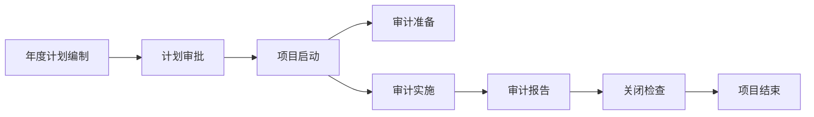
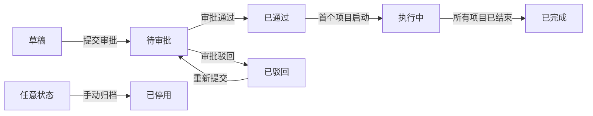
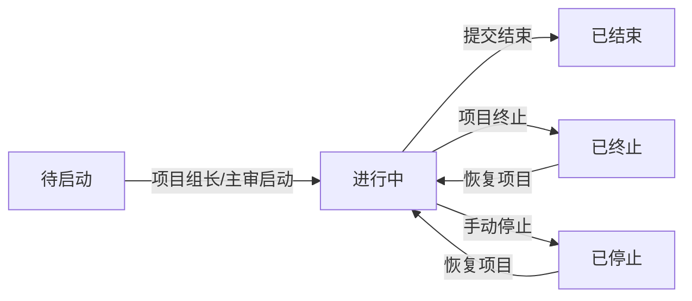
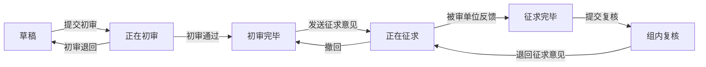
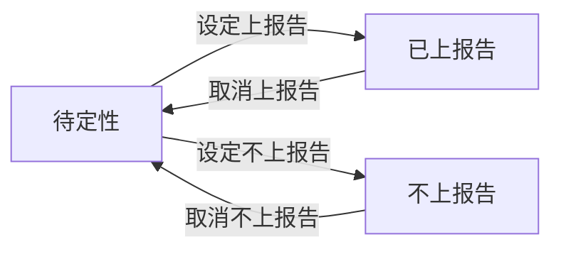
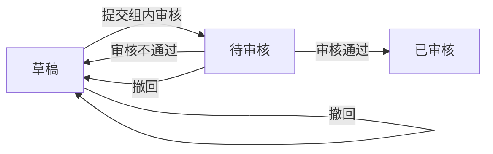
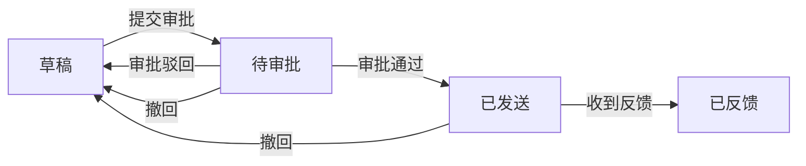

# PRD 正文

> 版本：v1.0
> 状态：评审稿
> 基于 design.md v1.0

| 版本 | 日期 | 修订人 | 修订说明 | 状态 |
|------|------|--------|----------|------|
| v1.0 | 2026-06-29 | testuser | 首次生成，基于 design v1.0 展开 | 评审稿 |

---

## 1. 文档概述

本 PRD 基于《审计管理系统详细设计》v1.0 展开，覆盖 10 个模块、54 个核心页面，纯 PC 端，不对接 OA 和移动端。一期实现审计全流程线上化、审计单位与被审单位在线协同、问题整改闭环追踪。

## 2. 名词说明

| 术语 | 类别 | 定义 |
|------|------|------|
| 系统管理员 | 角色术语 | 全系统配置与用户管理的系统管理角色 |
| 集团管理员 | 角色术语 | 管理集团本部部门与人员的管理角色 |
| 公司管理员 | 角色术语 | 管理本公司部门与人员的管理角色 |
| 集团领导 | 角色术语 | 查看全集团审计业务数据的业务角色 |
| 公司领导 | 角色术语 | 查看本公司审计业务数据的业务角色 |
| 审计用户 | 角色术语 | 审计部门正式员工，可参与审计业务 |
| 外包审计用户 | 角色术语 | 外部审计公司人员，仅参与被分配项目 |
| 被审单位用户 | 角色术语 | 被审单位人员，仅在审计反馈模块操作 |
| 项目组长 | 角色术语 | 审计项目负责人，项目身份之一 |
| 项目主审 | 角色术语 | 审计执行负责人，与项目组长并列 |
| 项目组员 | 角色术语 | 审计项目普通成员 |
| 对接人 | 角色术语 | 被审单位在项目中的对接联系人 |
| 经办人 | 角色术语 | 通过任务转办产生的被审单位任务处理人 |
| 年度计划 | 业务术语 | 年度审计计划的编制、审批与执行载体 |
| 初始规划 | 业务术语 | 年度首次编制的计划版本类型 |
| 年度计划调整 | 业务术语 | 已审批计划内增减审计项目的调整流程 |
| 审计项目 | 业务术语 | 计划下的具体审计任务单元 |
| 审计底稿 | 业务术语 | 记录单个审计发现问题的作业载体 |
| 审计问题 | 业务术语 | 底稿复核通过后自动生成的问题记录 |
| 上报告问题 | 业务术语 | 多个已上报告问题的归纳集合，需上报管理层 |
| 实施方案 | 业务术语 | 项目审计实施方案 |
| 审计通知书 | 业务术语 | 发送给被审单位的审计通知文书 |
| 进点会 | 业务术语 | 审计进点会议 |
| 承诺书 | 业务术语 | 被审单位签署的审计承诺文书 |
| 资料清单 | 业务术语 | 发送给被审单位准备资料的清单 |
| 问题沟通会 | 业务术语 | 与被审单位沟通问题底稿的会议 |
| 关闭检查 | 业务术语 | 项目结束前按七环节逐项检查的归档环节 |
| 挂销号 | 流程术语 | 整改台账问题的挂号与销号机制 |
| 三层权限模型 | 概念术语 | 系统管理角色+业务角色、用户类型、项目身份三级叠加的权限模型 |
| 数据范围 | 概念术语 | 用户可访问数据的边界，由角色和所属机构决定 |
| 并行完成度 | 概念术语 | 项目启动后按子模块完成度而非单一阶段标记的进度模型 |

## 3. 范围

一期覆盖 10 个模块、54 个核心页面：审计计划、项目启动、审计准备、审计实施、审计报告、审计反馈、审计总览、审计知识库、项目档案、系统管理。纯 PC 端，不对接 OA 和移动端。被审单位通过独立登录页进入审计反馈模块操作。

## 4. 业务流程

审计项目全流程分四个阶段：计划编制、项目启动、审计准备与实施、报告与关闭。审计用户在计划模块填报年度计划并提交审批，审批通过后项目自动同步到启动列表；项目组长/主审在项目启动模块补充信息、添加成员和对接人后启动项目，项目状态变为"进行中"。

进入"进行中"后，准备工作与实施工作并行推进。准备工作包括实施方案、审计通知书、进点会记录、承诺书、资料清单 5 项材料，每项均支持多次修改重提。实施工作从底稿录入开始：组员录入底稿后由项目组长/主审初审，再由被审单位反馈意见，组内复核，复核通过后自动生成审计问题；问题设定上报告标记后，可在上报告问题中被引用归纳，提交组内审核。

报告阶段从征求意见稿开始：审计用户编制征求意见稿并发送给被审单位，被审单位反馈意见后审计单位回复，流程完成；之后编制正式报告并关联上报告问题，发布后项目组长/主审在关闭检查页按七环节逐项确认归档材料齐全，提交项目结束。

被审单位通过独立登录页进入审计反馈模块，接收任务（承诺书签署、资料提交、底稿意见、报告意见、整改反馈），可将任务转办给经办人处理。

## 5. 详细需求说明

### 5.1 审计计划模块

负责年度审计计划的编制、审批与调整，以及计划内审计项目的维护，包含 7 个页面。计划状态流转由流程驱动，所有用户对状态字段只读。各状态含义：

- 草稿：未提交审批，可编辑、删除
- 待审批：审批流程中，不可编辑
- 已通过：审批通过待启动
- 执行中：至少一个项目已启动
- 已完成：所有项目已结束
- 已驳回：审批被驳回，可修改后重新提交
- 已停用：管理员手动归档停用

#### 5.1.1 年度计划管理

负责年度计划的列表浏览、详情查看、编辑编制与审批处理，包含 4 个页面。

---

**5.1.1.1 年度计划列表页**

页面顶部为筛选栏，下方为年度计划分页列表，每页 20 条，按创建时间倒序。

· 筛选年度计划

筛选栏提供计划年度、计划类型、状态下拉筛选。展示列：计划名称、计划年度、计划类型、计划版本、项目计划数、未执行数、在执行数、已关闭数、状态。计划名称超长截断 30 字符，悬停显示全文。

· 新建计划

点击"新建计划"按钮进入计划编辑页。计划类型默认"初始规划"，计划版本默认 V1.0。

· 操作计划

每行操作列按状态和权限显示按钮：草稿/已驳回状态显示"编辑""提交审批""删除"；已通过/执行中状态显示"查看详情""年度计划调整"。点击"查看详情"进入年度计划详情页。

---

**5.1.1.2 年度计划详情页**

展示计划完整信息，按区域分块呈现，全部只读。

· 查看计划全貌

- 基本信息：计划名称、年度、计划类型、计划版本、是否当前执行版本、编制部门、编制人、创建时间、更新时间、状态
- 审计背景：审计背景、指导思想、工作目标，长文本完整展示
- 人员信息：计划组员、填报人、填报日期
- 计划统计：项目计划数、未执行数、在执行数、已关闭数，系统自动计算
- 审计项目列表：状态、项目名称、审计类型、被审单位、项目级别、审计期间，可新增/停止项目
- 审批记录：审批节点、审批人、审批时间、审批意见，时间线展示，提交审批后显示
- 版本历史：该年度所有版本的修订历史

· 操作计划

操作区按状态显示：草稿状态显示"编辑""提交审批"；已通过/执行中状态显示"年度计划调整""查看审批记录"。点击"编辑"跳转计划编辑页；"年度计划调整"跳转计划编辑页并预填当前版本数据，计划版本自动递增（V1.0→V2.0→V3.0）。

---

**5.1.1.3 计划编辑页**

编制或调整年度计划的表单页，分为基本信息、审计背景、人员信息、备注、审计项目列表五个区域。

· 编辑计划信息

- 基本信息：计划名称（必填，最大 100 字符）、计划类型（必填，默认"初始规划"）、计划版本（必填，初始版本 V1.0，调整审批通过后自动递增）
- 审计背景：审计背景、指导思想、工作目标，选填，富文本编辑器，单项最大 2000 字符
- 人员信息：计划组员，选填，人员多选
- 备注：备注，选填，最大 1000 字符
- 审计项目列表：展示状态、项目名称、审计类型、被审单位、项目级别、审计期间，可新增/编辑/删除审计项目，点击项目名称进入审计项目编辑页

· 保存与提交

操作区提供"保存草稿""提交审批"。保存草稿仅校验必填项非空；提交审批时校验所有必填项，校验不通过的字段标红并显示错误提示，不关闭表单。提交成功后跳回列表页，列表顶部 toast 提示"计划已提交审批"，状态变为"待审批"。

---

**5.1.1.4 计划审批页**

审批人查看计划详情并执行审批操作的表单页。

· 查看计划详情

只读展示计划信息（计划名称、计划年度、计划类型、计划版本、编制人、编制部门、填报人、填报日期、状态）、计划统计（项目计划数、未执行数、在执行数、已关闭数）、审计背景、审计项目列表、备注。

· 执行审批

审批操作区提供审批意见输入框（必填，驳回时强制要求填写原因）、"通过""驳回"按钮。点击"通过"后状态变为"已通过"，审计项目自动同步到项目启动列表；点击"驳回"后状态变为"已驳回"，编制人可修改后重新提交。审批记录区时间线展示全部历史节点。

---

#### 5.1.2 审计项目管理

负责计划内审计项目的新建、详情查看与编辑维护，包含 3 个页面。

---

**5.1.2.1 审计项目新建页**

在年度计划编制阶段新增审计项目的表单页，按区域分块展开。

· 填写项目基本信息

- 基本信息：来源计划（自动带入不可修改）、审计年度、项目名称（必填，最大 200 字符）、项目类型（必填）、审计类型（必填，数据字典配置）、审计范围（必填，最大 2000 字符）、被审单位（必填）、被审单位用户对接人（选填）、计划开始日期、计划结束日期、启动月份
- 审计信息：审计期间（必填，日期区间）、审计目标（必填，最大 1500 字符）、审计重点（必填，最大 1500 字符）、立项依据（必填，最大 2000 字符）、审计事项（必填，枚举选择）
- 项目属性：项目级别（必填，重大项目/常规项目/其他）、完成形式（必填，就地审计/报送审计/远程审计/驻在审计/派出审计/巡回审计/轮回审计/联合审计）、审计方式（必填，自行审计/协同审计/全部外包/联审）、审计单位（必填，组织选择器）、审计领域（必填，内部审计/国家审计/社会审计/外部审计/其他）、版块业态（必填，数据字典配置）、业务领域（必填，数据字典配置）
- 人员安排：项目组长兼项目主审（必填，人员选择器）、项目副组长（选填）、内部项目组员（选填，人员多选）
- 外部协作：中介机构（选填，最大 200 字符）
- 计划调整：仅在年度计划调整场景显示，操作类型（新增/停止，必填）、变更原因（选填，最大 500 字符，停止时建议填写）
- 备注：备注说明（选填，最大 2000 字符）
- 附件信息：文件名称、文件类型（选填）、上传人（系统自动记录当前登录用户）

· 保存项目

点击"保存"按钮，校验通过后回到年度计划详情页，新建的审计项目状态为"待启动"。校验不通过时标红字段并提示。

---

**5.1.2.2 审计项目详情页**

只读展示审计项目完整信息。

· 查看项目全貌

按区域只读展示：基本信息、审计信息、项目属性、人员安排、外部协作、计划调整（仅年度计划调整产生的项目显示）、备注、附件信息。来源计划可点击跳转到年度计划详情；附件文件名称支持下载。

· 操作项目

操作区按状态和权限显示。年度计划处于草稿态时显示"编辑"按钮，点击进入审计项目编辑页；审批通过后不显示编辑按钮，需通过年度计划调整流程修改。点击"返回年度计划详情"回到上级页面。

---

**5.1.2.3 审计项目编辑页**

编辑已有审计项目信息的表单页，字段同新建页，但来源计划只读不可修改。

· 编辑项目信息

各区域字段同新建页，基本信息/审计信息/项目属性/人员安排/外部协作/备注/附件信息均可编辑。计划调整区域仅在年度计划调整场景可编辑，操作类型为"停止"时保存后该项目在计划中标记为停止。

· 保存修改

点击"保存"按钮，校验通过后回到项目详情页。校验不通过时标红字段并提示。

---

### 5.2 项目启动模块

负责审计项目的立项启动、成员管理与对接人指定，包含 3 个页面。项目状态流转由流程驱动，所有用户对状态字段只读。各状态含义：

- 待启动：从年度计划同步而来，等待项目组长/主审启动
- 进行中：启动后各阶段（准备/实施/报告）可并行推进
- 已结束：七环节全部完成，归档信息填写完整
- 已终止：项目终止，记录终止原因，可恢复
- 已停止：手动暂停，可恢复

---

**5.2.1 项目列表页**

页面顶部为筛选栏，下方为审计项目分页列表。

· 筛选项目

筛选栏提供计划年度、项目名称、审计类型、状态下拉/输入筛选。展示列：计划年度、项目名称、审计类型、项目组长、项目主审、被审单位、状态。

· 操作项目

每行操作列按状态和权限显示。点击"查看详情"进入项目详情页；草稿/待启动状态显示"编辑""启动项目"按钮。点击"启动项目"后状态变为"进行中"，准备工作与实施工作可并行推进。

---

**5.2.2 项目详情页**

只读展示项目完整信息。

· 查看项目信息

按区域只读展示：基本信息（所属计划、计划年度、项目编号、项目名称、项目类型、审计类型、被审单位、被审单位用户对接人、计划开始时间、计划结束时间、启动月份、状态、审计范围、备注信息）、审计信息、项目属性、人员信息（项目组长、项目主审、项目成员）、附件区、审批记录（提交审批后显示）。

· 操作项目

操作区按状态和权限显示"编辑""终止项目""查看项目档案""查看审批记录"按钮。点击"编辑"进入项目编辑页；点击"终止项目"弹出确认框，需填写终止原因（最大 500 字符），确认后状态变为"已终止"。

---

**5.2.3 项目编辑页**

填写或修改项目信息、添加成员和对接人的表单页。

· 编辑项目信息

基本信息、审计信息、项目属性从年度计划编制时带入可修改。审计范围、备注信息可编辑；人员信息中项目组长、项目主审必填，项目成员可多选；附件区支持多文件上传。

· 保存与终止

点击"保存"按钮校验后回到项目详情页。点击"终止项目"弹出确认框，需填写终止原因，确认后项目状态变为"已终止"。

---

### 5.3 审计准备模块

展示当前用户参与的所有项目，5 项准备材料的完成状态在列表中一目了然。每项材料在完成后仍可进入修改并重新提交。模块分为准备入口和准备材料编辑 2 个小模块。

#### 5.3.1 准备项目入口

---

**5.3.1.1 准备项目列表页**

· 筛选准备项目

筛选栏提供计划年度、项目名称、审计类型、被审单位下拉/输入筛选。列表仅展示当前用户参与的项目。

· 查看准备进度

展示列：计划年度、项目名称、被审单位、实施方案状态、通知书状态、进点会状态、承诺书状态、资料清单状态。各材料状态以标签形式展示（未开始/进行中/已完成）。点击材料状态标签直接进入该材料的编辑页；点击项目名称进入该项目的项目详情页。

---

#### 5.3.2 实施方案

---

**5.3.2.1 实施方案编辑页**

编辑实施方案的表单页。

· 编辑方案信息

- 基本信息：项目名称、项目类型、项目编号（关联带出）、被审单位、审计部门、项目组长、项目主审、方案名称（必填，最大 200 字符）。被审单位/项目组长/项目主审从项目带入，审计部门从当前用户所属部门带入
- 附件区：附件（选填，多文件，单文件≤100M）

· 保存与发布

操作区提供"保存草稿""发布"。已完成的实施方案进入后仍可修改，修改后重新发布。状态含义：起草中（编辑中未提交）、待审核（提交后进入审核流程）、已通过（方案生效，准备工作完成）、已驳回（回退修改后可重新提交）。

#### 5.3.3 审计通知书

---

**5.3.3.1 审计通知书编辑页**

制作审计通知书的表单页。

· 编辑通知书

- 基本信息：通知书编号（自动生成，格式 TZ-YYYY-NNN）、通知书名称（必填，最大 200 字符）、项目名称、项目类型、项目编号（关联带出）、被审单位（必填）、被审单位用户对接人
- 送达组织：主送组织（必填，组织多选）、抄送组织（选填，组织多选）
- 发送人员：发送清单人员（选填，人员多选）
- 通知内容：通知内容（必填，富文本编辑器）
- 附件区：附件（选填，多文件，单文件≤100M，用于上传通知书正式发文扫描件红头盖章版及支撑材料）

· 保存与发送

操作区提供"保存草稿""发送"。已发送的通知书进入后仍可修改，修改后重新发送。状态含义：起草中（编辑中未发送）、已发送（已发送给被审单位）。

#### 5.3.4 进点会记录

---

**5.3.4.1 进点会记录编辑页**

记录审计进点会信息的表单页。

· 编辑进点会记录

- 基本信息：项目名称、项目类型、项目编号（关联带出）、被审单位（必填）、会议时间（必填）、会议主题（必填，最大 200 字符）、会议地点（选填，最大 200 字符）
- 参会信息：参会人员（必填，最大 1000 字符）
- 会议内容：会议内容（必填，富文本编辑器）
- 附件区：附件（选填，多文件，单文件≤100M，用于上传会议签到表、会议照片、会议材料）

· 保存记录

新建保存即完成；已完成的记录在详情页点击修改按钮进入编辑状态，修改后重新保存。状态含义：草稿（编辑中未完成）、已完成（记录生效）。

#### 5.3.5 承诺书管理

---

**5.3.5.1 承诺书管理页**

管理承诺书基本信息、对接人和附件，跟踪各被审单位签署情况的组合页。

· 编辑承诺书

- 基本信息：项目名称、项目类型、项目编号（关联带出）、被审单位、被审单位用户对接人（从项目带入或人员选择）
- 承诺书内容：承诺书内容（必填，富文本编辑器）
- 附件区：附件（选填，多文件，单文件≤100M，用于上传承诺书参考文件或模板）

· 查看签署情况

签署情况列表展示被审单位用户对接人、签署时间、上传时间、签署文件。发出承诺书后生成签署记录，签署方式根据对接人是否有系统账号自动判定（有账号则线上签署，无账号则附件签署）；附件签署时可上传签字盖章版文件。

· 保存与发送签署

操作区提供"保存草稿""发送签署"。发送时自动为有账号的对接人生成签署任务，无账号的等待上传附件。已发出的承诺书进入后仍可修改，修改后重新发送。状态含义：草稿（编辑中未发出）、已发出（已发送待签署）、已完成（所有签署记录均已签署）。

#### 5.3.6 资料清单

---

**5.3.6.1 资料清单编辑页**

查看和管理资料清单条目的列表+弹窗页。

· 筛选资料

筛选栏提供资料状态、资料名称、详细说明、被审单位用户对接人下拉/输入筛选，含清空按钮。

· 查看资料列表

展示列：序号、资料名称、被审单位用户对接人、审计单位接口人、详细说明、资料状态、资料清单、操作。资料状态包括待提交/已提交。操作列：修改、删除、发送、撤回。

· 新增资料

点击"新增资料"弹出新增资料弹窗。弹窗字段：资料名称（必填）、审计单位接口人（必填）、被审单位用户对接人（必填，人员选择）、提交截止日期（选填，日期选择器）、详细说明（选填，多行文本）。"从资料库选择"可引用已有资料模板。保存后新增到清单列表。

· 查看上传资料详情

点击操作列"查看"打开查看上传资料详情弹窗，只读展示资料名称、对接人、提交截止日期、详细说明，以及被审单位已上传文件列表（文件名、上传时间、文件大小），支持预览和下载。

· 发送与撤回

资料清单发送后仍可修改，撤回后重新发送。状态含义：待提交（等待被审单位提交）、已提交（被审单位已提交资料，可包含多个附件）。

---

### 5.4 审计实施模块

面向"进行中"项目，覆盖底稿作业、问题管理、上报告和沟通会记录，共 9 个页面。底稿复核通过后自动生成审计问题，问题标记上报告后可在上报告问题中被引用。模块分为实施入口、审计底稿、审计问题、上报告问题、问题沟通会 5 个小模块。

#### 5.4.1 实施项目入口

---

**5.4.1.1 实施项目列表页**

· 筛选实施项目

筛选栏提供项目编号、项目名称、审计类型、被审单位下拉/输入筛选。列表仅展示状态为"进行中"且当前用户参与的项目。

· 查看实施进度

展示列：项目编号、项目名称、审计类型、被审单位、项目组长、项目主审、底稿进度、问题一览、问题沟通、上报告问题。底稿进度以标签形式展示（待开始/进行中/已完成），系统自动计算当前项目底稿完成比例。

· 进入项目作业

点击项目对应的状态标签进入对应页面：底稿列表、问题一览列表、问题沟通会页面、上报告问题列表。

---

#### 5.4.2 审计底稿

负责底稿的编制、初审、征求、复核全生命周期，包含 3 个页面。底稿状态流转由流程驱动，所有用户对状态字段只读。各状态含义：

- 草稿：编制人新建底稿后的初始状态，可编辑、删除
- 正在初审：编制人提交初审后，等待项目组长/主审审核
- 初审完毕：初审通过，等待编制人发送给被审单位征求意见
- 正在征求：已发送给被审单位
- 征求完毕：被审单位已反馈或手动标记
- 组内复核：复核完成（终态），记录复核意见和是否采纳反馈

---

**5.4.2.1 底稿列表页**

· 筛选底稿

筛选栏提供底稿编号、底稿名称、底稿类型、编制人、状态、审计事项下拉/输入筛选。展示列：底稿编号、底稿名称、问题标题、底稿类型、编制人、编制日期、审计事项、状态。底稿名称超长截断 30 字符，悬停显示全文。

· 新建底稿

点击"新建底稿"按钮进入底稿编辑页，由点击者进入编制人角色。

· 批量导入底稿

点击"批量导入"按钮弹出文件选择对话框，支持 Excel 模板导入。导入失败的行在弹窗中列出错误原因。

· 操作底稿

每行操作列按状态和权限显示。草稿状态显示"编辑""删除"；其他状态显示"查看详情"。

---

**5.4.2.2 底稿编辑页**

录入或编辑审计底稿的表单页。

· 编辑底稿信息

- 基本信息：底稿编号（自动生成，格式 DG-YYYY-NNN）、底稿名称（必填，最大 200 字符）、底稿类型（必填，数据字典配置）、项目编号、项目名称、项目类型、被审单位、审计检查项、审计事项（必填，数据字典配置）
- 问题信息：问题标题（必填，最大 200 字符）、问题描述（必填，富文本）、定性依据（选填，最大 2000 字符）、审计依据（选填，最大 2000 字符）、审计结论（选填，最大 2000 字符）、审计建议（选填，最大 2000 字符）
- 审计记录：审计记录（选填，最大 5000 字符）
- 附件区：附件（选填，多文件，单文件≤1G）

· 保存与提交初审

操作区提供"保存草稿""提交初审"。提交时校验必填项，校验不通过标红字段并提示。提交成功后状态变为"正在初审"，下一步由项目组长/主审在详情页进行初审操作。审批记录区在已提交后显示，时间线展示审批节点、审批人、审批时间、审批意见。

---

**5.4.2.3 底稿详情页**

展示底稿全貌、问题详情、审计记录、反馈意见、审批记录和附件的详情页。

· 查看底稿全貌

- 底稿信息：底稿编号、底稿名称、底稿类型、项目编号、项目名称、项目类型、被审单位、审计检查项、审计事项、编制人、编制日期、底稿状态（只读）
- 问题详情：问题标题、问题描述、定性依据、审计依据、审计结论、审计建议（富文本展示）
- 审计记录：审计记录（只读）
- 反馈记录：反馈人、被审单位反馈意见、反馈时间、被审单位附件
- 审批记录：审批节点、审批人、审批时间、审批意见（时间线展示，审批流程配置后显示）
- 附件：附件列表和下载链接

· 执行初审

仅项目组长/主审可见。初审状态下显示"初审通过""初审退回"按钮。初审通过后状态变为"初审完毕"，可发送被审单位征求意见；初审退回时退回意见必填（最大 1000 字符），状态回退为"草稿"。

· 发送征求意见

仅编制人可见。初审完毕状态下显示"发送征求意见"按钮。点击后状态变为"正在征求"，被审单位用户通过审计反馈模块反馈意见。

· 撤回征求意见

仅编制人可见。正在征求状态下显示"撤回"按钮。撤回时撤回原因必填（最大 500 字符），状态回到"初审完毕"。修改后可重新发送征求意见。

· 标记征求完毕

仅编制人可见。正在征求状态下显示"标记征求完毕"按钮，用于被审单位未反馈但需推进流程的场景。被审单位反馈后状态自动变为"征求完毕"。

· 执行复核

仅项目组长/主审可见。征求完毕状态下显示"提交复核"按钮。复核时记录复核意见（最大 1000 字符）和是否采纳反馈（布尔）。状态变为"组内复核"（终态）。复核后如需进一步沟通，可"退回征求意见"，状态回到"正在征求"。

---

#### 5.4.3 审计问题

汇总底稿复核通过后自动生成的审计问题，支持设定上报告标记和问题定性，包含 2 个页面。问题状态流转由流程驱动，所有用户对状态字段只读。各状态含义：

- 待定性：底稿组内复核通过后自动创建，待审计组设定上报告标记
- 已上报告：已标记可被上报告问题引用
- 不上报告：已填写未上报告原因

---

**5.4.3.1 问题列表页**

· 筛选问题

筛选栏提供问题名称、底稿类型、问题定性、状态、是否上报告下拉筛选。展示列：问题名称、底稿类型、问题定性、状态、是否上报告。

· 批量设定上报告

勾选多条问题后点击"批量设定为上报告"，状态变为"已上报告"；勾选后点击"批量取消上报告"，状态回到"待定性"。仅项目组长/主审可操作。

· 查看详情

点击"查看详情"进入问题详情页。

---

**5.4.3.2 问题详情页**

查看问题详情并设定问题定性、涉及金额、上报告决策的详情/表单页。

· 查看问题基础信息

- 基础信息：底稿类型、底稿名称、问题名称、被审单位（只读，从底稿自动获取）
- 问题信息：存在问题、处理建议（只读，从底稿自动获取）

· 设定问题属性

可编辑字段：问题定性（枚举选择，数据字典配置）、涉及金额（万元，非负小数 2 位）。

· 设定上报告决策

是否上报告（是/否）。选择"是"时状态变为"已上报告"，可被上报告问题引用；选择"否"时未上报告原因必填（最大 500 字符），状态变为"不上报告"。

· 保存修改

点击"保存"按钮校验后更新问题信息。校验不通过时标红字段并提示。

---

#### 5.4.4 上报告问题

新建上报告问题、关联已上报告问题并提交组内审核，包含 2 个页面。上报告问题状态流转由流程驱动，所有用户对状态字段只读。各状态含义：

- 草稿：编辑中
- 待审核：已提交组内审核
- 已审核：项目组长/主审审核通过，上报告问题完成

---

**5.4.4.1 上报告问题列表页**

· 筛选上报告问题

筛选栏提供问题名称、问题类型、状态下拉/输入筛选。展示列：问题名称、问题类型、问题数量、被审单位、状态。

· 新建上报告问题

点击"新建上报告问题"进入上报告问题详情页（新建模式）。

· 操作上报告问题

每行操作列按状态和权限显示。草稿状态显示"查看详情""删除"；待审核状态显示"查看详情""审核"（仅项目组长/主审可见）。

---

**5.4.4.2 上报告问题详情页**

新建或查看上报告问题的详情/表单页。

· 编辑上报告问题

- 基本信息：问题类型（下拉选择，必填，数据字典配置）、问题名称（手动填写，必填，最大 200 字符）、被审单位（从项目自动带入，只读）
- 关联问题：多选本项目内状态为"已上报告"的审计问题
- 问题数量：系统自动计算等于关联问题条数，只读
- 问题归纳：必填，最大 2000 字符
- 整改要求：必填，最大 2000 字符
- 数据流转：编制人、提交人、提交时间、审批人、审批时间（只读，系统自动记录）

· 保存与提交

操作区按状态显示：草稿状态显示"保存""提交组内审核""撤回"；待审核状态显示"审核通过""审核不通过""撤回"（仅项目组长/主审可见）。提交组内审核后状态变为"待审核"；审核通过后状态变为"已审核"，上报告问题完成；审核不通过回退到草稿；撤回后状态保持草稿或回到草稿。

---

#### 5.4.5 问题沟通会

记录与被审单位的问题沟通会，包含 1 个页面。

---

**5.4.5.1 问题沟通会编辑页**

· 编辑沟通会记录

- 会议信息：项目编号、项目名称、项目类型、被审单位（项目自动带出）、参会人员（必填，最大 1000 字符）、会议时间（必填）、会议主题（选填，最大 200 字符）
- 会议内容：沟通问题（必填，最大 2000 字符）、沟通结果（选填，最大 2000 字符）、会议内容（必填，富文本编辑器）
- 附件区：附件（选填，多文件，单文件≤100M，用于上传会议纪要、影像等佐证材料）

· 保存记录

点击"保存"按钮校验后保存。状态含义：草稿（编辑中未完成）、已完成（记录生效，可修改后重新保存）。

---

### 5.5 审计报告模块

面向"进行中"项目，覆盖征求意见稿、正式报告、关闭检查全流程，包含 5 个页面。模块分为报告管理和关闭检查 2 个小模块。

#### 5.5.1 报告管理

负责征求意见稿和正式报告的编制、审批、发送与反馈处理，包含 4 个页面。报告状态流转由流程驱动，所有用户对状态字段只读。

征求意见稿状态含义：草稿（编辑中）、待审批（编制人提交，项目组长/主审审批）、已发送（审批通过后系统自动发送给征求对象）、已反馈（被审单位提交反馈，流程完成）。

正式报告状态含义：草稿（编辑中）、待审批（编制人提交，项目组长/主审审批）、已发布（审批通过后正式发布，不可修改）。

---

**5.5.1.1 报告项目列表页**

· 筛选报告项目

筛选栏提供项目编号、项目名称、审计类型、被审单位下拉/输入筛选。列表仅展示状态为"进行中"且当前用户参与的项目。

· 查看报告环节状态

展示列：项目编号、项目名称、审计类型、被审单位、项目组长、项目主审、征求意见稿状态、正式报告状态、关闭检查状态。各报告环节状态以标签形式展示（征求意见稿：待开始/待审批/已发送/已反馈；正式报告：待开始/待审批/已发布；关闭检查：待检查/已结束）。点击状态标签直接进入对应页面操作；点击项目名称进入项目详情。

---

**5.5.1.2 报告列表页**

· 筛选报告

筛选栏提供报告类型（征求意见稿/正式报告）、报告标题、状态、编制人下拉/输入筛选。展示列：报告编号、报告标题、报告类型、编制人、创建时间、状态。通过报告类型标签区分征求意见稿和正式报告。

· 新建报告

点击"新建报告"进入报告编辑页，选择报告类型（征求意见稿/正式报告）。

· 操作报告

操作列按状态显示：草稿状态显示"查看详情""编辑""提交审批""删除"；待审批状态显示"审批"（项目组长/主审可见）。

---

**5.5.1.3 报告编辑页**

新建或编辑审计报告的表单页，字段根据报告类型动态变化。

· 编辑报告信息

- 报告类型：必填，选择征求意见稿/正式报告，选择后页面字段根据类型动态变化
- 基本信息：报告编号（自动生成，格式 BG-YYYY-NNN）、报告标题（必填，最大 200 字符）、项目编号、项目名称、项目类型、被审单位、板块业态（关联带出）
- 送达信息：征求意见稿填写征求对象/反馈截止日期；正式报告填写主送组织/抄送组织/发送清单
- 报告内容：报告正文（必填，富文本编辑器）
- 报告属性：密级（选填，秘密/机密/绝密，正式报告时显示）
- 关联问题：关联上报告问题（正式报告时显示，从本项目上报告清单中选择已审核的问题，关联后问题信息可引用至报告正文）
- 修订信息：修订说明（选填，最大 1000 字符，正式报告时显示）
- 附件区：附件（选填）

· 保存与提交

操作区提供"保存草稿""提交审批"。征求意见稿提交审批后状态变为"待审批"，审批通过后系统自动发送给征求对象；正式报告提交审批后状态变为"待审批"，审批通过后正式发布。提交时校验：征求意见稿需报告标题、正文、征求对象非空；正式报告需报告标题、正文、主送组织非空。校验不通过标红字段并提示。

---

**5.5.1.4 报告详情页**

展示报告详情和被审单位反馈意见的详情页。

· 查看报告全貌

- 基本信息：报告编号、报告标题、报告类型、密级、版块业态、状态（只读）
- 送达信息：征求对象/主送组织、抄送组织、发送清单、反馈截止日期（只读）
- 报告内容：报告正文（富文本展示）
- 关联问题：关联上报告问题列表（只读，正式报告时显示，展示引用的上报告问题名称、问题类型、问题归纳）
- 修订信息：修订说明（只读）
- 附件：附件列表和下载

· 查看与回复反馈

征求意见稿时显示被审单位反馈列表，每条反馈展示反馈人、反馈意见、反馈附件、回复人、回复意见、回复时间。操作列"查看详情"打开弹窗：上半区只读展示反馈详情（反馈人、反馈意见、反馈附件含文件名/文件类型/上传人/上传时间、反馈时间）；下半区为回复区，填写回复意见、回复附件（回复人自动带出当前用户），可"提交"或"撤回"回复。

· 操作报告

操作区按状态和权限显示：待审批状态显示"审批""查看审批记录"（项目组长/主审可见）；征求意见稿待审批或已发送状态显示"撤回"；提供"导出"按钮。

---

#### 5.5.2 关闭检查

按七环节逐项检查并归档项目，包含 1 个页面。

---

**5.5.2.1 关闭检查页**

· 查看项目信息

只读展示项目编号、项目名称、审计类型、被审单位、项目组长、项目主审（从项目自动带入）。

· 检查七环节

检查清单展示七环节（实施方案、审计通知书、审计承诺书、审计资料清单、审计底稿、上报告问题、审计报告）的完成状态（已完成/未完成）和跳转链接。系统自动标记完成状态，无需手动确认；点击环节可跳转到对应页面。全部完成方可提交结束。

· 填写档案归档信息

- 档案归档：编制日期（必填，日期选择器）、档案编号（选填，最大 100 字符）、保管期限（必填，10 年/20 年/永久）

· 查看归档材料

归档材料列表展示材料分类（实施方案/审计通知书/审计承诺书/审计资料清单/审计底稿/上报告问题/审计报告）、来源类型（审计方上传/被审方上传/手动上传）、材料名称、文件。系统自动归集各环节已完成的文档，自动归集的材料不可删除；项目组长/主审可额外手动上传材料（单文件≤50MB）。

· 保存与提交结束

操作区提供"保存""提交结束"。保存校验编制日期和保管期限非空；提交结束校验七环节全部已完成且编制日期、保管期限非空，通过后项目状态变为"已结束"。

---

### 5.6 审计反馈模块

被审单位通过独立登录页进入审计反馈模块，接收任务并完成签署、资料提交、意见反馈、整改反馈。任务可转办给经办人处理。

---

**5.6.1 反馈首页**

被审单位登录后查看待办任务列表和整改台账统计的看板页。

· 查看待办与整改统计
数字卡片展示待签署承诺书、待提交资料、待反馈底稿意见、待反馈报告意见、待整改问题数量；整改台账统计展示待整改问题数、已完成问题数、逾期问题数。点击数字进入对应待办或整改台账。

---

**5.6.2 任务转办页**

· 查看任务信息

只读展示任务类型、任务来源、关联项目、截止时间（从待办任务带入）。

· 转办任务

- 转办信息：转办给（必填，人员选择，仅可选择被审单位内部人员）、转办说明（选填）
· 操作区提供"保存""确认转办"。转办后任务流转至被转办人待办列表，原任务人不再接收该任务。

---

**5.6.3 承诺书签署页**

· 查看承诺书信息

只读展示项目编号、项目名称、项目类型、被审单位、签署状态、承诺书内容（从承诺书关联带出）。

· 签署承诺书

- 线上签署区：有系统账号的用户在线阅读条款后点击"确认签署"（电子签名确认），签署状态变为"已签署"
- 附件签署区：无系统账号的单位上传签字盖章版附件（多文件，单文件≤100M），上传后签署状态变为"已签署"
- 签署记录：展示文件名、文件类型、上传人、上传时间（只读，支持预览和下载）

· 提交签署

点击"提交"按钮后不可再修改。签署记录状态流转由流程驱动：待签署（等待签署）、已签署（签署完成）、已过期（超过签署期限未签署，可重新发送签署）。

---

**5.6.4 资料提交页**

· 查看资料清单

只读展示项目编号、项目名称、项目类型、被审单位、提交状态。列表展示序号、资料名称、审计单位接口人、详细说明、提交截止日期、资料状态、操作。资料状态包括待提交/已提交，一个资料可包含多个附件。

· 上传资料

点击操作列"上传资料"弹出上传资料弹窗。弹窗只读展示资料名称、详细说明、提交截止日期；上传区支持多文件上传（单文件≤100M），可多次上传追加附件；已上传文件列表展示文件名、上传时间、文件大小，支持预览/下载/删除。点击"保存"后资料状态变为已提交。

· 查看与撤回

点击"查看已提交资料详情"打开弹窗，只读展示资料基本信息和已上传文件列表。操作区提供"撤回""下载""关闭"。撤回后资料状态回退为待提交，可重新上传；支持批量下载全部上传文件。

---

**5.6.5 底稿意见反馈页**

· 查看底稿信息

只读展示底稿编号、底稿名称、底稿类型、项目编号、项目名称、项目类型、被审单位、审计检查项、审计事项、底稿状态、编制人、编制时间；问题详情展示问题标题、问题描述、定性依据、审计依据、审计结论、审计建议。

· 反馈意见

- 反馈信息：被审单位反馈意见（必填，无异议/有异议）、反馈时间、反馈人（自动带出当前用户）
- 具体说明：选填，有异议时填写具体异议内容和理由
- 附件区：佐证附件（选填，多文件）

· 保存与提交

操作区提供"保存""提交反馈"。保存为草稿可后续继续编辑；提交后反馈内容同步至审计系统底稿详情页。

---

**5.6.6 报告意见页**

· 查看报告信息

只读展示报告编号、报告标题、项目编号、项目名称、审计类型、被审单位、发送人、发送时间、反馈截止日期；报告正文（从征求意见稿带入）；相关附件（征求意见稿附件列表，支持下载）。

· 反馈意见

- 意见反馈：反馈人（自动带出当前用户）、反馈时间、总体意见（选填，最大 2000 字符）、具体意见（必填，最大 3000 字符）

· 保存与提交

操作区提供"保存""提交意见"。保存为草稿可后续继续编辑；提交后意见同步至审计报告意见反馈列表，审计方可查看并回复。

---

**5.6.7 整改反馈页**

· 查看项目与问题信息

- 项目信息：项目名称、项目类型、被审单位（只读，从项目关联带出）
- 上报告问题信息：问题名称、问题类型、问题归纳、整改要求、问题挂销号状态（只读，从上报告问题关联带出）

· 填写整改信息

- 整改信息：整改结果（必填，整改完成/正在整改/无法整改）、具体整改措施（选填，最大 2000 字符）、整改记录（选填，最大 2000 字符）、整改经办人（必填）、整改责任人（选填）、计划完成时间（选填）、整改截止日期（选填）
- 附件区：相关附件（选填，多文件，用于上传整改佐证材料）、整改计划文件（选填，单文件）、整改报告文件（选填，单文件）

· 保存与提交

操作区提供"保存草稿""提交整改"。保存草稿可后续继续编辑；提交时校验必填项，提交后进入审批流程。审批状态含义：草稿（编辑中未提交）、待审批（已提交审批流程）、已通过（整改完成）、已驳回（整改不合格，需重新整改）。

问题挂销号状态独立于审批状态：整改反馈审批通过后从已挂号变为已销号，可重新挂号纳入整改台账。

---

### 5.7 审计总览模块

提供统一登录入口和按角色分类的首页看板，包含 3 个页面。模块分为审计单位总览和被审单位总览 2 个小模块。

#### 5.7.1 审计单位总览

包含统一登录入口和审计单位首页，2 个页面。

---

**5.7.1.1 统一登录页**

所有角色统一登录入口。

· 登录

登录表单提供用户账号、密码输入框（必填）和"登录"按钮。验证通过后根据用户角色跳转对应首页：审计人员进入审计单位首页，被审单位人员进入被审单位首页，管理员进入系统管理首页。

---

**5.7.1.2 审计单位首页**

审计人员登录后查看项目阶段分布、待办提醒、年度计划进度的看板页。

· 查看我的项目概览

数字卡片按项目阶段分组统计（待启动、进行中、已结束、整改跟踪中、已归档），点击数字进入对应阶段的项目集合。

· 查看项目摘要列表

展示当前用户参与的执行中项目列表：项目名称、被审单位、当前阶段、我的角色、下一步事项、截止日期。点击进入项目作业详情。

· 查看年度计划进度

数字卡片展示项目总数、已启动、进行中、已结束。点击数字进入年度计划列表并带入对应筛选。统计口径根据用户角色分为两类：管理视角（公司/集团管理员、集团/公司领导）统计所有年度计划关联项目；执行视角（项目组员、项目组长/主审）仅统计用户参与的审计项目所关联的年度计划项目。

· 查看待办与已办

- 待办提醒：数字卡片+列表，展示待审批计划、待审底稿、待处理征求意见、待发布报告、待提交整改的上报告问题、待审整改反馈
- 我的已办：最近处理的审批、底稿、报告、整改审阅事项
- 我发起的：我发起的计划审批、项目启动、调计划、报告发布流程

· 查看公告

展示审计单位可见公告列表，按角色可见。

#### 5.7.2 被审单位总览

被审单位人员登录后查看配合事项和整改统计，1 个页面。

---

**5.7.2.1 被审单位首页**

被审单位人员登录后查看配合事项、整改项目概览、整改统计的看板页。

· 查看我的配合事项

数字卡片+列表展示待签署承诺书、待提交资料、待反馈底稿意见、待反馈报告意见、待整改问题。点击进入对应反馈页面。待整改问题来自审计方审核通过的上报告问题提交的整改要求。

· 查看整改项目概览

数字卡片按整改状态分组统计（待整改、整改中、已逾期、整改完成率），点击进入整改项目台账。整改项目摘要列表展示项目名称、整改问题总数、整改期限、剩余天数、整改负责人。

· 查看整改统计

数字卡片展示整改项目总数、待整改问题数、已完成问题数、逾期问题数，点击数字进入整改台账并带入状态筛选。逾期口径：整改期限日期早于当前日期即为逾期。

· 查看已办与发起

- 我的已办：最近提交的资料、意见反馈、整改反馈
- 我发起的：我提交的资料、意见反馈、整改反馈记录

· 查看公告

展示被审单位可见公告列表，按角色可见。

---

### 5.8 审计知识库

负责审计检查项的配置管理，包含 1 个页面。

---

**5.8.1 审计检查项列表页**

· 筛选检查项

筛选栏提供检查项名称、审计类型、状态下拉/输入筛选。展示列：检查项编码、检查项名称、审计类型、上级检查项、排序号、状态。

· 操作检查项

操作区按权限显示"新增""编辑""删除""启用/停用"按钮。检查项支持层级结构（上级检查项字段），新增时填写检查项名称（必填，最大 200 字符）、检查项编码（必填，唯一）、审计类型（选填，数据字典配置）、上级检查项（选填）、排序号（选填，默认 0）。状态含义：启用（可用）、停用（不可用）。

---

### 5.9 项目档案模块

查看项目档案信息与项目变更，包含 2 个页面。

---

**5.9.1 项目档案列表页**

· 筛选项目档案

筛选栏提供项目编号、项目名称、审计类型、被审单位、状态下拉/输入筛选。展示列：项目编号、项目名称、审计类型、被审单位、项目组长、项目主审、状态、归档时间。

· 操作项目档案

操作区按状态和权限显示"查看详情""项目变更"按钮。

---

**5.9.2 项目档案详情页**

· 查看项目档案

只读展示：基本信息（项目编号、项目名称、审计类型、被审单位、项目组长、项目主审、状态）、审计信息（审计期间、审计目标、审计重点）、项目属性（项目级别、审计方式、审计领域）、人员信息（内部项目组员、项目组长、项目主审）、档案信息（编制日期、档案编号、保管期限、材料分类）。

· 操作项目档案

操作区按权限显示"项目变更""返回"按钮。

---

### 5.10 系统管理模块

负责组织机构、用户、角色、审批流程、系统配置与日志管理，包含 11 个页面。模块分为组织与用户管理、角色与菜单管理、审批流程配置、系统配置、日志管理 5 个小模块。

#### 5.10.1 组织与用户管理

管理多级部门结构和系统用户，包含 2 个页面。

---

**5.10.1.1 组织机构树页**

· 查看机构树

树形列表展示机构名称、机构编码、上级机构、排序号、状态、是否审计部门。顶层为集团，下辖子公司和集团本部部门。支持拖拽排序。组织结构层级：集团下辖子公司/集团本部部门，再下辖部门/小组。

· 操作机构

操作区按权限显示"新增机构""编辑""删除""启用/停用"。系统管理员管理全部机构；集团管理员管理集团本部机构；公司管理员管理本公司机构。机构属性编辑面板提供机构名称（必填，最大 100 字符）、机构编码（必填，唯一）、上级机构、排序号（默认 0）、状态（启用/停用）、是否审计部门（默认否，用于数据范围判定）、机构层级（集团/子公司/部门/小组）。

---

**5.10.1.2 用户列表页**

· 筛选用户

筛选栏提供用户姓名、用户账号、所属机构、用户类型、状态下拉/输入筛选。展示列：用户账号、用户姓名、用户类型（多标签展示）、所属机构、手机号、邮箱、状态。

· 操作用户

操作区按权限显示"新增用户""编辑""删除""启用/停用"。系统管理员管理全部用户；集团管理员管理集团本部用户；公司管理员管理本公司用户。

· 新增/编辑用户

点击"新增用户"或"编辑"弹出弹窗表单。字段：用户账号（必填，唯一，最大 50 字符）、用户姓名（必填，最大 50 字符）、所属机构（必填，树形选择器，管理范围过滤）、用户类型（必填，多选，审计用户/外包审计用户/被审单位用户）、手机号（选填，唯一，11 位）、邮箱（选填，最大 100 字符）、角色分配（多选下拉，关联角色表）。用户类型推导规则：所属机构"是否审计部门"=是时默认勾选"审计用户"，否则默认勾选"被审单位用户"；"外包审计用户"需手动勾选；管理员可增减推导结果。状态含义：启用（可登录）、停用（不可登录）。

---

#### 5.10.2 角色与菜单管理

配置角色权限和系统菜单，包含 2 个页面。

---

**5.10.2.1 角色列表页**

· 筛选角色

筛选栏提供角色名称、角色类型、状态下拉/输入筛选。展示列：角色名称、角色编码、角色类型、数据范围、状态。角色类型区分系统管理角色和业务角色。

· 操作角色

操作区显示"新增角色""编辑""删除""启用/停用"按钮，仅系统管理员可操作。内置角色（系统管理员、集团管理员、公司管理员、集团领导、公司领导、审计用户、外包审计用户、被审单位用户）不可删除，仅可编辑菜单权限。角色编辑字段：角色名称（必填，最大 50 字符）、角色编码（必填，唯一）、角色类型（单选，系统管理角色/业务角色）、数据范围（单选，全部数据/全集团/本公司/部门数据/个人数据）、菜单权限（树形多选，关联菜单表）、角色描述（选填，最大 200 字符）。

---

**5.10.2.2 菜单管理页**

· 查看菜单树

树形列表展示菜单名称、菜单编码、父级菜单、排序号、状态，支持拖拽排序。

· 操作菜单

操作区显示"新增菜单""编辑""删除""启用/停用"按钮。菜单属性编辑面板提供菜单名称、菜单类型（目录/菜单/按钮）、路由地址、权限标识、图标。

---

#### 5.10.3 审批流程配置

图形化配置审批流程，包含 2 个页面。

---

**5.10.3.1 审批流程列表页**

· 筛选审批流程

筛选栏提供模板名称、适用业务、状态下拉/输入筛选。展示列：模板名称、适用业务、创建人、创建时间、状态。

· 操作审批流程

操作区按权限显示"新建模板""编辑""删除""启用/停用""进入设计器"按钮。

---

**5.10.3.2 审批流程设计器页**

· 设计审批流程

- 画布区：拖拽添加审批节点、条件分支节点，图形化操作
- 节点配置：审批人类型（角色/用户/项目角色）、会签/加签设置（侧边面板）
- 条件配置：条件字段、判断规则、分支走向

· 保存与启用

操作区提供"保存""启用/停用""预览"按钮。

---

#### 5.10.4 系统配置

配置年度规划、数据请求模板和数据字典，包含 3 个页面。

---

**5.10.4.1 年度规划设置页**

· 编辑规划参数

- 规划参数：规划年度（必填）、规划编制部门、规划编制人、规划版本
- 规划内容：审计背景、指导思想、工作目标（选填，富文本编辑器）

· 保存

点击"保存"按钮校验后保存。

---

**5.10.4.2 数据请求配置页**

· 查看模板列表

展示模板名称、模板类型、创建人、创建时间、状态，分页列表。

· 操作模板

操作区显示"新建模板""编辑""删除""启用/停用"按钮。模板编辑提供资料项名称、资料说明、提交要求，可动态增删资料项。

---

**5.10.4.3 数据字典页**

· 查看字典分类与项

- 字典分类：树形列表展示分类名称、编码、描述
- 字典项列表：分页展示字典项名称、编码、排序号、状态，按分类筛选

· 操作字典

操作区显示"新增分类""新增字典项""编辑""删除""启用/停用"按钮。

---

#### 5.10.5 日志管理

查看操作日志和登录日志，包含 2 个页面。

---

**5.10.5.1 操作日志页**

· 筛选日志

筛选栏提供操作人、操作模块、操作类型、时间范围下拉/输入筛选。展示列：操作人、操作时间、操作模块、操作类型、操作内容、IP 地址，分页列表。

· 操作日志

操作区显示"查看详情""导出"按钮。

---

**5.10.5.2 登录日志页**

· 筛选日志

筛选栏提供登录人、登录结果、时间范围下拉/输入筛选。展示列：登录人、登录时间、登录 IP、登录结果、浏览器信息，分页列表。

· 操作日志

操作区显示"查看详情""导出"按钮。

---

## 6. 权限汇总

#### 6.1 模块级权限矩阵

| 模块 | 集团领导 | 公司领导 | 审计用户 | 外包审计用户 | 被审单位用户 |
|------|----------|----------|----------|-------------|-------------|
| 审计计划 | 全集团只读 | 本公司只读 | 按数据范围 | 仅被分配项目 | 不可见 |
| 项目启动 | 全集团只读 | 本公司只读 | 按数据范围 | 仅被分配项目 | 不可见 |
| 审计准备 | 全集团只读 | 本公司只读 | 按数据范围 | 仅被分配项目 | 不可见 |
| 审计实施 | 全集团只读 | 本公司只读 | 按数据范围 | 仅被分配项目 | 不可见 |
| 审计报告 | 全集团只读 | 本公司只读 | 按数据范围 | 仅被分配项目 | 不可见 |
| 审计反馈 | 全集团只读 | 本公司只读 | 不可见 | 不可见 | 本单位 |
| 审计知识库 | 可见 | 可见 | 可见 | 可见 | 不可见 |
| 审计总览 | 全集团 | 本公司 | 可见 | 可见 | 可见 |
| 项目档案 | 全集团只读 | 本公司只读 | 按数据范围 | 仅被分配项目 | 不可见 |
| 系统管理 | 不可见 | 不可见 | 仅管理员 | 不可见 | 不可见 |

#### 6.2 项目内操作权限

| 操作对象 | 项目组长 | 项目主审 | 项目组员 | 对接人 | 经办人 |
|----------|----------|----------|----------|--------|--------|
| 编辑项目信息 | 可操作 | 可操作 | 不可见 | 不可见 | 不可见 |
| 管理成员 | 可操作 | 可操作 | 不可见 | 不可见 | 不可见 |
| 录入底稿 | 可操作 | 可操作 | 可操作 | 不可见 | 不可见 |
| 初审底稿 | 可操作 | 可操作 | 不可见 | 不可见 | 不可见 |
| 复核底稿 | 可操作 | 可操作 | 不可见 | 不可见 | 不可见 |
| 编辑报告 | 可操作 | 可操作 | 可操作 | 不可见 | 不可见 |
| 发布报告 | 可操作 | 可操作 | 不可见 | 不可见 | 不可见 |
| 签署承诺书 | 不可见 | 不可见 | 不可见 | 可操作 | 不可见 |
| 提交资料 | 不可见 | 不可见 | 不可见 | 可操作 | 可操作（转办） |
| 反馈底稿意见 | 不可见 | 不可见 | 不可见 | 可操作 | 可操作（转办） |
| 反馈报告意见 | 不可见 | 不可见 | 不可见 | 可操作 | 可操作（转办） |
| 提交整改 | 不可见 | 不可见 | 不可见 | 可操作 | 可操作（转办） |

---

## 7. 数据字典

### 7.1 年度计划

| 字段 | 类型 | 必填 | 说明 |
|------|------|------|------|
| 计划 ID | 整数 | 是 | 系统自动生成，主键 |
| 计划名称 | 字符串 | 是 | 最大 100 字符 |
| 计划年度 | 字符串 | 是 | 格式 YYYY |
| 计划类型 | 枚举 | 是 | 初始规划/年度计划调整 |
| 计划版本 | 字符串 | 是 | 格式 V1.0、V2.0，调整审批通过后自动递增，驳回时回退原版本号 |
| 是否当前执行版本 | 布尔 | 是 | 默认是，同年度同一时间仅一个版本为"是" |
| 编制部门 | 关联 | 是 | 关联组织机构 |
| 计划组员 | 多选人员 | 否 | 关联用户表 |
| 编制人 | 关联 | 是 | 关联用户表 |
| 填报人 | 关联 | 是 | 系统自动带出当前登录人，不可修改 |
| 审批流程实例 ID | 关联 | 否 | 关联审批实例，审批通过后生成 |
| 审计背景 | 文本 | 否 | 最大 2000 字符 |
| 指导思想 | 文本 | 否 | 最大 2000 字符 |
| 工作目标 | 文本 | 否 | 最大 2000 字符 |
| 备注 | 文本 | 否 | 最大 1000 字符 |
| 项目计划数 | 整数 | 否 | 系统自动计算 |
| 未执行数 | 整数 | 否 | 系统自动计算 |
| 在执行数 | 整数 | 否 | 系统自动计算 |
| 已关闭数 | 整数 | 否 | 系统自动计算 |
| 填报日期 | 日期时间 | 是 | 系统自动 |
| 创建时间 | 日期时间 | 是 | 系统自动 |
| 更新时间 | 日期时间 | 是 | 系统自动 |
| 状态 | 枚举 | 是 | 草稿/待审批/已通过/执行中/已完成/已驳回/已停用 |

### 7.2 审计项目

| 字段 | 类型 | 必填 | 说明 |
|------|------|------|------|
| 项目ID | 整数 | 是 | 系统自动生成，主键 |
| 项目编号 | 字符串 | 是 | 系统自动生成，格式 XM-YYYY-NNN |
| 项目名称 | 字符串 | 是 | 最大 200 字符 |
| 计划年度 | 整数 | 是 | 4 位年度数字 |
| 审计类型 | 枚举 | 是 | 数据字典配置 |
| 项目类型 | 枚举 | 是 | 财务收支审计/全过程跟踪审计/内控监督评价/监事专项检查/专项审计/竣工决算审计/经济责任审计/管理审计/经济效益审计/后续审计/其他审计 |
| 审计期间 | 日期区间 | 否 | 起止日期选择 |
| 完成形式 | 枚举 | 否 | 同项目属性枚举 |
| 审计方式 | 枚举 | 否 | 自行审计/协同审计/全部外包/联审 |
| 项目级别 | 枚举 | 否 | 重大项目/常规项目/其他 |
| 审计领域 | 枚举 | 否 | 内部审计/国家审计/社会审计/外部审计/其他 |
| 版块业态 | 枚举 | 否 | 数据字典配置 |
| 业务领域 | 枚举 | 否 | 数据字典配置 |
| 审计单位 | 多选组织 | 是 | 组织树 |
| 被审单位对接人 | 关联 | 否 | 关联被审单位用户 |
| 内部项目组员 | 多选人员 | 否 | 关联用户表 |
| 项目组长 | 关联 | 是 | 关联用户表 |
| 项目主审 | 关联 | 是 | 关联用户表，与项目组长并列 |
| 项目副组长 | 关联 | 否 | 关联用户表 |
| 来源计划 | 关联 | 是 | 关联年度计划 |
| 来源计划项目 | 关联 | 否 | 自引用，年度计划调整时关联原项目 |
| 中介机构 | 多选字符串 | 否 | 第三方审计机构 |
| 终止原因 | 文本 | 否 | 最大 500 字符 |
| 计划开始日期 | 日期 | 否 | |
| 计划结束日期 | 日期 | 否 | |
| 启动月份 | 月份 | 否 | 年月选择器 |
| 联系电话 | 字符串 | 否 | 11 位手机号 |
| 审计目标 | 文本 | 否 | 最大 1500 字符 |
| 审计重点 | 文本 | 否 | 最大 1500 字符 |
| 立项依据 | 文本 | 否 | 最大 2000 字符 |
| 实际开始日期 | 日期 | 否 | |
| 实际结束日期 | 日期 | 否 | |
| 被审单位 | 字符串 | 是 | 最大 200 字符 |
| 审计范围 | 文本 | 是 | 最大 2000 字符 |
| 审计事项 | 枚举 | 否 | 数据字典配置 |
| 备注信息 | 文本 | 否 | 最大 2000 字符 |
| 中介其他 | 字符串 | 否 | 第三方机构对接人员 |
| 状态 | 枚举 | 是 | 待启动/进行中/已结束/已终止/已停止 |
| 相关附件 | 文件上传 | 否 | 多格式文件 |
| 文件名称 | 字符串 | 否 | 上传自动读取 |
| 文件类型 | 枚举 | 否 | 发文/纪要/决议/通知 |
| 上传人 | 字符串 | 是 | 系统自动记录 |

### 7.3 项目成员

| 字段 | 类型 | 必填 | 说明 |
|------|------|------|------|
| 成员ID | 整数 | 是 | 系统自动生成，主键 |
| 用户 | 关联 | 是 | 关联用户表 |
| 项目 | 关联 | 是 | 关联审计项目 |
| 加入时间 | 日期时间 | 是 | 系统自动 |
| 项目角色 | 枚举 | 是 | 组长/主审/组员 |

### 7.4 实施方案

| 字段 | 类型 | 必填 | 说明 |
|------|------|------|------|
| 方案ID | 整数 | 是 | 系统自动生成，主键 |
| 方案名称 | 字符串 | 是 | 最大 200 字符 |
| 被审单位 | 关联 | 是 | 关联组织机构 |
| 审计部门 | 关联 | 是 | 关联组织机构 |
| 项目组长 | 关联 | 是 | 关联用户表 |
| 项目主审 | 关联 | 是 | 关联用户表 |
| 项目 | 关联 | 是 | 关联审计项目 |
| 状态 | 枚举 | 是 | 起草中/待审核/已通过/已驳回 |
| 附件 | 文件 | 否 | 多文件，单文件≤100M |
| 创建时间 | 日期时间 | 是 | 系统自动 |

### 7.5 审计通知书

| 字段 | 类型 | 必填 | 说明 |
|------|------|------|------|
| 通知书ID | 整数 | 是 | 系统自动生成，主键 |
| 通知书编号 | 字符串 | 是 | 系统自动生成，格式 TZ-YYYY-NNN |
| 通知书名称 | 字符串 | 是 | 最大 200 字符 |
| 主送组织 | 多选组织 | 是 | 关联组织架构 |
| 抄送组织 | 多选组织 | 否 | 关联组织架构 |
| 创建人 | 关联 | 是 | 关联用户表 |
| 项目 | 关联 | 是 | 关联审计项目 |
| 通知内容 | 富文本 | 是 | 通知书正文 |
| 被审单位 | 关联 | 是 | 关联组织机构 |
| 被审单位对接人 | 关联 | 否 | 关联被审单位用户 |
| 发送清单人员 | 多选人员 | 否 | 关联用户表 |
| 状态 | 枚举 | 是 | 起草中/已发送 |
| 附件 | 文件 | 否 | 多文件，单文件≤100M |
| 创建时间 | 日期时间 | 是 | 系统自动 |

### 7.6 进点会记录

| 字段 | 类型 | 必填 | 说明 |
|------|------|------|------|
| 记录ID | 整数 | 是 | 系统自动生成，主键 |
| 记录人 | 关联 | 是 | 关联用户表 |
| 项目 | 关联 | 是 | 关联审计项目 |
| 会议内容 | 富文本 | 是 | |
| 参会人员 | 文本 | 是 | 最大 1000 字符 |
| 会议时间 | 日期时间 | 是 | |
| 会议主题 | 字符串 | 是 | 最大 200 字符 |
| 会议地点 | 字符串 | 否 | 最大 200 字符 |
| 被审单位 | 关联 | 是 | 关联组织机构 |
| 状态 | 枚举 | 是 | 草稿/已完成 |
| 附件 | 文件 | 否 | 多文件，单文件≤100M |
| 创建时间 | 日期时间 | 是 | 系统自动 |

### 7.7 审计底稿

| 字段 | 类型 | 必填 | 说明 |
|------|------|------|------|
| 底稿ID | 整数 | 是 | 系统自动生成，主键 |
| 底稿编号 | 字符串 | 是 | 系统自动生成，格式 DG-YYYY-NNN |
| 底稿名称 | 字符串 | 是 | 最大 200 字符 |
| 问题标题 | 字符串 | 是 | 最大 200 字符 |
| 底稿类型 | 枚举 | 是 | 数据字典配置 |
| 部门信息 | 关联 | 否 | 关联组织机构 |
| 征求意见办理人 | 关联 | 否 | 关联用户表 |
| 编制人 | 关联 | 是 | 关联用户表 |
| 初审人 | 关联 | 否 | 关联用户表 |
| 反馈人 | 关联 | 否 | 关联被审单位用户 |
| 复核人 | 关联 | 否 | 关联用户表 |
| 项目 | 关联 | 是 | 关联审计项目 |
| 审计检查项 | 关联 | 否 | 关联审计检查项库 |
| 问题描述 | 富文本 | 是 | |
| 审计记录 | 文本 | 否 | 最大 5000 字符 |
| 定性依据 | 文本 | 否 | 最大 2000 字符 |
| 审计依据 | 文本 | 否 | 最大 2000 字符 |
| 审计结论 | 文本 | 否 | 最大 2000 字符 |
| 审计建议 | 文本 | 否 | 最大 2000 字符 |
| 初审意见 | 文本 | 否 | 最大 1000 字符，退回时必填 |
| 被审单位反馈意见 | 文本 | 否 | 最大 2000 字符 |
| 撤回原因 | 文本 | 否 | 最大 500 字符 |
| 撤回时间 | 日期时间 | 否 | 系统自动 |
| 复核意见 | 文本 | 否 | 最大 1000 字符 |
| 是否采纳反馈 | 布尔 | 否 | |
| 编制日期 | 日期时间 | 是 | 系统自动 |
| 初审时间 | 日期时间 | 否 | |
| 征求完毕时间 | 日期时间 | 否 | |
| 复核时间 | 日期时间 | 否 | |
| 创建时间 | 日期时间 | 是 | 系统自动 |
| 更新时间 | 日期时间 | 是 | 系统自动 |
| 状态 | 枚举 | 是 | 草稿/正在初审/初审完毕/正在征求/征求完毕/组内复核 |
| 附件 | 文件 | 否 | 多文件，单文件≤1G |
| 被审单位附件 | 文件 | 否 | 多文件 |
| 审计事项 | 枚举 | 是 | 数据字典配置 |
| 初审结果 | 枚举 | 否 | 初审通过/初审退回 |

### 7.8 审计问题

| 字段 | 类型 | 必填 | 说明 |
|------|------|------|------|
| 问题ID | 整数 | 是 | 系统自动生成，主键 |
| 底稿类型 | 枚举 | 否 | 数据字典配置，从底稿自动带入 |
| 底稿名称 | 字符串 | 否 | 最大 200 字符，从底稿自动带入 |
| 问题名称 | 字符串 | 是 | 最大 200 字符 |
| 问题类型 | 枚举 | 否 | 数据字典配置 |
| 被审单位 | 字符串 | 否 | 最大 200 字符，从项目自动带入 |
| 问题定性 | 枚举 | 否 | 数据字典配置 |
| 涉及金额(万) | 小数 | 否 | 非负，保留 2 位小数 |
| 存在问题 | 文本 | 否 | 最大 2000 字符 |
| 处理建议 | 文本 | 否 | 最大 2000 字符 |
| 是否上报告 | 布尔 | 是 | 默认否 |
| 未上报告原因 | 文本 | 否 | 最大 500 字符，是否上报告=否时必填 |
| 状态 | 枚举 | 是 | 待定性/已上报告/不上报告 |
| 项目 | 关联 | 是 | 关联审计项目 |
| 关联底稿 | 关联 | 否 | 关联审计底稿，新增问题时可空 |

### 7.9 上报告问题

| 字段 | 类型 | 必填 | 说明 |
|------|------|------|------|
| 上报告问题ID | 整数 | 是 | 系统自动生成，主键 |
| 问题类型 | 枚举 | 是 | 数据字典配置 |
| 问题名称 | 字符串 | 是 | 最大 200 字符 |
| 关联问题 | 多选关联 | 是 | 关联审计问题，仅状态为"已上报告"的问题可选 |
| 问题数量 | 整数 | 是 | 系统自动计算，等于关联问题条数 |
| 被审单位 | 字符串 | 是 | 从项目自动带入 |
| 问题归纳 | 文本 | 是 | 最大 2000 字符 |
| 整改要求 | 文本 | 是 | 最大 2000 字符 |
| 状态 | 枚举 | 是 | 草稿/待审核/已审核 |
| 项目 | 关联 | 是 | 关联审计项目 |
| 编制人 | 关联 | 是 | 关联用户表 |
| 提交人 | 关联 | 否 | 关联用户表 |
| 提交时间 | 日期时间 | 否 | 系统自动 |
| 审批人 | 关联 | 否 | 关联用户表 |
| 审批时间 | 日期时间 | 否 | 系统自动 |

### 7.10 审计报告

| 字段 | 类型 | 必填 | 说明 |
|------|------|------|------|
| 报告ID | 整数 | 是 | 系统自动生成，主键 |
| 报告编号 | 字符串 | 是 | 系统自动生成，格式 BG-YYYY-NNN |
| 报告标题 | 字符串 | 是 | 最大 200 字符 |
| 报告类型 | 枚举 | 是 | 征求意见稿/正式报告 |
| 密级 | 枚举 | 否 | 秘密/机密/绝密 |
| 版块业态 | 枚举 | 否 | 数据字典配置，从项目自动带入 |
| 主送组织 | 多选组织 | 否 | 关联组织架构 |
| 抄送组织 | 多选组织 | 否 | 关联组织架构 |
| 征求对象 | 多选组织 | 否 | 关联组织架构 |
| 编制人 | 关联 | 是 | 关联用户表 |
| 项目 | 关联 | 是 | 关联审计项目 |
| 报告正文 | 富文本 | 是 | |
| 关联上报告问题 | 多对多 | 否 | 关联审计问题（状态=已上报告或已提交整改） |
| 发送清单 | 文本 | 否 | 最大 1000 字符 |
| 修订说明 | 文本 | 否 | 最大 1000 字符 |
| 反馈截止日期 | 日期 | 否 | 日期选择器 |
| 创建时间 | 日期时间 | 是 | 系统自动 |
| 状态 | 枚举 | 是 | 草稿/待审批/已发送/已反馈/已发布 |
| 附件 | 文件 | 否 | 多文件 |

### 7.11 报告意见反馈

| 字段 | 类型 | 必填 | 说明 |
|------|------|------|------|
| 意见ID | 整数 | 是 | 系统自动生成，主键 |
| 反馈人 | 关联 | 是 | 关联被审单位用户 |
| 回复人 | 关联 | 否 | 关联用户表 |
| 报告 | 关联 | 是 | 关联审计报告 |
| 意见内容 | 文本 | 是 | 最大 2000 字符 |
| 具体意见 | 文本 | 否 | 最大 2000 字符 |
| 回复意见 | 文本 | 否 | 最大 2000 字符 |
| 采纳说明 | 文本 | 否 | 最大 1000 字符 |
| 反馈截止日期 | 日期 | 否 | 从报告自动带入，可修改 |
| 回复时间 | 日期时间 | 否 | 系统自动 |
| 反馈时间 | 日期时间 | 是 | 系统自动 |
| 反馈附件 | 文件 | 否 | 多文件 |
| 回复附件 | 文件 | 否 | 多文件 |
| 是否采纳 | 布尔 | 否 | |

### 7.12 承诺书

| 字段 | 类型 | 必填 | 说明 |
|------|------|------|------|
| 承诺书ID | 整数 | 是 | 系统自动生成，主键 |
| 审计单位接口人 | 关联 | 是 | 关联用户表 |
| 项目 | 关联 | 是 | 关联审计项目 |
| 承诺书内容 | 富文本 | 是 | |
| 被审单位 | 字符串 | 是 | 最大 200 字符 |
| 发出时间 | 日期时间 | 是 | 系统自动 |
| 状态 | 枚举 | 是 | 草稿/已发出/已完成 |
| 附件 | 文件 | 否 | 多文件，单文件≤100M |

### 7.13 资料清单

| 字段 | 类型 | 必填 | 说明 |
|------|------|------|------|
| 清单ID | 整数 | 是 | 系统自动生成，主键 |
| 清单编号 | 字符串 | 否 | 系统自动生成，格式 QD-YYYY-NNN |
| 清单名称 | 字符串 | 是 | 最大 200 字符 |
| 需求名称 | 字符串 | 否 | 最大 200 字符 |
| 发送人 | 关联 | 是 | 关联用户表 |
| 项目 | 关联 | 是 | 关联审计项目 |
| 审计单位接口人 | 关联 | 否 | 关联用户表 |
| 被审单位对接人 | 关联 | 否 | 关联被审单位用户 |
| 资料项 | JSON | 是 | 包含资料名称、份数、说明 |
| 提交截止日期 | 日期 | 否 | 日期选择器 |
| 资料状态 | 枚举 | 否 | 待提交/已提交 |
| 状态 | 枚举 | 是 | 待提交/已提交 |
| 附件 | 文件 | 否 | 多文件，单文件≤100M |
| 发送时间 | 日期时间 | 是 | 系统自动 |

### 7.14 资料提交记录

| 字段 | 类型 | 必填 | 说明 |
|------|------|------|------|
| 提交ID | 整数 | 是 | 系统自动生成，主键 |
| 提交人 | 关联 | 是 | 关联被审单位用户 |
| 资料清单 | 关联 | 是 | 关联资料清单 |
| 提交说明 | 文本 | 否 | 最大 500 字符 |
| 资料项序号 | 整数 | 是 | 对应清单中的资料项 |
| 提交时间 | 日期时间 | 是 | 系统自动 |
| 附件 | 文件 | 否 | 多文件 |

### 7.15 问题沟通会记录

| 字段 | 类型 | 必填 | 说明 |
|------|------|------|------|
| 记录ID | 整数 | 是 | 系统自动生成，主键 |
| 项目编号 | 字符串 | 否 | 最大 50 字符，从项目自动带入 |
| 项目名称 | 字符串 | 否 | 最大 200 字符，从项目自动带入 |
| 项目类型 | 枚举 | 否 | 数据字典配置，从项目自动带入 |
| 被审单位 | 字符串 | 否 | 最大 200 字符，从项目自动带入 |
| 记录人 | 关联 | 是 | 关联用户表，系统自动带入当前用户 |
| 项目 | 关联 | 是 | 关联审计项目 |
| 参会人员 | 文本 | 是 | 最大 1000 字符 |
| 沟通问题 | 文本 | 是 | 最大 2000 字符 |
| 沟通结果 | 文本 | 否 | 最大 2000 字符 |
| 会议时间 | 日期时间 | 是 | |
| 会议主题 | 字符串 | 否 | 最大 200 字符 |
| 状态 | 枚举 | 是 | 草稿/已完成 |
| 附件 | 文件 | 否 | 多文件，单文件≤100M |

### 7.16 审计检查项

| 字段 | 类型 | 必填 | 说明 |
|------|------|------|------|
| 检查项ID | 整数 | 是 | 系统自动生成，主键 |
| 检查项名称 | 字符串 | 是 | 最大 200 字符 |
| 审计类型 | 枚举 | 否 | 数据字典配置 |
| 上级检查项 | 关联 | 否 | 关联审计检查项，支持层级结构 |
| 排序号 | 整数 | 否 | 默认 0 |
| 检查项编码 | 字符串 | 是 | 唯一 |
| 状态 | 枚举 | 是 | 启用/停用 |

### 7.17 用户

| 字段 | 类型 | 必填 | 说明 |
|------|------|------|------|
| 用户ID | 整数 | 是 | 系统自动生成，主键 |
| 用户类型 | 多选枚举 | 是 | 审计用户/外包审计用户/被审单位用户；默认由所属机构推导，管理员可调整 |
| 所属机构 | 关联 | 是 | 关联组织机构，树形选择器，管理范围过滤 |
| 创建时间 | 日期时间 | 是 | 系统自动 |
| 手机号 | 字符串 | 否 | 唯一，11 位 |
| 邮箱 | 字符串 | 否 | 最大 100 字符 |
| 用户账号 | 字符串 | 是 | 唯一，最大 50 字符 |
| 用户姓名 | 字符串 | 是 | 最大 50 字符 |
| 状态 | 枚举 | 是 | 启用/停用 |

### 7.18 组织机构

| 字段 | 类型 | 必填 | 说明 |
|------|------|------|------|
| 机构ID | 整数 | 是 | 系统自动生成，主键 |
| 机构名称 | 字符串 | 是 | 最大 100 字符 |
| 机构层级 | 枚举 | 是 | 集团/子公司/部门/小组 |
| 上级机构 | 关联 | 否 | 关联组织机构，集团层级为空 |
| 排序号 | 整数 | 否 | 默认 0 |
| 机构编码 | 字符串 | 是 | 唯一 |
| 状态 | 枚举 | 是 | 启用/停用 |
| 是否审计部门 | 布尔 | 是 | 默认否，用于数据范围判定 |

### 7.19 角色

| 字段 | 类型 | 必填 | 说明 |
|------|------|------|------|
| 角色ID | 整数 | 是 | 系统自动生成，主键 |
| 角色名称 | 字符串 | 是 | 最大 50 字符 |
| 角色编码 | 字符串 | 是 | 唯一 |
| 角色类型 | 枚举 | 是 | 系统管理角色/业务角色 |
| 数据范围 | 枚举 | 是 | 全部数据/全集团/本公司/部门数据/个人数据 |
| 菜单权限 | JSON | 是 | 菜单 ID 列表 |
| 角色描述 | 文本 | 否 | 最大 200 字符 |
| 状态 | 枚举 | 是 | 启用/停用 |

### 7.20 用户-角色关联

| 字段 | 类型 | 必填 | 说明 |
|------|------|------|------|
| 关联ID | 整数 | 是 | 系统自动生成，主键 |
| 用户ID | 关联 | 是 | 关联用户表 |
| 角色ID | 关联 | 是 | 关联角色表 |
| 创建时间 | 日期时间 | 是 | 系统自动 |

### 7.21 审批流程模板

| 字段 | 类型 | 必填 | 说明 |
|------|------|------|------|
| 模板ID | 整数 | 是 | 系统自动生成，主键 |
| 模板名称 | 字符串 | 是 | 最大 100 字符 |
| 创建人 | 关联 | 是 | 关联用户表 |
| 流程定义 | JSON | 是 | 包含节点、连线、条件 |
| 创建时间 | 日期时间 | 是 | 系统自动 |
| 状态 | 枚举 | 是 | 启用/停用 |
| 适用业务 | 枚举 | 是 | 年度计划审批/底稿审核/报告审批/方案审批等 |

### 7.22 审批流程实例

| 字段 | 类型 | 必填 | 说明 |
|------|------|------|------|
| 实例ID | 整数 | 是 | 系统自动生成，主键 |
| 业务类型 | 枚举 | 是 | 同模板适用业务 |
| 发起人 | 关联 | 是 | 关联用户表 |
| 流程模板 | 关联 | 是 | 关联审批流程模板 |
| 业务ID | 整数 | 是 | 关联具体业务对象 |
| 发起时间 | 日期时间 | 是 | 系统自动 |
| 结束时间 | 日期时间 | 否 | |
| 当前节点 | 字符串 | 是 | 当前审批节点 |
| 状态 | 枚举 | 是 | 进行中/已通过/已驳回/已撤回 |

### 7.23 审批记录

| 字段 | 类型 | 必填 | 说明 |
|------|------|------|------|
| 记录ID | 整数 | 是 | 系统自动生成，主键 |
| 节点名称 | 字符串 | 是 | 最大 100 字符 |
| 审批人 | 关联 | 是 | 关联用户表 |
| 流程实例 | 关联 | 是 | 关联审批流程实例 |
| 审批意见 | 文本 | 否 | 最大 1000 字符 |
| 审批时间 | 日期时间 | 是 | 系统自动 |
| 审批动作 | 枚举 | 是 | 通过/驳回/转办 |

### 7.24 操作日志

| 字段 | 类型 | 必填 | 说明 |
|------|------|------|------|
| 日志ID | 整数 | 是 | 系统自动生成，主键 |
| 操作类型 | 字符串 | 是 | 最大 50 字符 |
| 操作人 | 关联 | 是 | 关联用户表 |
| 操作内容 | 文本 | 否 | 最大 2000 字符 |
| 操作时间 | 日期时间 | 是 | 系统自动 |
| 操作IP | 字符串 | 否 | 最大 50 字符 |
| 操作模块 | 字符串 | 是 | 最大 50 字符 |

### 7.25 登录日志

| 字段 | 类型 | 必填 | 说明 |
|------|------|------|------|
| 日志ID | 整数 | 是 | 系统自动生成，主键 |
| 用户 | 关联 | 是 | 关联用户表 |
| 登录时间 | 日期时间 | 是 | 系统自动 |
| 登录IP | 字符串 | 否 | 最大 50 字符 |
| 失败原因 | 字符串 | 否 | 最大 200 字符 |
| 登录结果 | 枚举 | 是 | 成功/失败 |

### 7.26 签署记录

| 字段 | 类型 | 必填 | 说明 |
|------|------|------|------|
| 签署记录ID | 整数 | 是 | 系统自动生成，主键 |
| 承诺书 | 关联 | 是 | 关联承诺书 |
| 被审单位对接人 | 关联 | 是 | 关联被审单位用户 |
| 被审单位 | 关联 | 是 | 关联组织机构 |
| 签署方式 | 枚举 | 是 | 线上签署/附件签署 |
| 签署状态 | 枚举 | 是 | 待签署/已签署/已过期 |
| 签署人 | 关联 | 否 | 关联用户表，线上签署的实际操作人 |
| 签署时间 | 日期时间 | 否 | |
| 上传时间 | 日期时间 | 否 | 系统自动 |
| 签署文件 | 文件 | 否 | 单文件≤100M |
| 倒计时(天) | 整数 | 否 | 正整数，线上签署剩余天数 |

### 7.27 在线反馈数据资料

| 字段 | 类型 | 必填 | 说明 |
|------|------|------|------|
| 反馈ID | 整数 | 是 | 系统自动生成，主键 |
| 资料名称 | 字符串 | 是 | 最大 200 字符 |
| 审计单位接口人 | 关联 | 否 | 关联用户表 |
| 被审单位用户（对接人） | 关联 | 是 | 关联用户表 |
| 提交人 | 关联 | 是 | 关联用户表 |
| 项目 | 关联 | 是 | 关联项目表 |
| 详细说明 | 文本 | 否 | |
| 提交截止日期 | 日期 | 否 | |
| 提交时间 | 日期时间 | 否 | |
| 资料状态 | 枚举 | 是 | 待提交/已提交 |
| 反馈附件 | 文件列表 | 否 | 多文件上传 |

### 7.28 在线反馈底稿意见

| 字段 | 类型 | 必填 | 说明 |
|------|------|------|------|
| 反馈ID | 整数 | 是 | 系统自动生成，主键 |
| 底稿编号 | 字符串 | 是 | 格式 DG-YYYY-NNN |
| 底稿名称 | 字符串 | 是 | 最大 200 字符 |
| 反馈人 | 关联 | 是 | 关联用户表 |
| 底稿 | 关联 | 是 | 关联底稿表 |
| 审计记录 | 文本 | 否 | 底稿中的审计记录内容 |
| 问题描述 | 文本 | 否 | 底稿中发现的问题描述 |
| 定性依据 | 文本 | 否 | |
| 处理建议 | 文本 | 否 | 底稿中给出的处理建议 |
| 反馈意见说明 | 文本 | 否 | 有异议时的具体说明 |
| 反馈时间 | 日期时间 | 是 | 系统自动 |
| 被审单位附件 | 文件列表 | 否 | 多文件上传 |
| 被审单位反馈意见 | 枚举 | 是 | 无异议/有异议 |

### 7.29 在线反馈报告意见

| 字段 | 类型 | 必填 | 说明 |
|------|------|------|------|
| 反馈 ID | 整数 | 是 | 系统自动生成，主键 |
| 报告名称 | 字符串 | 是 | 最大 200 字符 |
| 报告类型 | 枚举 | 是 | 征求意见稿/正式报告 |
| 反馈人 | 关联 | 是 | 关联用户表 |
| 回复人 | 关联 | 否 | 关联用户表 |
| 报告 ID | 关联 | 是 | 关联审计报告 |
| 总体意见 | 文本 | 否 | 最大 2000 字符 |
| 具体意见 | 文本 | 否 | 最大 3000 字符 |
| 回复意见 | 文本 | 否 | 最大 2000 字符 |
| 反馈截止日期 | 日期 | 否 | 日期选择器 |
| 反馈时间 | 日期时间 | 是 | 系统自动 |
| 回复时间 | 日期时间 | 否 | 系统自动 |
| 回复附件 | 文件列表 | 否 | 多文件上传 |

### 7.30 项目关闭检查

| 字段 | 类型 | 必填 | 说明 |
|------|------|------|------|
| 检查ID | 整数 | 是 | 系统自动生成，主键 |
| 项目 | 关联 | 是 | 关联审计项目，一个项目一条记录 |
| 编制日期 | 日期 | 是 | 日期选择器 |
| 档案编号 | 字符串 | 否 | 最大 100 字符 |
| 保管期限 | 枚举 | 是 | 10 年/20 年/永久 |
| 归档时间 | 日期时间 | 否 | 系统自动，提交结束时记录 |

### 7.31 归档材料

| 字段 | 类型 | 必填 | 说明 |
|------|------|------|------|
| 材料ID | 整数 | 是 | 系统自动生成，主键 |
| 检查ID | 关联 | 是 | 关联项目关闭检查 |
| 来源类型 | 枚举 | 是 | 审计方上传/被审方上传/手动上传 |
| 材料分类 | 枚举 | 是 | 实施方案/审计通知书/审计承诺书/审计资料清单/审计底稿/上报告问题/审计报告 |
| 材料名称 | 字符串 | 否 | 最大 200 字符 |
| 文件 | 文件列表 | 否 | 多文件，单文件≤50MB |
| 上传人 | 关联 | 是 | 关联用户表，自动记录 |
| 上传时间 | 日期时间 | 是 | 系统自动 |
| 是否自动归集 | 布尔 | 是 | true=系统自动归集；false=手动上传；自动归集不可删除 |

### 7.32 整改反馈

| 字段 | 类型 | 必填 | 说明 |
|------|------|------|------|
| 反馈ID | 整数 | 是 | 系统自动生成，主键 |
| 项目 | 关联 | 是 | 关联审计项目 |
| 问题 | 关联 | 是 | 关联审计问题 |
| 被审单位 | 关联 | 是 | 关联组织机构表 |
| 整改经办人 | 关联 | 是 | 关联被审单位用户 |
| 整改责任人 | 关联 | 否 | 关联被审单位用户 |
| 整改结果 | 枚举 | 是 | 整改完成/正在整改/无法整改 |
| 具体整改措施 | 文本 | 否 | 最大 2000 字符 |
| 整改记录 | 文本 | 否 | 最大 2000 字符 |
| 计划完成时间 | 日期 | 否 | 日期选择器 |
| 整改截止日期 | 日期 | 否 | 日期选择器 |
| 整改计划文件 | 文件 | 否 | 单文件 |
| 整改报告文件 | 文件 | 否 | 单文件 |
| 相关附件 | 文件 | 否 | 多文件 |
| 问题挂销号状态 | 枚举 | 是 | 已挂号/已销号 |
| 销号时间 | 日期时间 | 否 | 系统自动 |
| 提交时间 | 日期时间 | 否 | 系统自动 |
| 审批状态 | 枚举 | 是 | 草稿/待审批/已通过/已驳回 |

---

## 8. 状态机

### 8.1 年度计划

| 状态 | 含义 | 操作人 | 触发动作 | 下一状态 | 限制条件 |
|------|------|--------|----------|----------|----------|
| 草稿 | 未提交审批，可编辑、删除 | 编制人 | 提交审批 | 待审批 | 进入审批流程 |
| 待审批 | 审批流程中，不可编辑 | 审批人 | 审批通过 | 已通过 | 项目自动同步到启动列表 |
| | | 审批人 | 审批驳回 | 已驳回 | 可修改后重新提交 |
| 已驳回 | 审批被驳回，可修改后重新提交 | 编制人 | 重新提交 | 待审批 | — |
| 已通过 | 审批通过待启动 | 系统 | 首个项目启动 | 执行中 | 至少一个项目启动后自动进入 |
| | | 编制人 | 年度计划调整 | 已通过 | 增减审计项目，状态不变 |
| 执行中 | 至少一个项目已启动 | 编制人 | 年度计划调整 | 执行中 | 增减审计项目，状态不变 |
| | | 系统 | 所有项目已结束 | 已完成 | 计划下全部项目均已结束 |
| 任意状态 | — | 管理员 | 手动归档停用 | 已停用 | 管理员操作 |
| 已完成 | 所有项目已结束 | — | — | — | 终态 |
| 已停用 | 管理员手动归档停用 | — | — | — | 终态 |

### 8.2 审计项目

| 状态 | 含义 | 操作人 | 触发动作 | 下一状态 | 限制条件 |
|------|------|--------|----------|----------|----------|
| 待启动 | 从年度计划同步而来，等待项目组长/主审启动 | 项目组长/主审 | 启动 | 进行中 | 启动后各阶段可并行推进 |
| 进行中 | 启动后各阶段可并行推进 | 项目组长/主审 | 提交结束 | 已结束 | 七环节全部已完成，归档信息填写完整 |
| | | 项目组长/主审 | 项目终止 | 已终止 | 记录终止原因 |
| 任意状态 | — | 管理员 | 手动停止 | 已停止 | 暂停项目，可恢复 |
| 已终止 | 项目终止，记录终止原因，可恢复 | 项目组长/主审 | 恢复项目 | 进行中 | — |
| 已停止 | 手动暂停，可恢复 | 管理员 | 恢复项目 | 进行中 | — |
| 已结束 | 七环节全部完成，归档信息填写完整 | — | — | — | 终态 |

### 8.3 审计底稿

| 状态 | 含义 | 操作人 | 触发动作 | 下一状态 | 限制条件 |
|------|------|--------|----------|----------|----------|
| 草稿 | 编制人新建底稿后的初始状态，可编辑、删除 | 编制人 | 提交初审 | 正在初审 | — |
| 正在初审 | 编制人提交初审后，等待项目组长/主审审核 | 项目组长/主审 | 初审通过 | 初审完毕 | 可发送被审单位征求意见 |
| | | 项目组长/主审 | 初审退回 | 草稿 | 初审人填写退回意见 |
| 初审完毕 | 初审通过，等待编制人发送给被审单位征求意见 | 编制人 | 发送征求意见 | 正在征求 | 发送给被审单位 |
| 正在征求 | 已发送给被审单位 | 被审单位 | 被审单位反馈 | 征求完毕 | — |
| | | 编制人 | 撤回 | 初审完毕 | 经办人填写撤回原因 |
| 征求完毕 | 被审单位已反馈或手动标记 | 项目组长/主审 | 提交复核 | 组内复核 | — |
| 组内复核 | 复核完成（终态），记录复核意见和是否采纳反馈 | 项目组长/主审 | 复核完成 | 组内复核 | 终态，记录复核意见和是否采纳反馈 |
| | | 项目组长/主审 | 退回征求意见 | 正在征求 | 复核后需进一步与被审单位沟通 |

### 8.4 审计报告（征求意见稿）

| 状态 | 含义 | 操作人 | 触发动作 | 下一状态 | 限制条件 |
|------|------|--------|----------|----------|----------|
| 草稿 | 编辑中 | 编制人 | 提交审批 | 待审批 | 报告标题、正文、征求对象非空 |
| 待审批 | 编制人提交，项目组长/主审审批 | 项目组长/主审 | 审批通过 | 已发送 | 系统自动发送给征求对象 |
| | | 项目组长/主审 | 审批驳回 | 草稿 | 驳回意见必填 |
| | | 编制人 | 撤回 | 草稿 | 编制人取消审批流程 |
| 已发送 | 审批通过后系统自动发送给征求对象 | 被审单位 | 收到反馈意见 | 已反馈 | 被审单位提交反馈，征求意见稿流程完成 |
| | | 编制人 | 撤回 | 草稿 | 撤回征求意见稿，修改后重新提交审批 |
| 已反馈 | 被审单位提交反馈，流程完成 | — | — | — | 终态 |

### 8.5 审计报告（正式报告）

| 状态 | 含义 | 操作人 | 触发动作 | 下一状态 | 限制条件 |
|------|------|--------|----------|----------|----------|
| 草稿 | 编辑中 | 编制人 | 提交审批 | 待审批 | 报告标题、正文、主送组织非空 |
| 待审批 | 编制人提交，项目组长/主审审批 | 项目组长/主审 | 审批通过 | 已发布 | 正式发布，不可修改 |
| | | 项目组长/主审 | 审批驳回 | 草稿 | 驳回意见必填 |
| | | 编制人 | 撤回 | 草稿 | 编制人取消审批流程 |
| 已发布 | 审批通过后正式发布，不可修改 | — | — | — | 终态 |

### 8.6 承诺书

| 状态 | 含义 | 操作人 | 触发动作 | 下一状态 | 限制条件 |
|------|------|--------|----------|----------|----------|
| 草稿 | 编辑中未发出 | 编制人 | 发送签署 | 已发出 | 为各对接人生成签署记录 |
| 已发出 | 已发送待签署 | 系统 | 全部签署完成 | 已完成 | 所有签署记录的签署状态均为"已签署" |
| 已完成 | 所有签署记录均已签署 | — | — | — | 终态 |

### 8.7 签署记录

| 状态 | 含义 | 操作人 | 触发动作 | 下一状态 | 限制条件 |
|------|------|--------|----------|----------|----------|
| 待签署 | 等待签署 | 对接人 | 线上签署 | 已签署 | 有账号的对接人在线确认签署 |
| | | 对接人 | 上传附件签署 | 已签署 | 无账号单位上传签字盖章版附件 |
| | | 系统 | 签署期限到期 | 已过期 | 超过签署期限未签署 |
| 已过期 | 超过签署期限未签署，可重新发送签署 | 编制人 | 重新发送签署 | 待签署 | — |
| 已签署 | 签署完成 | 编制人 | 撤回签署 | 待签署 | — |

### 8.8 审计问题

| 状态 | 含义 | 操作人 | 触发动作 | 下一状态 | 限制条件 |
|------|------|--------|----------|----------|----------|
| 待定性 | 底稿组内复核通过后自动创建，待审计组设定上报告标记 | 系统 | 底稿组内复核通过 | 待定性 | 底稿组内复核通过后自动创建审计问题 |
| | | 项目组长/主审 | 设定上报告标记 | 已上报告 | 标记后可被上报告问题引用 |
| | | 项目组长/主审 | 设定不上报告 | 不上报告 | 填写未上报告原因 |
| 已上报告 | 已标记可被上报告问题引用 | 项目组长/主审 | 取消上报告标记 | 待定性 | — |
| 不上报告 | 已填写未上报告原因 | 项目组长/主审 | 取消不上报告标记 | 待定性 | — |

### 8.9 上报告问题

| 状态 | 含义 | 操作人 | 触发动作 | 下一状态 | 限制条件 |
|------|------|--------|----------|----------|----------|
| 草稿 | 编辑中 | 编制人 | 提交组内审核 | 待审核 | 进入项目组长/主审审核队列 |
| 待审核 | 已提交组内审核 | 项目组长/主审 | 审核不通过 | 草稿 | 回退到草稿可继续编辑 |
| | | 项目组长/主审 | 审核通过 | 已审核 | 上报告问题完成 |
| 草稿 | | 编制人 | 撤回 | 草稿 | 草稿状态随时可撤回 |
| 待审核 | | 编制人 | 撤回 | 草稿 | 待审核状态可随时撤回 |
| 已审核 | 项目组长/主审审核通过，上报告问题完成 | — | — | — | 终态 |

### 8.10 实施方案

| 状态 | 含义 | 操作人 | 触发动作 | 下一状态 | 限制条件 |
|------|------|--------|----------|----------|----------|
| 起草中 | 编辑中未提交 | 编制人 | 保存草稿 | 起草中 | 编辑中未提交 |
| | | 编制人 | 提交审核 | 待审核 | 提交后进入审核流程 |
| 待审核 | 提交后进入审核流程 | 项目组长/主审 | 审核通过 | 已通过 | 方案生效，准备工作完成 |
| | | 项目组长/主审 | 审核驳回 | 已驳回 | 回退修改后可重新提交 |
| 已驳回 | 回退修改后可重新提交 | 编制人 | 修改后重新提交 | 待审核 | — |
| 已通过 | 方案生效，准备工作完成 | 编制人 | 修改后重新提交 | 待审核 | 已完成的方案可修改后重新提交审核 |

### 8.11 审计通知书

| 状态 | 含义 | 操作人 | 触发动作 | 下一状态 | 限制条件 |
|------|------|--------|----------|----------|----------|
| 起草中 | 编辑中未发送 | 编制人 | 保存草稿 | 起草中 | 编辑中未发送 |
| | | 编制人 | 发送 | 已发送 | 校验通过后直接发送给被审单位 |
| 已发送 | 已发送给被审单位 | 编制人 | 修改后重新发送 | 已发送 | 已发送的通知书可修改后重新发送 |

### 8.12 进点会记录

| 状态 | 含义 | 操作人 | 触发动作 | 下一状态 | 限制条件 |
|------|------|--------|----------|----------|----------|
| 草稿 | 编辑中未完成 | 编制人 | 保存 | 已完成 | 校验通过后保存即完成 |
| 已完成 | 记录生效 | 编制人 | 修改后保存 | 已完成 | 已完成的记录可修改后重新保存 |

### 8.13 资料清单

| 状态 | 含义 | 操作人 | 触发动作 | 下一状态 | 限制条件 |
|------|------|--------|----------|----------|----------|
| 待提交 | 等待被审单位提交 | 被审单位 | 提交资料 | 已提交 | 上传附件后状态变为已提交 |
| 已提交 | 被审单位已提交资料，可包含多个附件 | 编制人 | 撤回 | 待提交 | 撤回后可重新提交资料 |

### 8.14 问题沟通会记录

| 状态 | 含义 | 操作人 | 触发动作 | 下一状态 | 限制条件 |
|------|------|--------|----------|----------|----------|
| 草稿 | 编辑中未完成 | 编制人 | 保存 | 草稿 | 编辑中未完成 |
| | | 编制人 | 提交完成 | 已完成 | 记录生效 |
| 已完成 | 记录生效，可修改后重新保存 | 编制人 | 修改后重新提交 | 已完成 | 已完成的记录可修改后重新保存 |

### 8.15 整改反馈

| 状态 | 含义 | 操作人 | 触发动作 | 下一状态 | 限制条件 |
|------|------|--------|----------|----------|----------|
| 草稿 | 编辑中未提交 | 被审单位 | 保存草稿 | 草稿 | 编辑中未提交 |
| | | 被审单位 | 提整改审批 | 待审批 | 提交后进入审批流程 |
| 待审批 | 已提交审批流程 | 项目组长/主审 | 审批通过 | 已通过 | 整改完成 |
| | | 项目组长/主审 | 审批驳回 | 已驳回 | 整改不合格，需重新整改 |
| 已驳回 | 整改不合格，需重新整改 | 被审单位 | 修改后重新提交 | 待审批 | 重新整改后再次提交 |
| 已通过 | 整改完成 | — | — | — | 终态 |

问题挂销号状态流转（独立于审批状态）：

| 状态 | 含义 | 操作人 | 触发动作 | 下一状态 | 限制条件 |
|------|------|--------|----------|----------|----------|
| 已挂号 | 问题已纳入整改台账 | 系统 | 整改反馈审批通过 | 已销号 | 问题从整改台账销号 |
| 已销号 | 问题已从整改台账销号 | 项目组长/主审 | 重新挂号 | 已挂号 | 重新纳入整改台账 |

---

## 9. 验收标准汇总

· 年度计划提交审批时，所有必填项校验通过后状态变为"待审批"，审批通过后审计项目自动同步到项目启动列表
· 项目启动需项目组长和项目主审均非空，启动后状态变为"进行中"，准备工作与实施工作可并行推进
· 底稿提交初审时校验底稿名称、底稿类型、审计事项、问题标题、问题描述非空；复核通过后自动生成审计问题
· 问题设定"是否上报告=否"时未上报告原因必填，状态变为"不上报告"
· 上报告问题提交组内审核需问题类型、问题名称、关联问题、问题归纳、整改要求非空
· 征求意见稿提交审批需报告标题、正文、征求对象非空；正式报告提交审批需报告标题、正文、主送组织非空
· 关闭检查提交结束校验七环节全部已完成且编制日期、保管期限非空，通过后项目状态变为"已结束"
· 整改反馈提交时校验整改结果和整改经办人非空，审批通过后问题挂销号状态变为"已销号"

## 10. 风险与待确认

| 问题 | 影响范围 | 当前状态 | 建议处理 |
|------|----------|----------|----------|
| 征求意见稿在线批注功能是否纳入一期 | 审计报告模块 | 待研发评估 | 备选方案为对接人/审计单位统一录入意见并确认采纳 |
| 系统初始化数据的具体范围 | 全系统 | 待确认 | 除数据字典、审计检查项、角色外，需确认用户初始密码规则、年度计划初始化范围等 |
| 被审单位独立登录页的认证机制 | 审计反馈模块 | 待研发确认 | 需确定账号密码或手机验证码或其他方式 |
| 审批流程引擎选型 | 系统管理模块 | 待研发确认 | 自研或引入开源流程引擎（如 Flowable、Activiti） |
| 底稿批量导入的文件格式 | 审计实施模块 | 待确认 | 建议支持 Excel 导入，需确认模板格式 |
| 审计检查项库层级结构深度 | 审计知识库 | 待确认 | 需确认支持几级子检查项 |
| 项目身份变更的审批流程 | 项目管理 | 待设计 | 需设计组长/主审/组员变更的审批流程和通知机制 |
| 项目身份变更后的历史数据处理 | 数据一致性 | 待确认 | 变更后历史底稿/报告的操作人记录是否保留原值 |
| 外包审计用户的计费/合同关联 | 一期不涉及 | 暂不处理 | 后续可扩展外包用户的合同和计费管理 |
